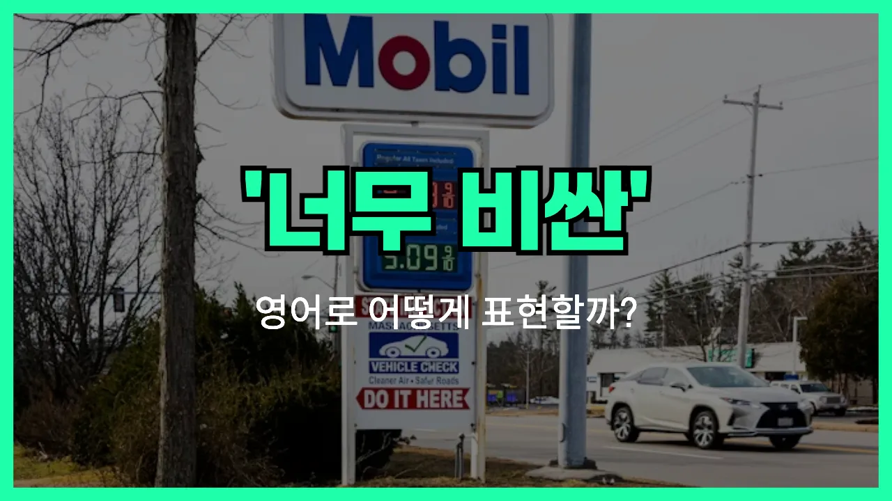

## 🌟 영어 표현 - overpriced

안녕하세요 👋 오늘은 일상에서 자주 쓰이는 영어 표현인 '**overpriced**'에 대해 알아보려고 해요. 혹시 물건이나 서비스가 너무 비싸다고 느낀 적 있으신가요? 그럴 때 바로 쓸 수 있는 단어가 '**overpriced**'예요.

'**overpriced**'는 '값이 지나치게 비싼', '바가지 쓴', '제값보다 비싸다'라는 뜻을 가지고 있어요. 즉, 어떤 물건이나 서비스가 실제 가치보다 더 비싸게 책정되었을 때 사용하는 표현이에요!

예를 들어, 카페에서 커피 한 잔이 너무 비싸다고 느껴질 때 "This coffee is overpriced."라고 말할 수 있어요. 또는, 여행지에서 기념품 가격이 너무 높을 때도 자연스럽게 쓸 수 있답니다.

## 📖 예문

1. "이 식당 음식은 너무 비싼 것 같아요."

   "The food at this restaurant is overpriced."

2. "그 신발은 예쁘지만 가격이 너무 비싸요."

   "Those shoes are nice, but they're overpriced."

## 💬 연습해보기

<ul data-interactive-list>

  <li data-interactive-item>
    시내에 새로 생긴 스시집 완전 비싸요. 롤 하나에 2만원이라니 믿기지가 않아요.
    That new sushi place downtown is so overpriced. I can't believe they charge $20 just for a roll.
  </li>

  <li data-interactive-item>
    솔직히 이 폰 케이스 완전 바가지예요. 같은 거 온라인에서 절반 가격에 살 수 있는데.
    <a href="/blog/in-english/336.honestly/">Honestly</a>, this phone case is really overpriced. You could get the same one online for half the <a href="/blog/in-english/640.price/">price</a>.
  </li>

  <li data-interactive-item>
    친구가 그 고급 브런치 가게 가자고 했는데, 메뉴 다 완전 바가지였어요.
    My friend wanted <a href="/blog/in-english/450.to-go/">to go</a> to that fancy brunch spot, but everything on the menu was totally overpriced.
  </li>

  <li data-interactive-item>
    박물관 기념품 가게 가봤는데, 와 다 완전 비싸더라고요.
    We <a href="/blog/in-english/104check-out/">checked out</a> the gift shop at the museum, and wow, everything is so overpriced.
  </li>

  <li data-interactive-item>
    운동화 보려고 했는데, 몰에 있는 건 온라인보다 다 비싸서 좀 별로였어요.
    I was <a href="/blog/in-english/173.look-for/">looking for</a> some sneakers, but all the ones at the mall were pretty overpriced compared to the ones I saw online.
  </li>

  <li data-interactive-item>
    영화관 간식들이 비싸다고들 하는데, 진짜 맞아요. 팝콘 1만원이라니?
    People say that movie theater snacks are overpriced, and they're totally right. Ten bucks for popcorn?
  </li>

  <li data-interactive-item>
    그 자켓 사고 싶었는데, 가격 대비 완전 바가지였어요.
    I really wanted to buy that jacket, but it was way overpriced for what it was.
  </li>

  <li data-interactive-item>
    이 동네 임대료 너무 비싸서 누가 감당하는지 모르겠어요.
    The rent in this part of the city is so overpriced. I don't know how anyone can afford it.
  </li>

  <li data-interactive-item>
    콘서트 티켓이 원래부터 비쌌던 건지, 아니면 요즘 더 그런 건지 궁금해요.
    You think concert tickets have always been overpriced, or is it just lately?
  </li>

  <li data-interactive-item>
    어제 동생이랑 부티크 갔는데, 거기 옷들 대부분이 좀 비싼 것 같았어요.
    I went to that boutique with my sister yesterday. Most of the clothes there seemed kind of overpriced to me.
  </li>

</ul>

## 🤝 함께 알아두면 좋은 표현들

### cost an arm and a leg

'[cost](/blog/in-english/664.cost/) an arm and a leg'는 "엄청나게 비싸다" 또는 "터무니없이 비싸다"는 뜻이에요. 어떤 물건이나 서비스의 가격이 너무 높아서 부담스럽거나 납득이 안 될 때 자주 써요.

- "That designer bag costs an arm and a leg!"
- "저 디자이너 가방은 정말 터무니없이 비싸요!"

### rip-off

'rip-off'는 "바가지 쓰다" 또는 "값에 비해 너무 비싸다"는 의미예요. 가격이 실제 가치보다 훨씬 높아서 속은 느낌이 들 때 자주 사용해요.

- "$10 for a bottle of water? That's a total rip-off."
- "물 한 병에 10달러라니, 완전 바가지예요."

### a bargain

'a bargain'은 "싸게 산 물건" 또는 "가성비 좋은 거래"라는 뜻이에요. 가격이 저렴하거나 값어치에 비해 싸게 샀을 때 긍정적으로 쓰는 표현이라서 'overpriced'의 반대말이에요.

- "I found this jacket for half price—it was such a bargain!"
- "이 재킷을 반값에 샀는데, 정말 득템했어요!"

---

오늘은 '값이 비싸다', '바가지 쓰다'라는 뜻을 가진 영어 표현 '**overpriced**'에 대해 알아봤어요. 앞으로 쇼핑하거나 외식할 때 가격이 너무 높다고 느껴지면 이 표현을 떠올려 보세요 😊

오늘 배운 표현과 예문들을 꼭 최소 3번씩 소리 내서 읽어보세요. 다음에도 더 재미있고 유익한 영어 표현으로 찾아올게요! 감사합니다!

