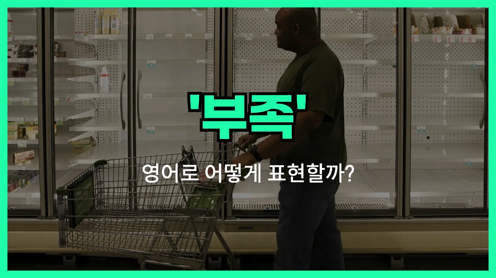

## 🌟 영어 표현 - shortage

안녕하세요 👋 오늘은 일상에서 자주 쓰이는 영어 표현 '**shortage**'에 대해 알아보려고 해요. '부족하다', '결핍', '모자람'이라는 뜻을 가진 단어인데요, 어떤 것이 충분하지 않거나 모자랄 때 자주 사용돼요.

예를 들어, 마트에 가서 원하는 물건이 다 떨어졌을 때, 혹은 회사에서 인력이 부족할 때 등 다양한 상황에서 쓸 수 있어요. 'shortage'는 주로 명사로 쓰이며, 'a shortage of ~' 형태로 많이 사용돼요. 예를 들어 'a shortage of water'는 '물 부족'이라는 뜻이에요.

또한, 'There is a shortage of [nurses](/blog/in-english/564.nurse/).'라고 하면 '간호사가 부족해요.'라는 의미가 돼요. 이렇게 일상생활이나 뉴스, 비즈니스 상황에서도 자주 등장하는 표현이니 꼭 알아두면 좋아요!

## 📖 예문

1. "식량이 부족해요."

   "There is a shortage of food."

2. "이 도시에 주차 공간이 부족해요."

   "There is a shortage of parking spaces in this city."

## 💬 연습해보기

<ul data-interactive-list>

  <li data-interactive-item>
    요즘 마트에 계란이 너무 부족해서 우유 사려면 세 군데나 돌아다녔어요.
    There's been a shortage of eggs at the grocery store lately. I had <a href="/blog/in-english/450.to-go/">to go</a> to three stores just to find some milk.
  </li>

  <li data-interactive-item>
    지금 회사에 직원이 너무 부족해서 다들 야근 중이에요.
    We're experiencing a <a href="/blog/in-english/146.serious/">serious</a> shortage of staff at my job <a href="/blog/in-english/525.right-now/">right now</a>. Everybody is working overtime.
  </li>

  <li data-interactive-item>
    컴퓨터 칩 부족 때문에 가격이 엄청 올랐대요.
    Have you heard about the shortage of computer chips? It's causing <a href="/blog/in-english/640.price/">prices</a> to go way up.
  </li>

  <li data-interactive-item>
    이번 달 헌혈자가 부족하다며 의사 선생님이 헌혈 부탁하고 계셔요.
    The <a href="/blog/in-english/563.doctor/">doctor</a> said there's a shortage of blood donors this month. <a href="/blog/in-english/116.that-is-why/">That's why</a> they're urging people to donate.
  </li>

  <li data-interactive-item>
    표가 없어서 티켓을 못 샀는데, 티켓이 진짜 빨리 매진됐어요.
    I <a href="/blog/in-english/117.try-to/">tried to</a> buy tickets but there was a ticket shortage, so they sold out super fast.
  </li>

  <li data-interactive-item>
    이 동네는 저렴한 아파트가 부족해서 월세가 엄청 비싸요.
    There's a shortage of affordable apartments in this area. That's why rent prices are so high.
  </li>

  <li data-interactive-item>
    지난 겨울 폭설 때 소금이 부족해서 정말 구하기 힘들었어요.
    Last winter, there was a shortage of rock salt during the snowstorm. It was really hard to find.
  </li>

  <li data-interactive-item>
    우리 동네 약국에 독감 주사 없어서 일주일이나 기다려야 했어요.
    My local <a href="/blog/in-english/550.pharmacy/">pharmacy</a> had a shortage of flu vaccines, so I had to wait a week to get my shot.
  </li>

  <li data-interactive-item>
    학교 선생님이 부족해서 수업 인원이 평소보다 훨씬 많아요.
    We're dealing with a shortage of good teachers in the school district. The classes are way bigger than usual.
  </li>

  <li data-interactive-item>
    허리케인 후에 주유소에 연료가 부족해서 다들 줄 서서 기름 넣었어요.
    Gas stations had a shortage of fuel after the hurricane. Everyone was lined up to fill their tanks.
  </li>

</ul>

## 🤝 함께 알아두면 좋은 표현들

### scarcity

'[scarcity](/blog/in-english/642.scarcity/)'는 'shortage'와 비슷하게 '부족' 또는 '희소함'을 의미해요. 주로 자원이나 물건이 충분하지 않을 때, 그 수량이 매우 적어서 귀한 상태를 나타낼 때 사용해요.

- "There is a scarcity of [clean](/blog/in-english/523.clean/) water in some parts of the world."
- "세계 일부 지역에는 깨끗한 물이 부족해요."

### abundance

'abundance'는 'shortage'의 반대말로, '풍부함'이나 '충분함'을 뜻해요. 어떤 것이 넉넉하게 많아서 부족함이 전혀 없는 상태를 나타낼 때 써요.

- "During the harvest season, there is an abundance of fresh fruits and vegetables at the [market](/blog/in-english/641.market/)."
- "수확철에는 시장에 신선한 과일과 채소가 아주 풍부해요."

### run out of

'[run out of](/blog/in-english/340.run-out-of/)'는 '무엇이 다 떨어지다' 또는 '고갈되다'라는 뜻이에요. 어떤 물건이나 자원이 더 이상 남아 있지 않은 상황을 말할 때 자주 사용해요.

- "We ran out of paper, so we couldn't print the documents."
- "종이가 다 떨어져서 문서를 출력할 수 없었어요."

---

오늘은 '부족하다', '결핍', '모자람'이라는 뜻을 가진 영어 표현 'shortage'에 대해 알아봤어요. 앞으로 무언가가 모자랄 때 이 단어를 떠올려 보세요 😊

오늘 배운 표현과 예문들을 꼭 최소 3번씩 소리 내서 읽어보세요. 다음에도 더 재미있고 유익한 영어 표현으로 찾아올게요! 감사합니다!

