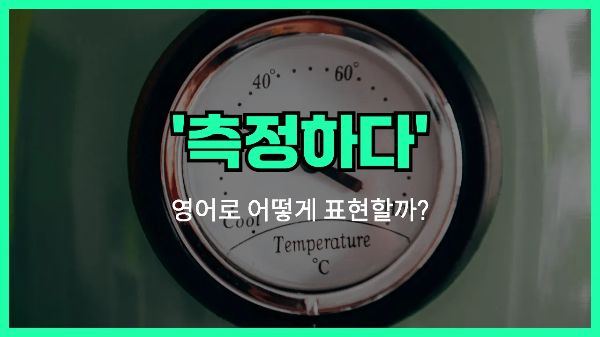

## 🌟 영어 표현 - gauge

안녕하세요 👋 오늘은 '측정하다', '재다'라는 뜻을 가진 영어 표현을 소개해드릴게요. 바로 '**gauge**'라는 단어예요.

'gauge'는 어떤 사물이나 상황의 크기, 양, 정도 등을 **정확하게 재거나 평가할 때** 사용하는 단어예요. 즉, 무언가를 수치적으로 혹은 감각적으로 판단하고 싶을 때 쓸 수 있어요!

이 단어는 과학, 공학, 일상 대화 등 다양한 상황에서 자연스럽게 사용돼요. 예를 들어, 온도, 압력, 감정, 반응 등 여러 가지를 'gauge'할 수 있어요. 예를 들어, "사람의 반응을 살피다"라는 의미로도 쓸 수 있답니다.

또한, 'gauge'는 명사로도 쓰여서 '게이지(측정기)'라는 뜻도 있어요. 하지만 오늘은 동사로서의 '측정하다', '재다'에 집중해볼게요.

## 📖 예문

1. "그는 사람들의 반응을 측정하려고 했다."

   "He [tried to](/blog/in-english/117.try-to/) gauge people's reactions."

2. "우리는 성공 가능성을 측정해야 해요."

   "We need to gauge the chances of success."

## 💬 연습해보기

<ul data-interactive-list>

  <li data-interactive-item>
    회의가 얼마나 오래 걸릴지 감이 잘 안 와서, 좀 더 정확한 예상 시간을 알려줬으면 해요.
    <a href="/blog/in-english/111.hard-to/">It's hard to</a> gauge how long the meeting will last. <a href="/blog/in-english/118.i-wish/">I wish</a> they'd give us a better <a href="/blog/in-english/747.estimate/">estimate</a>.
  </li>

  <li data-interactive-item>
    그가 뉴스에 어떻게 반응했을지 짐작할 수 있나요? 진짜 놀란 표정이었어요.
    Can you gauge his reaction to the <a href="/blog/in-english/536.news/">news</a>? He looked really surprised.
  </li>

  <li data-interactive-item>
    이 새 직장이 나랑 잘 맞을지 아직까지 감을 잡으려는 중이에요.
    I'm <a href="/blog/in-english/254.still/">still</a> trying to gauge whether this new job is a good fit for me.
  </li>

  <li data-interactive-item>
    결정하기 전에 다들 관심 있는지 먼저 살펴보자요.
    Before we <a href="/blog/vocab-1/010.make-a-decision/">make a decision</a>, let's gauge everyone's interest.
  </li>

  <li data-interactive-item>
    요즘 날씨는 감잡기 어려워요. 한 순간엔 햇볕 쨍쨍, 다음 순간엔 비 오는 것 같아요.
    It's <a href="/blog/in-english/183.tough/">tough</a> to gauge the weather <a href="/blog/in-english/417.these-days/">these days</a>. One minute it's sunny, the next it's raining.
  </li>

  <li data-interactive-item>
    직접 가보기 전까지는 대학 생활이 얼마나 힘들지 감이 안 잡혀요.
    You can't really gauge how hard college will be until you're actually there.
  </li>

  <li data-interactive-item>
    수리비 얼마나 나올지 짐작해봤는데, 정비사가 아직 말을 안 해줬어요.
    I tried to gauge how <a href="/blog/in-english/317.expensive/">expensive</a> the repairs would be, but the mechanic wouldn't say yet.
  </li>

  <li data-interactive-item>
    문자만 보고는 그 사람이 얼마나 진지한지 파악하기가 가끔 어려워요.
    <a href="/blog/in-english/270.sometimes/">Sometimes</a> it's tricky to gauge how <a href="/blog/in-english/146.serious/">serious</a> someone is just by texting.
  </li>

  <li data-interactive-item>
    그 이야기 꺼내기 전에 분위기를 좀 살펴보자요.
    Let's gauge the mood in the room before <a href="/blog/in-english/122.bring-up/">bringing up</a> that topic.
  </li>

  <li data-interactive-item>
    운동하고 나서 내가 얼마나 피곤한지 감을 잡으려고 했어요.
    After the workout, I was trying to gauge how tired I actually was.
  </li>

</ul>

## 🤝 함께 알아두면 좋은 표현들

### assess

'assess'는 "평가하다" 또는 "가늠하다"라는 뜻이에요. 어떤 상황이나 사람, 사물의 가치를 판단하거나 상태를 평가할 때 자주 쓰여요. 'gauge'와 비슷하게 무언가의 정도나 수준을 알아보는 느낌이에요.

- "The teacher needs to assess the students' progress throughout the semester."
- "선생님은 학기 내내 학생들의 진도를 평가해야 해요."

### estimate

'[estimate](/blog/in-english/747.estimate/)'는 "추정하다" 또는 "어림잡다"라는 의미예요. 정확한 수치나 결과를 알 수 없을 때 대략적으로 수치를 내거나 판단할 때 사용해요. 'gauge'와 비슷하게 대략적인 값을 알아볼 때 쓰여요.

- "Can you estimate how long the repairs will take?"
- "수리가 얼마나 걸릴지 대략적으로 말해줄 수 있어요?"

### ignore

'[ignore](/blog/in-english/348.ignore/)'는 "무시하다"라는 뜻으로, 어떤 정보나 상황을 일부러 신경 쓰지 않거나 고려하지 않을 때 사용해요. 'gauge'가 무언가를 측정하거나 평가하는 것과 반대로, 'ignore'는 아예 신경을 쓰지 않는다는 점에서 반대되는 의미예요.

- "He chose to ignore the warning signs and [continued with](/blog/in-english/233.continue-with/) his plan."
- "그는 경고 신호를 무시하고 계획을 계속 진행했어요."

---

오늘은 '측정하다', '재다'라는 뜻을 가진 영어 표현 '**gauge**'에 대해 알아봤어요. 무언가를 평가하거나 수치로 재고 싶을 때 이 단어를 떠올려보면 좋겠어요 😊

오늘 배운 표현과 예문들을 꼭 최소 3번씩 소리 내서 읽어보세요. 다음에도 더 재미있고 유익한 영어 표현으로 찾아올게요! 감사합니다!
