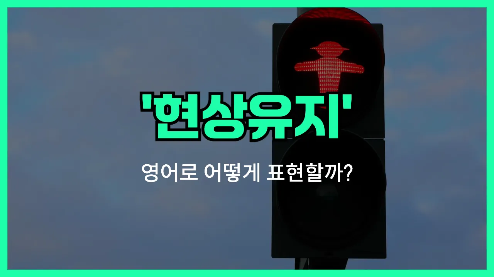

## 🌟 영어 표현 - status quo

안녕하세요 👋 오늘은 영어 표현 '**status quo**'에 대해 알아보려고 해요. 혹시 '**현상 유지**', '**현재 상태**', '**변함 없음**'이라는 말을 영어로 어떻게 표현하는지 궁금하셨나요? 바로 이럴 때 '**status quo**'라는 표현을 사용할 수 있어요.

'**status quo**'는 라틴어에서 온 표현으로, **현재의 상태**나 **지금 있는 그대로의 상황**을 의미해요. 즉, 어떤 변화 없이 지금의 상태를 그대로 유지하는 것을 말할 때 자주 쓰여요!

이 표현은 비즈니스, 정치, 일상 대화 등 다양한 상황에서 자연스럽게 사용돼요. 예를 들어, 회사에서 큰 변화를 주지 않고 지금의 방식을 계속 유지하고 싶을 때 "We want to maintain the status quo."라고 말할 수 있어요.

또는, 사회나 조직에서 변화에 대한 논의가 있을 때 "Some people [prefer](/blog/in-english/191.prefer/) the status quo rather than change."라고 할 수 있어요. 이처럼 '**status quo**'는 변화보다는 현재 상태를 유지하고 싶을 때 딱 맞는 표현이에요.

## 📖 예문

1. "그들은 현상 유지를 원해요."

   "They want to maintain the status quo."

2. "변화보다 현상 유지를 선호하는 사람들이 있어요."

   "Some people prefer the status quo over change."

## 💬 연습해보기

<ul data-interactive-list>

  <li data-interactive-item>
    솔직히, 회사에서 똑같은 일만 하다 보니까 좀 지루해졌어요.
    <a href="/blog/in-english/336.honestly/">Honestly</a>, I'm getting pretty bored with the status quo at work. It's always the same thing every day.
  </li>

  <li data-interactive-item>
    그냥 지금 상태에 만족하는 건가요, 아니면 진짜 뭔가 바꾸려고 할 건가요?
    Are we just supposed to accept the status quo, or are we actually gonna <a href="/blog/in-english/117.try-to/">try to</a> make things better?
  </li>

  <li data-interactive-item>
    걔는 변화를 싫어해서 항상 지금 상태를 최대한 유지하려고 해요.
    He <a href="/blog/in-english/392.hate/">hates</a> change, so he always tries to maintain the status quo as much as possible.
  </li>

  <li data-interactive-item>
    합병 후에 다들 회사 상황이 어떻게 달라질지 걱정했어요.
    After the <a href="/blog/in-english/690.merger/">merger</a>, everyone was <a href="/blog/in-english/209.worry-about/">worried about</a> how it might affect the status quo in the company.
  </li>

  <li data-interactive-item>
    그냥 현상 유지해도 되긴 하는데, 그게 재미가 있나요?
    We could just stick with the status quo, but where's the fun in that?
  </li>

  <li data-interactive-item>
    우리 부모님은 지금 상황을 크게 건드리는 걸 별로 좋아하지 않으세요. 그냥 있는 그대로가 좋아요.
    My parents aren't big <a href="/blog/in-english/141.fan-of/">fans of</a> <a href="/blog/in-english/460.shake/">shaking</a> up the status quo. They like things just the way they are.
  </li>

  <li data-interactive-item>
    가끔 학교가 진짜 문제 해결보단 지금 상태만 유지하려는 것 같아요.
    <a href="/blog/in-english/270.sometimes/">Sometimes</a> <a href="/blog/한-것-같아-영어표현/">it feels like</a> the school just wants to keep the status quo <a href="/blog/in-english/169.instead-of/">instead of</a> addressing real problems.
  </li>

  <li data-interactive-item>
    현상에 도전하는 건 쉽지 않지만, 누군가는 해야 해요.
    Challenging the status quo isn't easy, but somebody's gotta do it.
  </li>

  <li data-interactive-item>
    그 시스템이 모두에게 잘 돌아가지 않는다는 걸 알았기에 그녀는 현상에 맞서 싸우기로 했어요.
    She <a href="/blog/in-english/062.decide-to/">decided to</a> fight the status quo because she knew the <a href="/blog/in-english/432.system/">system</a> wasn't working for everyone.
  </li>

  <li data-interactive-item>
    지금 상태를 흔들고 싶은 거 맞아요? 그럼 많은 사람들을 불편하게 할 수도 있어요.
    Are you sure you want to disrupt the status quo? That could <a href="/blog/in-english/395.upset/">upset</a> a lot of people.
  </li>

</ul>

## 🤝 함께 알아두면 좋은 표현들

### the current state of affairs

'the current state of affairs'는 'status quo'와 비슷하게 현재의 상황이나 상태를 의미해요. 주로 지금의 조건이나 환경이 어떻게 유지되고 있는지를 설명할 때 사용해요.

- "Many people are dissatisfied with the current state of affairs in the company."
- "많은 사람들이 회사의 현재 상황에 불만을 가지고 있어요."

### shake things up

'shake things up'은 기존의 상태나 질서를 바꾸거나 변화를 주는 것을 의미해요. 즉, 'status quo'를 깨고 새로운 변화를 시도할 때 쓰는 표현이에요.

- "The new manager wants to shake things up and [introduce](/blog/in-english/262.introduce/) fresh ideas."
- "새로운 매니저가 변화를 주고 신선한 아이디어를 도입하고 싶어 해요."

### rock the boat

'rock the boat'은 평온한 상태나 기존의 질서를 깨뜨리거나 문제를 일으키는 행동을 의미해요. 즉, 'status quo'를 유지하지 않고 변화를 시도하거나 불편함을 초래할 때 쓰는 표현이에요.

- "I don't want to rock the boat, so I'll just go along with the plan."
- "나는 괜히 문제를 만들고 싶지 않아서 그냥 그 계획에 따르려고 해요."

---

오늘은 '**현상 유지**', '**현재 상태**', '**변함 없음**'이라는 뜻을 가진 영어 표현 '**status quo**'에 대해 알아봤어요. 앞으로 변화가 필요 없거나 지금 상태를 그대로 두고 싶을 때 이 표현을 떠올려 보세요 😊

오늘 배운 표현과 예문들을 꼭 최소 3번씩 소리 내서 읽어보세요. 다음에도 더 재미있고 유익한 영어 표현으로 찾아올게요! 감사합니다!

