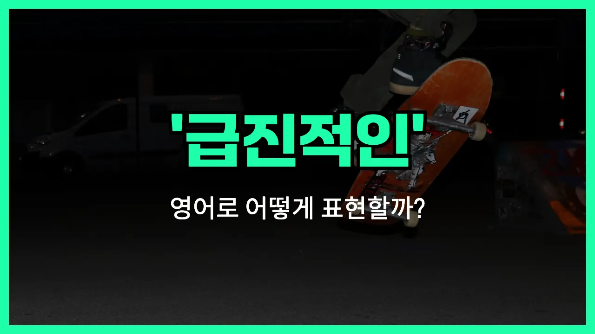

## 🌟 영어 표현 - radical

안녕하세요 👋 오늘은 영어 표현 '**radical**'에 대해 알아보려고 해요. 혹시 '**급진적인**', '**과격한**', '**혁명적인**'이라는 뜻을 영어로 어떻게 말하는지 궁금하셨나요? 바로 '**radical**'이라는 단어가 그 뜻을 담고 있어요.

'**radical**'은 어떤 생각이나 행동, 변화가 기존의 틀을 완전히 바꾸거나, 아주 새로운 방식으로 접근할 때 자주 쓰여요. 즉, **기존의 방식에서 벗어나 큰 변화를 추구하는** 상황에서 사용된답니다!

예를 들어, 사회 제도나 정책이 완전히 바뀌는 경우, 또는 누군가가 매우 새로운 아이디어를 제시할 때 '**radical**'이라는 단어를 쓸 수 있어요. 일상 대화에서는 '너무 파격적이야!'라는 느낌으로도 사용돼요.

## 📖 예문

1. "그는 급진적인 아이디어를 가지고 있어요."

   "He has radical ideas."

2. "이 정책은 사회에 급진적인 변화를 가져올 거예요."

   "This [policy](/blog/in-english/623.policy/) will bring radical changes to society."

## 💬 연습해보기

<ul data-interactive-list>

  <li data-interactive-item>
    그 새 영화 진짜 대박이었어요. 다들 그 얘기만 하더라고요.
    That new movie was totally radical. Everyone's talking about it.
  </li>

  <li data-interactive-item>
    좀 터무니없게 들리지만, 우리 하와이로 이사 가면 어떨까요?
    I know it sounds radical, but what if we just moved to Hawaii?
  </li>

  <li data-interactive-item>
    내 사촌이 완전 색다른 헤어스타일 했는데, 의외로 잘 어울려요.
    My cousin got a radical new haircut. It actually suits him.
  </li>

  <li data-interactive-item>
    야, 네가 한 스케이트보드 묘기 진짜 쩔었어.
    Dude, the skateboarding tricks you pulled off were radical.
  </li>

  <li data-interactive-item>
    걔는 기후 변화에 대해 꽤 독특한 생각을 가지고 있어요.
    She has some pretty radical ideas about climate change.
  </li>

  <li data-interactive-item>
    80년대에는 멋진 걸 다 '레디컬'이라고 표현했어요.
    Back in the '80s, everything cool was described as radical.
  </li>

  <li data-interactive-item>
    그 선생님이 올해 수학 가르치는 방법을 완전 새롭게 시도했어요.
    Their teacher tried a radical <a href="/blog/in-english/267.approach/">approach</a> to teaching math this year.
  </li>

  <li data-interactive-item>
    직장 그만두고 세계 여행? 진짜 무모한 결정이에요.
    Quitting your job and traveling the world? That's a radical decision.
  </li>

  <li data-interactive-item>
    셰프가 레시피에 완전 색다른 변화를 줬어요. 이제 맛이 끝내줘요.
    The chef added a radical twist to the recipe. It tastes amazing now.
  </li>

  <li data-interactive-item>
    솔직히 말해서 그런 큰 변화는 아직 준비가 안 된 것 같아요.
    I'm not sure I'm ready for such a radical change, to be honest.
  </li>

</ul>

## 🤝 함께 알아두면 좋은 표현들

### revolutionary

'revolutionary'는 "혁명적인" 또는 "아주 획기적인"이라는 뜻이에요. 기존의 방식을 완전히 바꾸거나 새로운 변화를 일으키는 것을 강조할 때 사용해요. 'radical'과 비슷하게 큰 변화를 의미하지만, 특히 사회나 기술, 사상 등에서 혁신적인 변화를 말할 때 자주 써요.

- "Her ideas about education are truly revolutionary and could change the [system](/blog/in-english/432.system/) for the better."
- "그녀의 교육에 대한 생각은 정말 혁명적이라서 교육 시스템을 더 좋게 바꿀 수도 있을 것 같아요."

### conservative

'conservative'는 "보수적인" 또는 "변화를 꺼리는"이라는 뜻이에요. 새로운 시도나 급진적인 변화보다는 기존의 방식을 유지하려는 태도를 나타낼 때 써요. 'radical'의 반대 의미로, 변화에 신중하거나 조심스러운 입장을 강조할 때 자주 사용해요.

- "My parents are quite conservative [when it comes to](/blog/in-english/269.when-it-comes-to/) new technology."
- "우리 부모님은 새로운 기술에 대해서는 꽤 보수적이세요."

### progressive

'progressive'는 "진보적인" 또는 "점진적으로 발전하는"이라는 뜻이에요. 'radical'처럼 변화를 추구하지만, 급진적이기보다는 조금씩 나아지는 방향을 선호할 때 사용해요. 사회, 정치, 교육 등 다양한 분야에서 점진적인 개혁이나 발전을 말할 때 자주 써요.

- "The company has a progressive approach to [employee](/blog/in-english/700.employee/) benefits."
- "그 회사는 직원 복지에 대해 진보적인 방식을 가지고 있어요."

---

오늘은 '**급진적인**', '**과격한**', '**혁명적인**'이라는 뜻을 가진 영어 표현 '**radical**'에 대해 알아봤어요. 새로운 변화나 파격적인 아이디어를 이야기할 때 이 단어를 떠올려 보세요! 😊

오늘 배운 표현과 예문들을 꼭 최소 3번씩 소리 내서 읽어보세요. 다음에도 더 재미있고 유익한 영어 표현으로 찾아올게요! 감사합니다!
