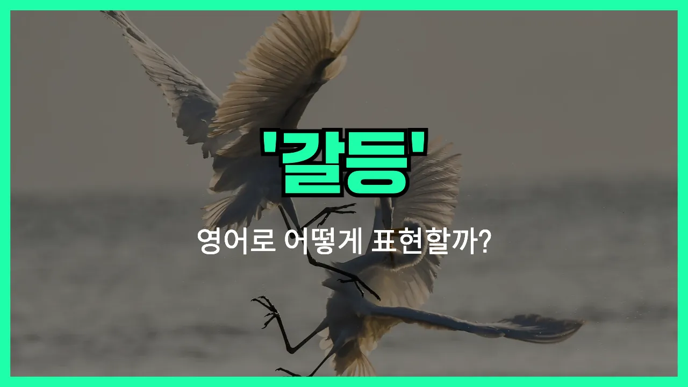

## 🌟 영어 표현 - conflict

안녕하세요 👋 오늘은 일상에서 자주 쓰이는 단어인 '**갈등**'을 영어로 어떻게 표현하는지 알아보려고 해요. 바로 '**conflict**'라는 단어인데요~

'**conflict**'는 두 사람, 집단, 생각 등이 서로 맞지 않아서 부딪히거나 충돌하는 상황을 의미해요. 즉, **의견이나 이해관계가 달라서 생기는 대립, 충돌, 갈등**을 표현할 때 자주 쓰여요~

이 단어는 친구 사이의 오해, 회사에서의 의견 차이, 국가 간의 분쟁 등 다양한 상황에서 자연스럽게 사용할 수 있어요. 예를 들어, "There was a conflict between the two teams."라고 하면 "두 팀 사이에 갈등이 있었어요."라는 뜻이에요~

또는, "She [tries to](/blog/in-english/117.try-to/) avoid conflict whenever possible."이라고 하면 "그녀는 가능한 한 갈등을 피하려고 해요."라는 의미로 쓸 수 있어요~

'**conflict**'는 명사로도, 동사로도 사용할 수 있어서 정말 유용한 단어예요! 명사로는 '갈등', '충돌', 동사로는 '충돌하다', '대립하다'라는 뜻이 있으니 상황에 맞게 활용해 보세요~

## 📖 예문

1. "그들은 의견 차이로 갈등을 겪고 있어요."

   "They are experiencing conflict [due to](/blog/in-english/335.due-to/) differences in [opinion](/blog/in-english/527.opinion/)."

2. "가족 내 갈등을 해결하는 것이 중요해요."

   "It is [important](/blog/in-english/318.important/) to resolve conflicts within the family."

## 💬 연습해보기

<ul data-interactive-list>

  <li data-interactive-item>
    오늘 일터에서 프로젝트 마감일 때문에 좀 다툼이 있었어요. 그래서 회의 분위기가 꽤 팽팽했거든요.
    There was a bit of conflict at work today about the project deadlines. It made our meeting pretty tense.
  </li>

  <li data-interactive-item>
    전 갈등이 정말 싫어서 보통은 싸움은 피하려고 해요.
    I really don't like conflict, so I usually try to avoid arguments.
  </li>

  <li data-interactive-item>
    사라랑 룸메이트는 청소 문제로 항상 티격태격하는 것 같아요.
    Sarah and her roommate always seem to be in conflict over cleaning the apartment.
  </li>

  <li data-interactive-item>
    우리 생각이 좀 달라서 충돌이 있지만, 분명 뭔가 해결책을 찾을 수 있을 거예요.
    Our ideas are in conflict, but I'm sure we can figure something out.
  </li>

  <li data-interactive-item>
    부모님이랑 10대 자녀들은 통금 시간 같은 문제로 자주 다툼이 있죠.
    Parents and teenagers <a href="/blog/in-english/326.often/">often</a> have conflict about things like curfew.
  </li>

  <li data-interactive-item>
    항상 갈등을 피할 수는 없지만, 갈등을 잘 다루는 법은 분명 배울 수 있어요.
    You can't always avoid conflict, but you can definitely <a href="/blog/in-english/245.learn/">learn</a> to handle it better.
  </li>

  <li data-interactive-item>
    그 영화는 주인공들 사이의 갈등이 주요 내용이었는데, 되게 긴장감 넘쳤어요.
    That movie was all about the conflict between the main characters. It was actually pretty intense.
  </li>

  <li data-interactive-item>
    단체 과제하면 항상 이런저런 갈등이 있는 거 같아요, 맞죠?
    There's always some kind of conflict in group projects, right?
  </li>

  <li data-interactive-item>
    가끔 갈등이 오히려 서로를 더 가까워지게 할 수도 있어요, 같이 잘 풀면 말이죠.
    <a href="/blog/in-english/270.sometimes/">Sometimes</a>, conflict can help people grow closer if they work through it.
  </li>

  <li data-interactive-item>
    솔직히 가족 모임에서 갈등은 최대한 피하려고 해요. 너무 스트레스 받거든요.
    <a href="/blog/in-english/336.honestly/">Honestly</a>, I try to stay out of any conflict at family gatherings. It just stresses me out.
  </li>

</ul>

## 🤝 함께 알아두면 좋은 표현들

### dispute

'dispute'는 "분쟁"이나 "논쟁"을 의미해요. 주로 두 사람이나 집단이 의견이 달라서 서로 다투거나 논의가 격해질 때 사용해요. 'conflict'와 비슷하게 갈등이나 충돌을 나타내지만, 좀 더 공식적이거나 법적인 상황에서 자주 쓰여요.

- "The two companies are [involved](/blog/in-english/274.involve/) in a legal dispute over the patent rights."
- "두 회사는 특허권을 두고 법적 분쟁에 휘말려 있어요."

### harmony

'harmony'는 "조화"나 "화합"을 의미해요. 사람들이나 집단이 서로 잘 어울리고 갈등 없이 평화롭게 지내는 상태를 나타내요. 'conflict'의 반대되는 개념으로, 서로 이해하고 협력하는 분위기를 강조할 때 써요.

- "The team worked in [perfect](/blog/in-english/413.perfect/) harmony to [finish](/blog/in-english/295.finish/) the project [on time](/blog/vocab-1/043.on-time/)."
- "팀원들이 완벽하게 조화를 이루면서 프로젝트를 제시간에 끝냈어요."

### tension

'tension'은 "긴장"이나 "불안감"을 의미해요. 갈등이 직접적으로 드러나진 않았지만, 서로 사이가 불편하거나 언제든지 충돌이 일어날 수 있는 불안한 상태를 나타낼 때 사용해요. 'conflict'와 비슷하지만, 실제로 싸움이 일어나기 전의 분위기를 더 강조해요.

- "There was a lot of tension in the room after the argument."
- "언쟁이 있은 후에 방 안에는 긴장감이 감돌았어요."

---

오늘은 '**갈등**', '**충돌**', '**대립**'이라는 뜻을 가진 영어 표현 '**conflict**'에 대해 알아봤어요. 앞으로 누군가와 의견이 다를 때 이 표현을 떠올려 보세요~ 😊

오늘 배운 표현과 예문들을 꼭 최소 3번씩 소리 내서 읽어보세요. 다음에도 더 재미있고 유익한 영어 표현으로 찾아올게요! 감사합니다~
