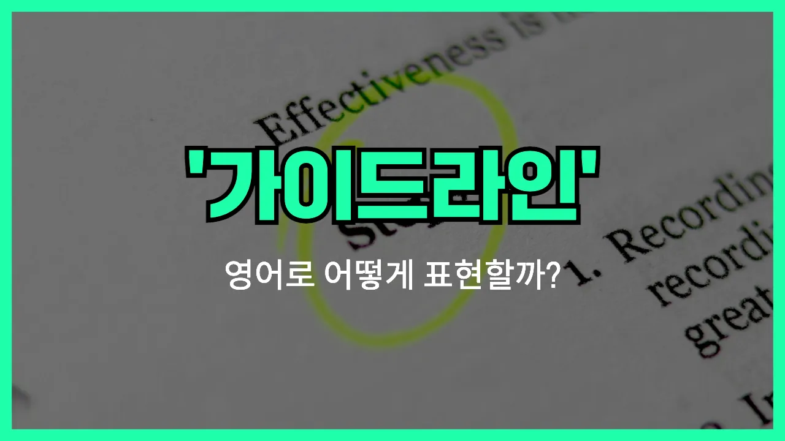

## 🌟 영어 표현 - guideline

안녕하세요 👋 오늘은 영어로 '지침', '가이드라인'이라는 뜻을 가진 표현인 '**guideline**'에 대해 알아보려고 해요.

'**guideline**'은 어떤 일을 할 때 따라야 하는 **기본적인 원칙이나 규칙, 안내**를 의미해요. 즉, 무언가를 올바르게 하거나, 절차를 따를 때 참고할 수 있는 기준을 말할 때 자주 쓰여요!

이 단어는 회사의 정책, 학교의 규칙, 건강 관리, 프로젝트 진행 등 다양한 상황에서 자연스럽게 사용돼요. 예를 들어, 회사에서 새로운 업무를 시작할 때 "Please follow the company guidelines."라고 할 수 있어요.

또는, "The [government](/blog/in-english/608.government/) has issued new guidelines for public safety."라고 하면 "정부가 공공 안전을 위한 새로운 지침을 발표했어요."라는 의미에요.

'**guideline**'은 주로 복수형(guidelines)으로 많이 쓰이니 참고해 주세요!

## 📖 예문

1. "이 프로젝트에는 몇 가지 중요한 지침이 있어요."

   "There are several [important](/blog/in-english/318.important/) guidelines for this project."

2. "학생들은 학교의 지침을 따라야 해요."

   "Students must follow the school's guidelines."

## 💬 연습해보기

<ul data-interactive-list>

  <li data-interactive-item>
    매니저가 고객 불만 처리 방법에 대한 새 지침을 알려줬어요.
    My manager gave us a new guideline for how to handle customer complaints.
  </li>

  <li data-interactive-item>
    직원 수첩에 복장 규정에 관한 지침이 있어요.
    There's a guideline about dress code in the <a href="/blog/in-english/700.employee/">employee</a> handbook.
  </li>

  <li data-interactive-item>
    지침만 잘 따르면 문제없을 거예요.
    If you follow the guideline, you shouldn't run into any trouble.
  </li>

  <li data-interactive-item>
    지침 하나 알려줄게요: 제출 전에 항상 작업을 다시 한 번 확인하세요.
    <a href="/blog/in-english/510.Here’s/">Here's</a> a guideline: always double-check your work before submitting it.
  </li>

  <li data-interactive-item>
    선생님이 이건 엄격한 규칙이 아니라 그냥 참고용 지침이라고 하셨어요.
    The teacher said these are just guidelines, not <a href="/blog/in-english/275.strict/">strict</a> rules.
  </li>

  <li data-interactive-item>
    이 프로젝트 시작하기 전에 지침을 꼭 확인해야 해요.
    I need to check the guideline before I start this project.
  </li>

  <li data-interactive-item>
    회의 중에 휴대폰 사용 금지에 관한 지침이 있어요.
    There's a guideline about not using phones during meetings.
  </li>

  <li data-interactive-item>
    원격 근무에 관한 최신 지침 좀 보내줄 수 있어요?
    Can you <a href="/blog/in-english/292.send/">send</a> me the updated guideline for remote work?
  </li>

  <li data-interactive-item>
    안전 지침에 창고에서는 꼭 헬멧을 써야 한다고 나와 있어요.
    The safety guideline says we have to wear helmets in the warehouse.
  </li>

  <li data-interactive-item>
    이건 그냥 참고용 지침이라고 생각하면 돼요, 절대 바뀌지 않는 법칙은 아니에요.
    Just consider it a guideline, not something set in stone.
  </li>

</ul>

## 🤝 함께 알아두면 좋은 표현들

### rule

'rule'은 "규칙" 또는 "원칙"이라는 뜻으로, 반드시 지켜야 하는 명확한 기준을 말해요. 'guideline'이 참고용이나 권장사항이라면, 'rule'은 어기면 안 되는 엄격한 규정이에요.

- "There is a strict rule against using phones during class."
- "수업 시간에 휴대폰을 사용하는 건 엄격하게 금지되어 있어요."

### recommendation

'recommendation'은 "권고" 또는 "추천"이라는 뜻으로, 꼭 따라야 하는 건 아니지만 도움이 되도록 제시하는 조언이나 지침이에요. 'guideline'과 비슷하게 참고용으로 주로 사용돼요.

- "The [doctor](/blog/in-english/563.doctor/) gave me some recommendations for a healthier lifestyle."
- "의사 선생님이 더 건강하게 살 수 있는 방법을 몇 가지 추천해 주셨어요."

### free-for-all

'free-for-all'은 "무질서한 상황" 또는 "규칙이 없는 상태"를 의미해요. 즉, 'guideline'이나 규칙이 전혀 없는, 아무렇게나 행동해도 되는 상황을 나타내는 반대 표현이에요.

- "Without any guidelines, the meeting [turned into](/blog/in-english/400.turn-into/) a free-for-all."
- "지침이 전혀 없으니까 회의가 완전히 엉망진창이 되어버렸어요."

---

오늘은 '지침', '가이드라인'이라는 뜻을 가진 영어 표현 '**guideline**'에 대해 알아봤어요. 앞으로 무언가를 안내하거나 기준을 제시할 때 이 표현을 떠올리면 좋겠어요 😊

오늘 배운 표현과 예문들을 꼭 최소 3번씩 소리 내서 읽어보세요. 다음에도 더 재미있고 유익한 영어 표현으로 찾아올게요! 감사합니다!
