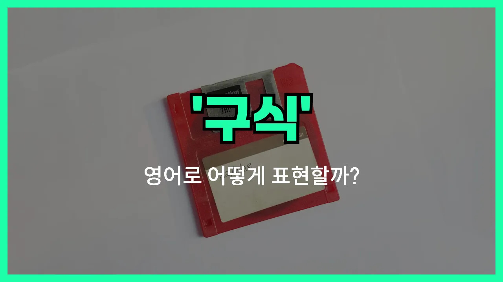

## 🌟 영어 표현 - outdated

안녕하세요 👋 오늘은 '**구식이다**', '**시대에 뒤떨어지다**'라는 뜻을 가진 영어 표현을 알아보려고 해요. 바로 '**outdated**'라는 단어인데요~

'**outdated**'는 말 그대로 어떤 것이 더 이상 최신이 아니고, **오래되어서 쓸모없거나 시대에 맞지 않는** 상황을 표현할 때 사용해요. 예를 들어, 기술, 생각, 규칙, 스타일 등이 더 이상 현대 사회에 적합하지 않을 때 자주 쓰여요~

예를 들어, 오래된 휴대폰이나 컴퓨터를 말할 때 "This phone is outdated."라고 할 수 있어요. 또는, 예전 방식이나 규칙이 지금은 맞지 않을 때 "That rule is outdated."라고 표현해요~

## 📖 예문

1. "이 소프트웨어는 너무 구식이에요."

   "This software is too outdated."

2. "그의 생각은 시대에 뒤떨어졌어요."

   "His ideas are outdated."

## 💬 연습해보기

<ul data-interactive-list>

  <li data-interactive-item>
    새 노트북 사야겠어요. 이거 진짜 옛날 거라서요.
    I need to get a new laptop. This one is so outdated.
  </li>

  <li data-interactive-item>
    다들 내 구식 핸드폰 놀리더라고요. 이제 바꿀 때가 된 것 같아요.
    Everyone keeps making fun of my outdated phone. I guess it's time for an upgrade.
  </li>

  <li data-interactive-item>
    저 웹사이트 정보 완전 옛날 거라 믿으면 안 돼요.
    The information on that website is pretty outdated. You shouldn't <a href="/blog/in-english/113.rely-on/">rely on</a> it.
  </li>

  <li data-interactive-item>
    내 음악 취향 좀 구식일 수도 있는데, 90년대 히트곡 완전 좋아해요.
    My music taste might be a little outdated, but I love 90s hits.
  </li>

  <li data-interactive-item>
    그 소프트웨어 구버전이라 새 시스템이랑 잘 안 맞아요.
    That software is outdated and doesn't work well with the new <a href="/blog/in-english/432.system/">system</a>.
  </li>

  <li data-interactive-item>
    아빠 그 구닥다리 옷 좀 그만 입으셨으면 좋겠어요. 스타일 좀 바꿔야 해요.
    <a href="/blog/in-english/118.i-wish/">I wish</a> Dad would stop wearing those outdated clothes. He needs a style update.
  </li>

  <li data-interactive-item>
    그 규칙들 진짜 옛날 거 많아서 요즘엔 별로 안 맞아요.
    A lot of those rules are outdated and don't really <a href="/blog/in-english/068.make-sense/">make sense</a> anymore.
  </li>

  <li data-interactive-item>
    대학생 때 쓰던 오래된 교과서 다 버리려고요.
    I'm <a href="/blog/in-english/117.try-to/">trying to</a> <a href="/blog/in-english/398.get-rid-of/">get rid of</a> all my outdated textbooks from college.
  </li>

  <li data-interactive-item>
    GPS 지도 업데이트 안 돼서 길 잃은 거 오래 걸렸어요. 당연히 헤맬 수밖에요.
    It took forever to <a href="/blog/in-english/166.realize/">realize</a> my GPS had outdated <a href="/blog/in-english/535.map/">maps</a>. <a href="/blog/in-english/079.no-wonder/">No wonder</a> I got <a href="/blog/in-english/457.lose/">lost</a>.
  </li>

  <li data-interactive-item>
    우리 집 장식 진짜 구식이에요. 명절 전에 인테리어 좀 바꿔야겠어요.
    Our decorations are so outdated. We should redecorate before the <a href="/blog/in-english/517.holiday/">holidays</a>.
  </li>

</ul>

## 🤝 함께 알아두면 좋은 표현들

### old-fashioned

'old-fashioned'는 "구식의" 또는 "옛날 스타일의"라는 뜻이에요. 시대에 뒤떨어지거나 요즘 유행과 맞지 않는 스타일이나 생각, 물건 등에 대해 말할 때 자주 써요.

- "Her dress looked a bit old-fashioned compared to everyone else's at the party."
- "그녀의 드레스는 파티에 온 다른 사람들에 비해 좀 구식처럼 보였어요."

### modern

'modern'은 "현대적인" 또는 "최신의"라는 뜻으로, 'outdated'의 반대말이에요. 요즘 트렌드에 맞거나 새롭고 세련된 것을 표현할 때 사용해요.

- "They [decided to](/blog/in-english/062.decide-to/) renovate their kitchen with a modern design."
- "그들은 주방을 현대적인 디자인으로 리모델링하기로 했어요."

### behind the times

'behind the times'는 "시대에 뒤처진" 또는 "유행에 뒤떨어진"이라는 뜻이에요. 사람이나 생각, 기술 등이 최신 트렌드나 변화에 따라가지 못할 때 자주 쓰는 표현이에요.

- "My grandfather is a bit behind the times [when it comes to](/blog/in-english/269.when-it-comes-to/) technology."
- "우리 할아버지는 기술에 관해서는 좀 시대에 뒤처지신 편이에요."

---

오늘은 '**구식이다**', '**시대에 뒤떨어지다**'라는 뜻을 가진 영어 표현 '**outdated**'에 대해 알아봤어요. 혹시 오래된 물건이나 생각을 말할 때 이 표현을 떠올려 보세요~ 😊

오늘 배운 표현과 예문들을 꼭 최소 3번씩 소리 내서 읽어보세요. 다음에도 더 재미있고 유익한 영어 표현으로 찾아올게요! 감사합니다!~요
