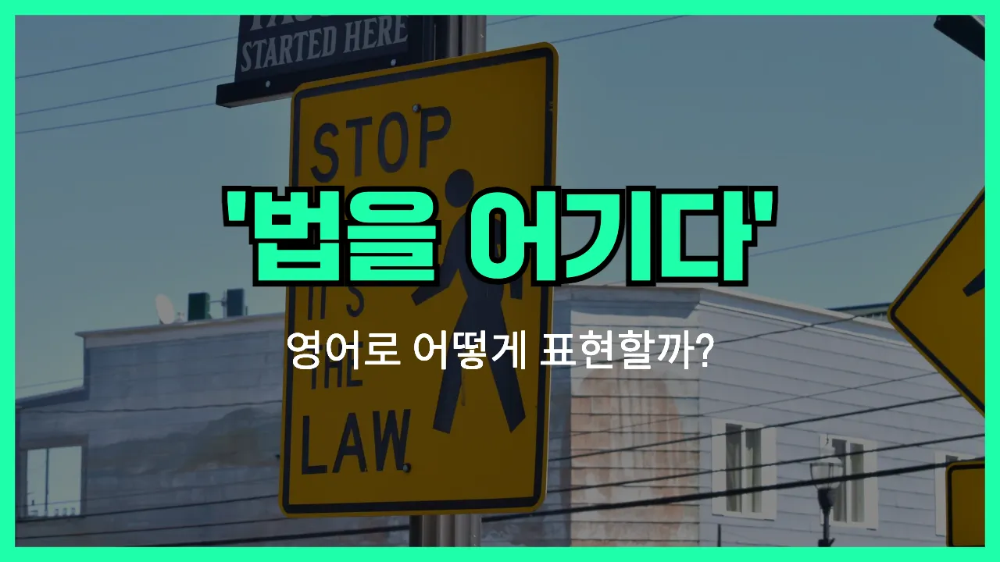

## 🌟 영어 표현 - break the law

안녕하세요 👋 오늘은 '**법을 어기다**', '**위법하다**'라는 뜻을 가진 영어 표현을 소개해드릴게요. 바로 '**break the [law](/blog/in-english/619.law/)**'라는 표현이에요.

'**break the law**'는 말 그대로 '법을 깨다', 즉 **법을 지키지 않고 위반하는 행동**을 할 때 사용하는 표현이에요. 우리가 일상에서 뉴스나 드라마, 영화 등에서 자주 들을 수 있는 표현이기도 해요.

예를 들어, 누군가 교통 신호를 무시하거나, 절도와 같은 범죄를 저질렀을 때 "He broke the law."라고 말할 수 있어요. 이 표현은 아주 직설적이고 명확하게 '법을 어겼다'는 의미를 전달해줘요.

또한, 'break' 대신 'violate'라는 동사를 써서 'violate the law'라고 할 수도 있지만, 일상적으로는 'break the law'가 더 자주 쓰여요.

## 📖 예문

1. "그는 법을 어겼어요."

   "He broke the law."

2. "법을 어기면 처벌을 받아요."

   "If you break the law, you will be punished."

## 💬 연습해보기

<ul data-interactive-list>

  <li data-interactive-item>
    법을 어기면 감옥에 갈 수도 있어요. 그만한 위험을 감수할 필요가 없어요.
    If you break the law, you could <a href="/blog/vocab-1/039.end-up/">end up</a> in jail. It's not worth the <a href="/blog/in-english/676.risk/">risk</a>.
  </li>

  <li data-interactive-item>
    우리 부모님은 항상 무슨 일이 있어도 법을 어기면 안 된다고 가르쳐 주셨어요.
    My parents always taught me never to break the law, <a href="/blog/in-english/229.no-matter-what/">no matter what</a>.
  </li>

  <li data-interactive-item>
    작년에 법을 어긴 연예인 얘기 들었어요? 뉴스에 완전 난리 났었죠.
    Did you hear about that celebrity who broke the law last year? It was all over the <a href="/blog/in-english/536.news/">news</a>.
  </li>

  <li data-interactive-item>
    솔직히 왜 다들 하니까 괜찮다고 생각하는지 이해가 안 가요, 법 어기는 게.
    <a href="/blog/in-english/336.honestly/">Honestly</a>, I don't understand why some people think it's okay to break the law just because everyone else is doing it.
  </li>

  <li data-interactive-item>
    그 사람 법 어기다가 들켜서 지금은 사회봉사 중이에요.
    He got caught breaking the law and now he has to do community service.
  </li>

  <li data-interactive-item>
    그녀는 법을 어기려던 게 아니었고, 세금 신고를 잘못해서 실수한 거예요.
    She didn't mean to break the law, but she made a mistake on her taxes.
  </li>

  <li data-interactive-item>
    가끔 사람들은 자신도 모르게 법을 어기는 경우가 있어요.
    <a href="/blog/in-english/270.sometimes/">Sometimes</a> people <a href="/blog/in-english/314.accidentally/">accidentally</a> break the law without even <a href="/blog/in-english/166.realize/">realizing</a> it.
  </li>

  <li data-interactive-item>
    작은 일이라도 법을 어기면 진짜 큰일 날 수 있다는 거 알아야 해요.
    You know, you can get into <a href="/blog/in-english/146.serious/">serious</a> trouble if you break the law, even for something small.
  </li>

  <li data-interactive-item>
    어릴 때는 차도 없고 해서 무단횡단이 법 어기는 거라고 생각했어서 절대 안 했어요.
    When I was a kid, I thought jaywalking was breaking the law, so I never did it.
  </li>

  <li data-interactive-item>
    거기 규칙 진짜 엄격해서 법 어길 생각 자체 말아요.
    They have really <a href="/blog/in-english/275.strict/">strict</a> rules there, so don't even think about breaking the law.
  </li>

</ul>

## 🤝 함께 알아두면 좋은 표현들

### commit a crime

'commit a crime'은 "범죄를 저지르다"라는 뜻이에요. 법을 어기고 불법적인 행동을 하는 것을 공식적으로 표현할 때 자주 사용돼요.

- "Anyone who commits a crime should be [held](/blog/in-english/388.hold/) responsible for their actions."
- "누구든 범죄를 저지르면 그 행동에 대해 책임을 져야 해요."

### obey the law

'obey the law'는 "법을 지키다"라는 의미예요. 법이나 규칙을 따르고, 정해진 규정을 어기지 않는 태도를 나타낼 때 써요. 'break the law'의 반대 표현이에요.

- "It's [important](/blog/in-english/318.important/) to obey the law to keep our community safe."
- "우리 공동체의 안전을 위해서는 법을 지키는 게 중요해요."

### follow the rules

'follow the rules'는 "규칙을 따르다"라는 뜻이에요. 법뿐만 아니라 학교, 회사, 사회 등에서 정해진 규칙이나 지침을 잘 지키는 것을 말해요. 역시 'break the law'의 반대 의미로 자주 쓰여요.

- "If you follow the rules, you [won](/blog/in-english/456.win/)'t get into trouble."
- "규칙을 잘 따르면 문제에 휘말릴 일이 없어요."

---

오늘은 '**법을 어기다**', '**위법하다**'라는 뜻의 영어 표현 '**break the law**'에 대해 알아봤어요. 앞으로 뉴스나 영화를 볼 때 이 표현이 나오면 바로 이해할 수 있겠죠? 😊

오늘 배운 표현과 예문들을 꼭 최소 3번씩 소리 내서 읽어보세요. 다음에도 더 재미있고 유익한 영어 표현으로 찾아올게요! 감사합니다!~요
