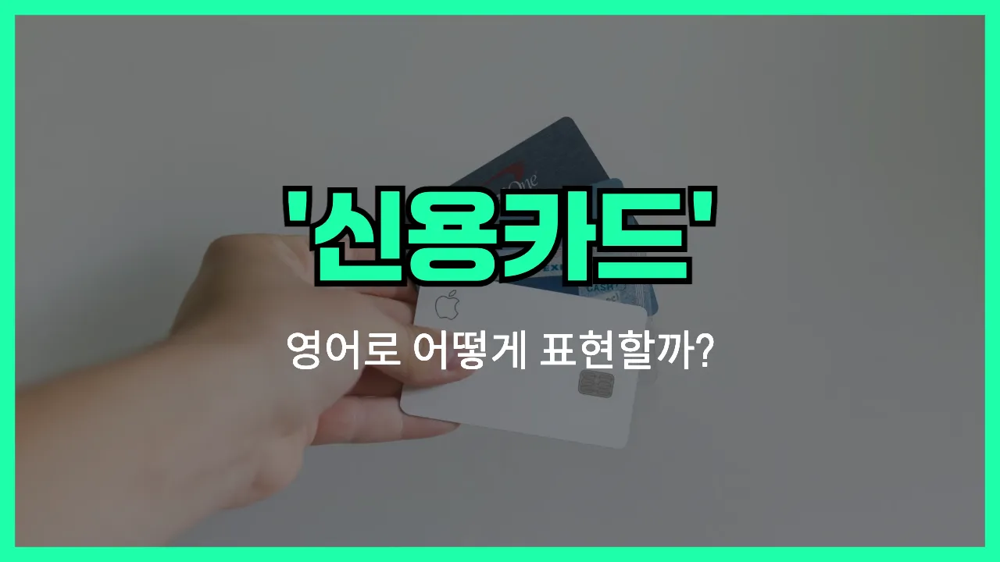

## 🌟 영어 표현 - credit card

안녕하세요 👋 오늘은 우리가 일상에서 자주 사용하는 '**신용카드**'의 영어 표현에 대해 알아보려고 해요. 바로 '**credit card**'라고 해요.

'**credit card**'는 은행이나 카드사에서 발급받아 물건을 살 때 결제수단으로 사용하는 카드를 의미해요. 즉, 현금 없이도 물건을 사고, 나중에 돈을 갚는 방식이에요!

이 표현은 쇼핑, 온라인 결제, 호텔 예약 등 다양한 상황에서 정말 자주 쓰여요. 예를 들어, 계산대에서 "신용카드로 결제할게요"라고 말하고 싶을 때 "I will pay by credit card."라고 할 수 있어요.

또한, 해외여행이나 온라인 쇼핑을 할 때도 "Do you accept credit cards?"라고 물어보면 "신용카드 받으시나요?"라는 의미가 돼요.

## 📖 예문

1. "신용카드로 결제할 수 있나요?"

   "Can I pay with a credit card?"

2. "저는 신용카드 두 장이 있어요."

   "I have two credit cards."

## 💬 연습해보기

<ul data-interactive-list>

  <li data-interactive-item>
    점심값을 못 냈어요, 집에 신용카드를 두고 와서요.
    I <a href="/blog/in-english/023.forget/">forgot</a> my credit card at home, so I couldn't pay for lunch.
  </li>

  <li data-interactive-item>
    계산 나눠서 할래요? 신용카드로 제가 낼게요.
    Could you split the <a href="/blog/in-english/620.bill/">bill</a>? I'll pay with my credit card.
  </li>

  <li data-interactive-item>
    이 구매에는 제 신용카드 한도가 좀 부족해요.
    My credit card limit isn't high enough for this purchase.
  </li>

  <li data-interactive-item>
    수상한 결제 때문에 신용카드를 취소해야 했어요.
    I had to cancel my credit card because of suspicious charges.
  </li>

  <li data-interactive-item>
    카드 받나요, 현금만 되나요?
    Do you take credit cards or is it cash only?
  </li>

  <li data-interactive-item>
    아빠가 식료품 사라고 신용카드를 줬어요.
    My dad gave me his credit card to buy some groceries.
  </li>

  <li data-interactive-item>
    현금 안 들고 다니는 거 싫어서 신용카드를 주로 써요.
    I don't like <a href="/blog/in-english/464.carry/">carrying</a> cash, so I use my credit card most of the time.
  </li>

  <li data-interactive-item>
    뉴욕 여행 중에 신용카드를 잃어버렸대요.
    She <a href="/blog/in-english/457.lose/">lost</a> her credit card while traveling in New York.
  </li>

  <li data-interactive-item>
    첫 신용카드 승인이 방금 떨어졌어요.
    I just got <a href="/blog/in-english/349.approve/">approved</a> for my very first credit card.
  </li>

  <li data-interactive-item>
    이자 안 내려면 매달 신용카드 잔액 꼭 갚으세요.
    Don't forget to <a href="/blog/in-english/199.pay-off/">pay off</a> your credit card balance every month to avoid interest.
  </li>

</ul>

## 🤝 함께 알아두면 좋은 표현들

### debit card

'debit card'는 '직불카드'를 의미해요. 신용카드와 달리, 결제 시 바로 내 통장에서 돈이 빠져나가는 카드예요. 즉, 미리 충전된 내 돈만큼만 쓸 수 있어서 과소비를 막는 데 도움이 돼요.

- "I [prefer](/blog/in-english/191.prefer/) using my debit card because it helps me keep track of my [spending](/blog/in-english/258.spend/)."
- "저는 제 지출을 관리하는 데 도움이 돼서 직불카드를 더 선호해요."

### pay in cash

'pay in cash'는 '현금으로 결제하다'라는 뜻이에요. 신용카드나 직불카드 같은 전자 결제 수단이 아니라, 실제 지폐나 동전을 사용해서 돈을 내는 상황에서 써요.

- "Some small shops only allow customers to pay in cash."
- "일부 작은 가게들은 손님이 현금으로만 결제할 수 있게 해요."

### max out a credit card

'max out a credit card'는 '신용카드 한도를 다 써버리다'라는 뜻이에요. 신용카드로 너무 많이 써서 더 이상 결제할 수 없는 상태를 말해요. 주로 과소비나 재정 관리에 어려움을 겪을 때 사용해요.

- "She maxed out her credit card during the [holiday](/blog/in-english/517.holiday/) shopping season."
- "그녀는 연말 쇼핑 시즌에 신용카드 한도를 다 써버렸어요."

---

오늘은 '**신용카드**'라는 뜻을 가진 영어 표현 '**credit card**'에 대해 알아봤어요. 앞으로 결제할 때나 해외에서 쇼핑할 때 이 표현을 꼭 활용해 보세요! 😊

오늘 배운 표현과 예문들을 꼭 최소 3번씩 소리 내서 읽어보세요. 다음에도 더 재미있고 유익한 영어 표현으로 찾아올게요! 감사합니다!

