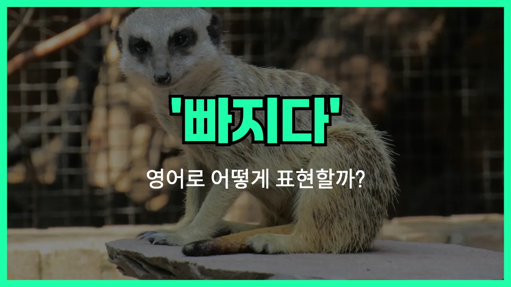

## 🌟 영어 표현 - sit out

안녕하세요 👋 오늘은 '빠지다', '결석하다'라는 뜻을 가진 영어 표현을 소개해드릴게요. 바로 '**sit out**'이에요. 이 표현은 어떤 활동이나 행사, 경기 등에 **참여하지 않고 빠지는 상황**을 말할 때 자주 사용돼요!

예를 들어, 친구들이 농구를 하자고 했는데 몸이 안 좋아서 참여하지 않을 때 "I'll sit out this game."이라고 말할 수 있어요. 즉, 이번 게임에는 빠지겠다는 의미에요.

또한, 회의나 수업 등에서 잠시 자리를 비우거나 결석할 때도 자연스럽게 쓸 수 있어요. 'sit out'은 주로 **일시적으로 참여하지 않을 때** 사용된다는 점 기억해두세요!

## 📖 예문

1. "저는 이번 라운드는 빠질게요."

   "I'll sit out this round."

2. "그는 부상 때문에 경기를 빠졌어요."

   "He sat out the game [due to](/blog/in-english/335.due-to/) an injury."

## 💬 연습해보기

<ul data-interactive-list>

  <li data-interactive-item>
    오늘 좀 피곤해서 이번 라운드는 그냥 쉬려고 해요.
    I'm feeling kind of tired today, so I think I'll just sit out this round.
  </li>

  <li data-interactive-item>
    저번 주에 발목을 다쳐서 경기에 참가하지 못했어요.
    She hurt her ankle last week, so she has to sit out the game.
  </li>

  <li data-interactive-item>
    다음 경기 참여할 거예요? 아니면 쉬실 건가요?
    Hey, are you going to join the next match, or are you going to sit out?
  </li>

  <li data-interactive-item>
    노래방은 노래를 몰라서 안 가기로 했어요.
    He <a href="/blog/in-english/062.decide-to/">decided to</a> sit out karaoke night because he didn't know any of the songs.
  </li>

  <li data-interactive-item>
    솔직히 이번엔 그냥 빠질래요. 기분이 별로 안 좋아서요.
    <a href="/blog/in-english/336.honestly/">Honestly</a>, I'm gonna sit out this one. I'm not really in the mood.
  </li>

  <li data-interactive-item>
    테일러는 축구화 안 가져와서 연습에 못 나왔어요.
    Taylor had to sit out <a href="/blog/in-english/247.practice/">practice</a> since he <a href="/blog/in-english/023.forget/">forgot</a> his cleats.
  </li>

  <li data-interactive-item>
    정말 쉬고 싶은 거 맞아요? 다들 재밌어 보이는데.
    You sure you want to sit out? It looks like everyone's having fun.
  </li>

  <li data-interactive-item>
    우리 추가 선수가 필요했는데 마이크는 참여하지 않기로 했어요.
    We needed an <a href="/blog/in-english/265.extra/">extra</a> <a href="/blog/in-english/768.player/">player</a>, but Mike chose to sit out.
  </li>

  <li data-interactive-item>
    코치가 손목을 삐끗해서 쉬라고 했어요.
    The coach told him to sit out and rest after he twisted his wrist.
  </li>

  <li data-interactive-item>
    점심 먹고 배불러서 다음 배구 라운드는 빠질 거예요.
    I'm stuffed after lunch, so I'm going to sit out the next round of volleyball.
  </li>

</ul>

## 🤝 함께 알아두면 좋은 표현들

### take part in

'take part in'은 "참여하다" 또는 "참가하다"라는 뜻이에요. 어떤 활동이나 행사에 적극적으로 참여하는 것을 의미해요. 'sit out'의 반대되는 의미로, 빠지지 않고 함께 한다는 뉘앙스를 줘요.

- "Are you going to take part in the game tonight?"
- "오늘 밤 경기에는 참여할 거예요?"

### skip

'[skip](/blog/in-english/369.skip/)'은 "건너뛰다" 또는 "빠지다"라는 뜻이에요. 어떤 활동이나 모임에 일부러 참여하지 않고 빠지는 상황에서 자주 써요. 'sit out'과 비슷한 의미로, 가볍게 빠진다는 느낌을 줄 때 사용해요.

- "I think I'll skip the meeting today because I'm not feeling well."
- "오늘은 몸이 안 좋아서 회의는 빠질까 해요."

### join in

'[join in](/blog/in-english/603.join-in/)'은 "함께하다" 또는 "끼어들다"라는 뜻이에요. 어떤 활동이나 대화에 새로 참여하거나 합류할 때 쓰는 표현이에요. 'sit out'의 반대말로, 적극적으로 참여하는 상황에서 자주 사용돼요.

- "Why don't you join in the fun [instead of](/blog/in-english/169.instead-of/) sitting out?"
- "빠지지 말고 같이 재미있게 놀아요."

---

오늘은 '빠지다', '결석하다'라는 뜻을 가진 영어 표현 'sit out'에 대해 알아봤어요. 앞으로 모임이나 활동에 참여하지 않을 때 이 표현을 활용해보면 좋겠어요 😊

오늘 배운 표현과 예문들을 꼭 최소 3번씩 소리 내서 읽어보세요. 다음에도 더 재미있고 유익한 영어 표현으로 찾아올게요! 감사합니다!

