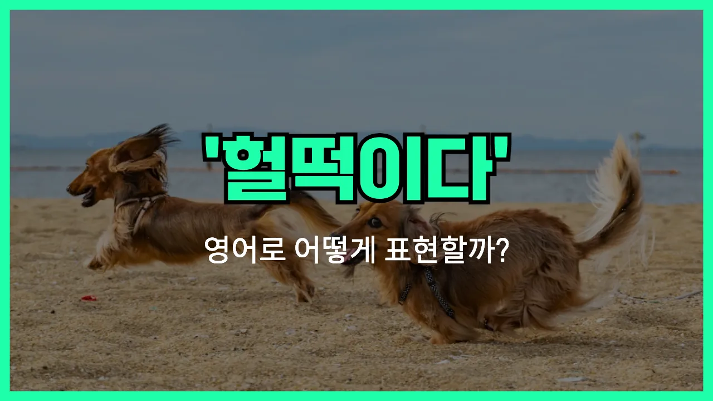

## 🌟 영어 표현 - gasp for air

안녕하세요 👋 오늘은 '**숨을 헐떡이다**'라는 뜻을 가진 영어 표현을 소개해드릴게요. 바로 '**gasp for air**'라는 표현이에요.

이 표현은 **숨이 차서 숨을 크게 들이마시거나, 숨을 쉬기 힘들 때** 자주 사용돼요. 예를 들어, 운동을 심하게 한 후나, 무언가에 놀라서 숨이 막힐 때 쓸 수 있어요.

'Gasp'는 '숨을 헐떡이다', '숨을 급하게 들이마시다'라는 뜻이고, 'for air'는 '공기를 위해'라는 의미에요. 그래서 합치면 '공기를 얻으려고 숨을 헐떡이다'라는 느낌이 돼요.

이 표현은 영화나 드라마에서도 자주 들을 수 있고, 일상 대화에서도 자연스럽게 쓸 수 있어요!

## 📖 예문

1. "운동 후에 숨을 헐떡이고 있었어요."

   "I was gasping for air after the workout."

2. "그녀는 계단을 뛰어오르고 나서 숨을 헐떡였어요."

   "She was gasping for air after running up the stairs."

## 💬 연습해보기

<ul data-interactive-list>

  <li data-interactive-item>
    계단을 뛰어 올라갔더니 숨이 턱 막혀서 간신히 숨을 쉬었어요.
    After running up the stairs, I was totally out of breath and had to gasp for air.
  </li>

  <li data-interactive-item>
    그 사람이 실수로 수영장에 빠져서 허우적거리며 숨을 몰아쉬었어요.
    He fell into the pool by accident and came up gasping for air.
  </li>

  <li data-interactive-item>
    그녀 농담에 너무 빵 터져서 숨 쉴 틈도 없이 웃었어요.
    We <a href="/blog/in-english/321.laugh/">laughed</a> so hard at her joke that I started to gasp for air.
  </li>

  <li data-interactive-item>
    그 빡센 운동 끝나고 나서는 완전 숨이 가빠서 죽는 줄 알았어요.
    I was gasping for air after finishing that <a href="/blog/in-english/183.tough/">tough</a> workout. It was <a href="/blog/in-english/405.brutal/">brutal</a>.
  </li>

  <li data-interactive-item>
    엘리베이터 정전됐을 때 갇힌 느낌이 들면서 진짜 숨 막힐 것 같았어요.
    When the power went out in the elevator, I felt trapped and just wanted to gasp for air.
  </li>

  <li data-interactive-item>
    우리 강아지는 강아지 공원에서 너무 신나서 막 뛰다가 숨을 헐떡일 때가 있어요.
    My dog gets excited at the dog <a href="/blog/in-english/463.park/">park</a> and <a href="/blog/in-english/270.sometimes/">sometimes</a> runs so much he <a href="/blog/vocab-1/039.end-up/">ends up</a> gasping for air.
  </li>

  <li data-interactive-item>
    영화가 너무 긴장감 넘쳐서 마지막 장면에서 숨이 턱 막혔어요.
    The movie was so intense, I actually gasped for air during the final scene.
  </li>

  <li data-interactive-item>
    그녀는 물속에서 너무 오래 숨 참다가 갑자기 튀어나와서 허구헌날 숨을 몰아쉬었어요.
    She <a href="/blog/in-english/388.hold/">held</a> her breath underwater for way too long, then shot up and gasped for air.
  </li>

  <li data-interactive-item>
    조카를 마당 이리저리 쫓아다니다 보니 숨이 턱 막힐 정도였어요.
    After chasing my little nephew all over the yard, I was <a href="/blog/in-english/402.leave/">left</a> gasping for air.
  </li>

  <li data-interactive-item>
    그 롤러코스터가 너무 빨라서 내내 소리 지르면서 숨을 헐떡였어요.
    That rollercoaster went so fast, I was screaming and gasping for air the entire ride.
  </li>

</ul>

## 🤝 함께 알아두면 좋은 표현들

### catch one's breath

'catch one's breath'는 "숨을 고르다" 또는 "숨을 돌리다"라는 뜻이에요. 숨이 차거나 힘든 일을 한 후에 잠깐 멈춰서 천천히 숨을 쉬며 회복하는 상황에서 자주 써요.

- "After running up the stairs, I had to stop to catch my breath."
- "계단을 뛰어 올라간 후에 잠깐 멈춰서 숨을 고르게 됐어요."

### out of breath

'out of breath'는 "숨이 찬" 또는 "헉헉거리는" 상태를 나타내요. 주로 운동을 하거나 급하게 움직인 후에 숨이 가빠진 상황에서 사용해요.

- "She was out of breath after chasing her dog around the park."
- "공원에서 강아지를 쫓아다닌 후에 숨이 차서 헉헉거렸어요."

### breathe easily

'[breathe](/blog/in-english/596.breathe/) easily'는 "숨을 편하게 쉬다"라는 뜻으로, 숨이 막히거나 힘든 상황이 끝나고 나서 안도하며 편하게 숨을 쉴 수 있게 된 상황을 말해요. 주로 긴장이나 걱정이 풀렸을 때도 사용해요.

- "Once the test was over, I could [finally](/blog/in-english/182.finally/) breathe easily."
- "시험이 끝나고 나니까 드디어 숨을 편하게 쉴 수 있었어요."

---

오늘은 '**숨을 헐떡이다**'라는 뜻의 영어 표현 '**gasp for air**'에 대해 알아봤어요. 운동하거나 놀랐을 때 이 표현을 떠올려보면 좋겠어요 😊

오늘 배운 표현과 예문들을 꼭 최소 3번씩 소리 내서 읽어보세요. 다음에도 더 재미있고 유익한 영어 표현으로 찾아올게요! 감사합니다!

