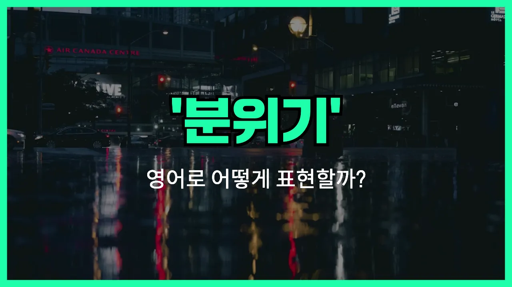

## 🌟 영어 표현 - vibe

안녕하세요 👋 오늘은 일상에서 자주 쓰이는 영어 표현 '**vibe**'에 대해 이야기해보려고 해요. '분위기', '느낌', '기운'과 같은 의미를 가진 단어인데요, 요즘 정말 많이 들을 수 있는 표현이에요.

'**vibe**'는 어떤 장소, 사람, 상황에서 느껴지는 **특유의 분위기나 감정**을 말할 때 사용해요. 예를 들어, 카페에 들어갔을 때 아늑하고 편안한 느낌이 들면 "이 카페 분위기 너무 좋아요!"라고 하잖아요? 이럴 때 영어로는 "I love the vibe of this cafe!"라고 표현할 수 있어요.

또한, 'vibe'는 긍정적인 느낌뿐만 아니라, 뭔가 이상하거나 불편한 분위기를 말할 때도 쓸 수 있어요. 예를 들어, "오늘 회의 분위기 좀 이상했어요."는 "There was a [weird](/blog/in-english/296.weird/) vibe in the meeting today."라고 할 수 있어요.

'Vibe'는 명사로도 쓰이고, 'vibe with'처럼 동사로도 쓰여서 "나랑 잘 맞는다"는 의미로도 활용할 수 있어요. 정말 유용한 표현이죠!

## 📖 예문

1. "이 파티 분위기 정말 좋아요."

   "I really like the vibe of this party."

2. "그 사람은 긍정적인 분위기를 가지고 있어요."

   "She has a positive vibe."

3. "우리 서로 잘 맞는 것 같아요."

   "We vibe well [together](/blog/in-english/374.together/)."

## 💬 연습해보기

<ul data-interactive-list>

  <li data-interactive-item>
    이 커피숍 분위기가 너무 좋아요. 완전 편안한 느낌이에요.
    I really like the vibe at this coffee shop. It just feels so <a href="/blog/in-english/867.chill/">chill</a>.
  </li>

  <li data-interactive-item>
    어젯밤 파티 분위기 진짜 재밌었어요. 모두 다 춤추고 웃고 있었거든요.
    That party last night had such a fun vibe. Everyone was dancing and <a href="/blog/in-english/321.laugh/">laughing</a>.
  </li>

  <li data-interactive-item>
    이 식당은 아늑한 분위기예요. 여기서 하루 종일 있고 싶을 정도예요.
    This restaurant has a <a href="/blog/in-english/408.cozy/">cozy</a> vibe. I could stay here all day.
  </li>

  <li data-interactive-item>
    그 친구 정말 긍정적인 에너지가 느껴져요. 친근한 게 바로 알 수 있어요.
    She gives off a really positive vibe. You can tell she's friendly right away.
  </li>

  <li data-interactive-item>
    오늘 해변 분위기 완전 편안해요. 파도 소리가 정말 멋져요.
    The beach has a relaxing vibe today. The waves sound amazing.
  </li>

  <li data-interactive-item>
    그 사람이 갑자기 다투기 시작해서 분위기가 좀 깨졌어요.
    He kind of ruined the vibe when he started <a href="/blog/in-english/132.argue/">arguing</a> with everyone.
  </li>

  <li data-interactive-item>
    여기 분위기가 마음에 들지 않을지도 몰라요. 뭔가 좀 이상하게 느껴져요.
    I'm not sure if I like the vibe of this place. It feels a little weird to me.
  </li>

  <li data-interactive-item>
    걔네 집 분위기 좋아요. 항상 따뜻하게 맞아줘요.
    Their house has a good vibe. It's always so welcoming.
  </li>

  <li data-interactive-item>
    여기 분위기 좀 바꿔 볼까요? 음악 좀 틀어도 될까요?
    Let's change up the vibe in here. Can we play some music?
  </li>

  <li data-interactive-item>
    밤에 도시 분위기 너무 좋아해요. 모든 게 활기차게 살아나는 것 같아요.
    I love the city's vibe at night. Everything just comes alive.
  </li>

</ul>

## 🤝 함께 알아두면 좋은 표현들

### atmosphere

'atmosphere'는 '분위기'를 의미하는 단어로, 특정 장소나 상황에서 느껴지는 전체적인 기운이나 느낌을 말해요. 'vibe'보다 조금 더 공식적이고, 공간이나 모임의 전반적인 느낌을 표현할 때 자주 사용돼요.

- "The restaurant has a cozy atmosphere that makes you want to stay longer."
- "그 식당은 아늑한 분위기라서 오래 머물고 싶어져요."

### energy

'energy'는 '에너지'라는 뜻이지만, 사람들이 모인 곳에서 느껴지는 활기나 분위기를 표현할 때도 자주 써요. 'vibe'와 비슷하게 긍정적이거나 특별한 느낌을 강조할 때 사용해요.

- "I love the positive energy in this room."
- "이 방의 긍정적인 분위기가 정말 좋아요."

### tension

'tension'은 '긴장감'이나 '불편한 분위기'를 의미해요. 'vibe'가 보통 긍정적이거나 중립적인 분위기를 나타낸다면, 'tension'은 불편하거나 어색한 분위기를 강조할 때 쓰는 반대 표현이에요.

- "There was a lot of tension in the meeting after the argument."
- "회의에서 언쟁이 있은 후에 분위기가 많이 어색해졌어요."

---

오늘은 '분위기', '느낌', '기운'이라는 뜻을 가진 영어 표현 '**vibe**'에 대해 알아봤어요. 앞으로 누군가의 분위기나 장소의 느낌을 말하고 싶을 때 이 표현을 꼭 활용해보세요! 😊

오늘 배운 표현과 예문들을 꼭 최소 3번씩 소리 내서 읽어보세요. 다음에도 더 재미있고 유익한 영어 표현으로 찾아올게요! 감사합니다!
