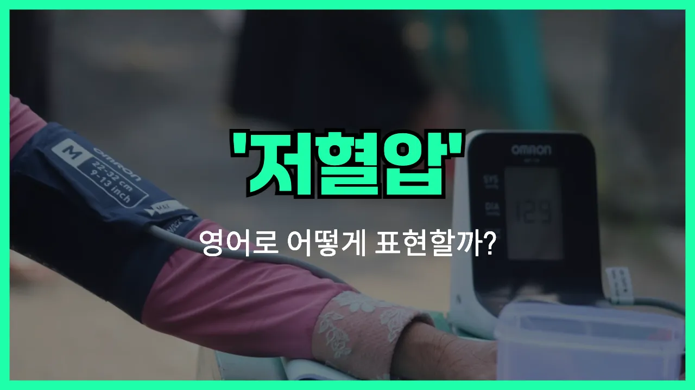

## 🌟 영어 표현 - hypotension

안녕하세요 👋 오늘은 '**저혈압**'이라는 뜻을 가진 영어 표현을 소개해드리려고 해요. 바로 '**hypotension**'이에요. 이 단어는 혈압이 정상보다 낮은 상태를 의미해요. 즉, **혈압이 부족하거나 낮아서 어지러움, 피로감** 등이 나타날 때 사용할 수 있는 표현이에요!

'hypotension'은 주로 의학적인 상황에서 많이 쓰여요. 예를 들어, 병원에서 혈압을 측정했을 때 정상 수치보다 낮게 나오면 "You have hypotension."이라고 말할 수 있어요.

또한, 일상 대화에서는 "My [blood pressure](/blog/in-english/585.blood-pressure/) is low."라고도 표현할 수 있어요. 하지만 공식적인 진단이나 의학적 설명에서는 'hypotension'이라는 단어가 더 적합해요.

## 📖 예문

1. "그녀는 저혈압 때문에 자주 어지러워요."

   "She [often](/blog/in-english/326.often/) feels [dizzy](/blog/in-english/776.dizzy/) because of hypotension."

2. "의사가 저혈압 진단을 내렸어요."

   "The [doctor](/blog/in-english/563.doctor/) diagnosed her with hypotension."

## 💬 연습해보기

<ul data-interactive-list>

  <li data-interactive-item>
    의사 선생님이 저한테 저혈압이라고 하셨는데, 그냥 혈압이 평소보다 낮다는 뜻이에요.
    My doctor said I have hypotension, which just means my blood pressure's lower than normal.
  </li>

  <li data-interactive-item>
    가끔 갑자기 일어설 때 어지러운 건 저혈압 때문인 것 같아요.
    <a href="/blog/in-english/270.sometimes/">Sometimes</a> I get dizzy when I stand up fast because of my hypotension.
  </li>

  <li data-interactive-item>
    병원에서 혈압 재고 저혈압이라고 알려줬어요.
    They checked my blood pressure at the clinic and told me it was hypotension.
  </li>

  <li data-interactive-item>
    저혈압이 뭔지 간호사가 설명해주기 전까지는 몰랐거든요.
    I didn't even know what hypotension was until my <a href="/blog/in-english/564.nurse/">nurse</a> explained it to me.
  </li>

  <li data-interactive-item>
    머리가 핑 돌 때마다 저혈압이 심해진 건가 싶어요.
    Whenever I feel lightheaded, I <a href="/blog/in-english/220.wonder-if/">wonder if</a> it's my hypotension acting up.
  </li>

  <li data-interactive-item>
    저혈압 때문에 기운 없어서 잠깐 앉아 있어야 했어요.
    He had to sit down for a while because his hypotension made him feel faint.
  </li>

  <li data-interactive-item>
    지난 여름에 할머니가 심한 저혈압으로 입원하셨었어요.
    Last summer, my grandma was hospitalized for severe hypotension.
  </li>

  <li data-interactive-item>
    사람들은 보통 고혈압 걱정만 하는데, 저혈압도 문제될 수 있거든요.
    People usually <a href="/blog/in-english/209.worry-about/">worry about</a> high blood pressure, but hypotension can be a problem, too.
  </li>

  <li data-interactive-item>
    저는 물을 많이 마셔야 저혈압 증상이 심해지지 않아요.
    I have to drink plenty of water or my hypotension <a href="/blog/in-english/234.get-worse/">gets worse</a>.
  </li>

  <li data-interactive-item>
    저혈압이 자꾸 반복되면 병원에 가보는 게 좋겠어요.
    If hypotension keeps happening, it's a good idea to <a href="/blog/in-english/423.see-a-doctor/">see a doctor</a> about it.
  </li>

</ul>

## 🤝 함께 알아두면 좋은 표현들

### low blood pressure

'low blood pressure'는 'hypotension'의 일상적인 표현으로, 혈압이 정상보다 낮은 상태를 의미해요. 주로 어지러움, 피로감, 기운 없음 등의 증상과 함께 사용돼요.

- "She often feels dizzy because she has low blood pressure."
- "그녀는 저혈압이 있어서 자주 어지러움을 느껴요."

### hypertension

'[hypertension](/blog/in-english/775.hypertension/)'은 '고혈압'을 의미하며, 'hypotension(저혈압)'의 반대 개념이에요. 혈압이 정상보다 높아서 건강에 위험이 될 수 있는 상태를 말해요.

- "My father takes [medicine](/blog/in-english/567.medicine/) every day to control his hypertension."
- "우리 아버지는 고혈압을 조절하려고 매일 약을 드셔요."

### normal blood pressure

'normal blood pressure'는 정상 혈압을 의미해요. 저혈압(hypotension)이나 고혈압(hypertension)과 달리, 건강한 범위 내의 혈압 상태를 나타낼 때 사용해요.

- "Regular exercise helps maintain normal blood pressure."
- "규칙적으로 운동하면 정상 혈압을 유지하는 데 도움이 돼요."

---

오늘은 '**저혈압**'이라는 뜻을 가진 영어 표현 '**hypotension**'에 대해 알아봤어요. 혹시 혈압이 낮아서 불편함을 느낄 때 이 표현을 떠올리면 좋겠어요 😊

오늘 배운 표현과 예문들을 꼭 최소 3번씩 소리 내서 읽어보세요. 다음에도 더 재미있고 유익한 영어 표현으로 찾아올게요! 감사합니다!

