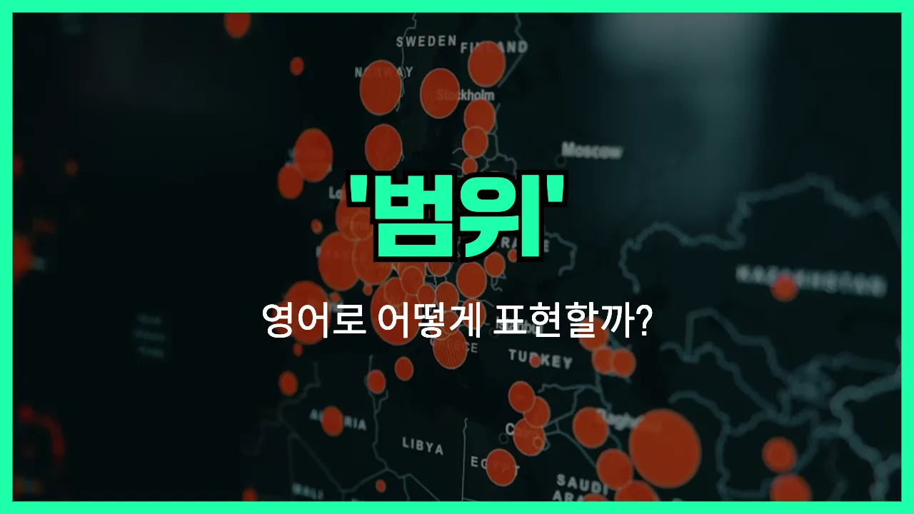

## 🌟 영어 표현 - coverage

안녕하세요 👋 오늘은 영어에서 자주 쓰이는 단어 '**coverage**'에 대해 알아보려고 해요. 이 단어는 우리말로 '**범위**', '**적용**', '**포괄**'과 같은 뜻을 가지고 있어요.

'Coverage'는 어떤 것이 미치는 범위, 즉 **어디까지 포함하고 있는지**를 나타낼 때 사용해요. 예를 들어, 보험이 보장하는 범위, 뉴스가 다루는 영역, 혹은 휴대폰 신호가 닿는 지역 등 다양한 상황에서 쓸 수 있어요!

예를 들어, "이 보험은 치과 치료도 포함돼요?"라고 물을 때, "Does this [insurance](/blog/in-english/580.insurance/) [provide](/blog/in-english/743.provide/) dental coverage?"라고 할 수 있어요. 또, "이 지역은 5G 커버리지가 잘 돼요."라고 말하고 싶을 때, "This area has good 5G coverage."라고 표현할 수 있어요.

## 📖 예문

1. "이 정책의 적용 범위는 어디까지인가요?"

   "What is the coverage of this [policy](/blog/in-english/623.policy/)?"

2. "뉴스에서 이번 사건을 폭넓게 다뤘어요."

   "The [news](/blog/in-english/536.news/) provided extensive coverage of the incident."

## 💬 연습해보기

<ul data-interactive-list>

  <li data-interactive-item>
    나 새 폰 요금제 바꿨는데, 우리 동네 커버리지가 훨씬 좋아졌어.
    I just got a new phone plan. The coverage is way better in my area now.
  </li>

  <li data-interactive-item>
    산길 따라 차 몰고 갔는데 신호가 완전 끊겨서 통신 안 됐어.
    We <a href="/blog/in-english/457.lose/">lost</a> coverage when we drove through the mountains. There was no signal at all.
  </li>

  <li data-interactive-item>
    너 보험에 치과도 포함돼 있는지 알아?
    Do you know if your insurance coverage <a href="/blog/in-english/522.include/">includes</a> dental?
  </li>

  <li data-interactive-item>
    난 이 뉴스 채널이 좋아, 날씨 보도 디테일하게 잘 해줘.
    I'm happy with this news channel. Their weather coverage is really detailed.
  </li>

  <li data-interactive-item>
    도시 몇 군데는 인터넷 커버가 아직 좀 불안정해.
    Some parts of the city <a href="/blog/in-english/254.still/">still</a> have spotty internet coverage.
  </li>

  <li data-interactive-item>
    병원 가기 전에 건강보험 적용 범위 다시 한번 확인했어.
    I had to double-check my health insurance coverage before I went to the <a href="/blog/in-english/563.doctor/">doctor</a>.
  </li>

  <li data-interactive-item>
    우리 집 와이파이, 침실 쪽은 신호가 좀 약해.
    The Wi-Fi coverage in my apartment isn't great in the bedroom.
  </li>

  <li data-interactive-item>
    지난 주말 음악 페스티벌 취재한 기자 분 보도 정말 멋졌어.
    That reporter did some awesome coverage of the music festival last weekend.
  </li>

  <li data-interactive-item>
    감염병 막으려면 백신 접종률 더 높여야 해.
    We need better vaccine coverage if we're going to stop the outbreak.
  </li>

  <li data-interactive-item>
    내 일터는 시력과 치과 보험도 잘 돼 있어서 좋아.
    My job offers good coverage for vision and dental, so that's a plus.
  </li>

</ul>

## 🤝 함께 알아두면 좋은 표현들

### scope

'scope'는 "범위" 또는 "영역"이라는 뜻으로, 어떤 주제나 활동이 미치는 한계나 범위를 나타낼 때 사용해요. 'coverage'와 비슷하게 사용되지만, 좀 더 추상적이거나 개념적인 범위를 말할 때 자주 써요.

- "The scope of this project includes both research and development."
- "이 프로젝트의 범위에는 연구와 개발이 모두 포함돼 있어요."

### limit

'limit'는 "한계" 또는 "제한"이라는 뜻으로, 어떤 것이 미칠 수 있는 최대치나 경계선을 강조할 때 사용해요. 'coverage'가 넓게 퍼지는 범위를 의미한다면, 'limit'는 그 범위의 끝, 즉 더 이상 넘어갈 수 없는 선을 나타내는 반대 개념이에요.

- "There is a limit to the coverage provided by this insurance policy."
- "이 보험이 제공하는 보장 범위에는 한계가 있어요."

### out of reach

'[out of reach](/blog/vocab-1/034.out-of-reach/)'는 "손이 닿지 않는" 또는 "범위 밖에 있는"이라는 뜻이에요. 즉, 'coverage'가 미치지 못하는 영역이나 범위 밖에 있는 것을 말할 때 쓰는 표현이에요.

- "Some remote areas are still out of reach of internet coverage."
- "일부 외진 지역은 아직 인터넷 범위 밖에 있어요."

---

오늘은 '**범위**', '**적용**', '**포괄**'이라는 뜻을 가진 영어 표현 '**coverage**'에 대해 알아봤어요. 일상에서 보험, 뉴스, 통신 등 다양한 상황에서 쓸 수 있으니 꼭 기억해 두세요 😊

오늘 배운 표현과 예문들을 소리 내서 여러 번 읽어보면 더 쉽게 익힐 수 있어요. 다음에도 더 유익한 영어 표현으로 찾아올게요! 감사합니다!

