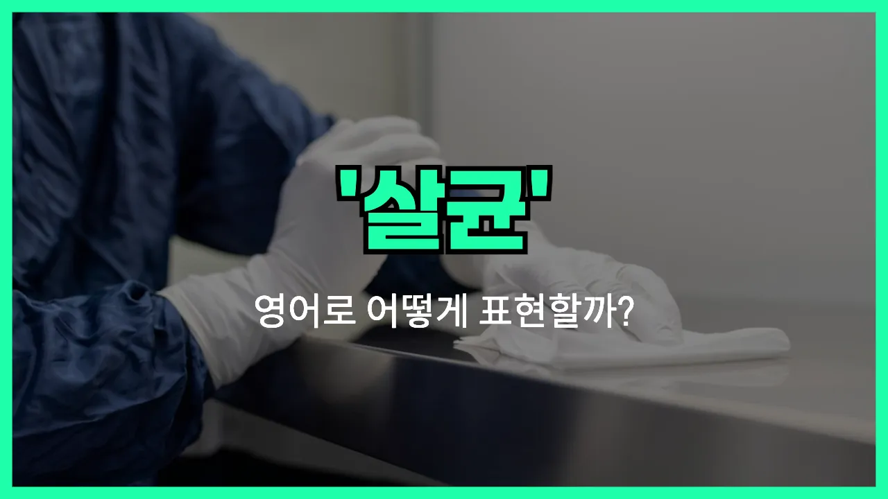

## 🌟 영어 표현 - sterilization

안녕하세요 👋 오늘은 일상에서 자주 듣는 단어인 '**살균**'을 영어로 어떻게 표현하는지 알아보려고 해요. 바로 '**sterilization**'이라는 단어인데요. 이 단어는 **세균이나 바이러스 등 유해한 미생물을 완전히 제거하는 과정**을 의미해요.

'**Sterilization**'은 병원, 실험실, 식품 산업 등 다양한 분야에서 위생을 위해 꼭 필요한 과정이에요. 예를 들어, 의료기구를 사용할 때 감염을 막기 위해 반드시 살균을 하죠. 또, 집에서 젖병이나 식기류를 끓는 물에 소독할 때도 이 단어를 쓸 수 있어요.

비슷한 의미로 '**disinfection**(소독)'이나 '**sanitization**(위생 처리)'도 있지만, sterilization은 **완전히** 미생물을 제거한다는 점에서 더 강한 의미를 가지고 있어요!

## 📖 예문

1. "이 의료기구는 사용 전에 반드시 살균해야 해요."

   "This medical instrument must be sterilized before use."

2. "병원에서는 모든 수술 도구를 고온에서 살균해요."

   "All surgical tools are sterilized at high temperatures in hospitals."

## 💬 연습해보기

<ul data-interactive-list>

  <li data-interactive-item>
    수술 끝나고 나서 모든 도구를 멸균했어요. 감염 걱정해서 정말 꼼꼼하게 했답니다.
    After the <a href="/blog/in-english/572.surgery/">surgery</a>, all the tools went through sterilization. We want to be <a href="/blog/in-english/265.extra/">extra</a> safe about <a href="/blog/in-english/577.infection/">infections</a>.
  </li>

  <li data-interactive-item>
    요리사분은 항상 조리 전에 장비 멸균을 철저히 해요. 여기 보건 검사관분들이 진짜 엄격하시거든요.
    The chef always <a href="/blog/in-english/232.make-sure/">makes sure</a> all the equipment gets sterilization before <a href="/blog/in-english/461.cook/">cooking</a>. Health inspectors are really <a href="/blog/in-english/275.strict/">strict</a> here.
  </li>

  <li data-interactive-item>
    치과의사분이 모든 도구는 멸균이 얼마나 중요한지 계속 강조했어요.
    The dentist talked about the importance of sterilization for every instrument.
  </li>

  <li data-interactive-item>
    어딘가에서 읽었는데, 제대로 멸균하면 세균 전파를 확 줄일 수 있다고 하더라고요.
    I <a href="/blog/in-english/436.read/">read</a> somewhere that proper sterilization can really reduce the spread of germs.
  </li>

  <li data-interactive-item>
    공장에서 멸균 과정이 빠져서 문제가 있었대요. 그래서 제품 몇 개를 리콜해야 했다고 해요.
    There was a problem at the factory because the sterilization process was skipped. They had to recall some products.
  </li>

  <li data-interactive-item>
    병원에서는 환자 안전 위해 멸균에 진짜 많은 비용을 쓰고 있어요.
    Hospitals <a href="/blog/in-english/258.spend/">spend</a> a lot of money on sterilization to keep <a href="/blog/in-english/562.patient/">patients</a> safe.
  </li>

  <li data-interactive-item>
    식품 가공에서 멸균이 어떻게 이루어지는지 아세요? 생각보다 엄청 신기해요.
    Do you know how sterilization works in food processing? It's actually pretty cool.
  </li>

  <li data-interactive-item>
    가정용 양조가 늘면서 병 멸균이 엄청 중요한 이슈가 됐어요.
    With the increase in home brewing, sterilization of bottles has become a big deal.
  </li>

  <li data-interactive-item>
    우리 연구실은 자외선(UV)으로 멸균하는데, 빠르고 효과가 좋거든요.
    We use UV light for sterilization in our lab. It's fast and <a href="/blog/in-english/277.effective/">effective</a>.
  </li>

  <li data-interactive-item>
    보호소에서 반려동물을 입양할 때 멸균에 대해 질문하더라고요.
    She was asking about sterilization when she adopted her pet from the shelter.
  </li>

</ul>

## 🤝 함께 알아두면 좋은 표현들

### disinfection

'disinfection'은 "소독"이라는 뜻으로, 살균과 비슷하지만 모든 미생물을 완전히 제거하는 살균과 달리, 해로운 미생물만 죽이거나 줄이는 것을 의미해요. 주로 병원이나 가정에서 위생을 위해 자주 쓰는 표현이에요.

- "We use alcohol wipes for disinfection before giving an injection."
- "주사를 놓기 전에 알코올 솜으로 소독을 해요."

### contamination

'contamination'은 "오염"이라는 뜻으로, 살균의 반대 개념이에요. 깨끗한 환경이나 물건에 세균, 바이러스, 먼지 등이 들어가 더럽혀지는 상황을 나타낼 때 사용해요.

- "Food [left](/blog/in-english/402.leave/) uncovered can [lead to](/blog/vocab-1/004.lead-to/) contamination by bacteria."
- "음식을 덮지 않고 두면 박테리아에 오염될 수 있어요."

### sanitize

'sanitize'는 "위생적으로 처리하다" 또는 "살균하다"라는 뜻이에요. 살균과 비슷하지만, 완벽하게 모든 미생물을 없애기보다는 안전한 수준까지 줄이는 데 초점을 둔 표현이에요. 일상에서 손이나 물건을 깨끗하게 할 때 자주 써요.

- "Please sanitize your hands before entering the kitchen."
- "주방에 들어가기 전에 손을 깨끗이 소독해 주세요."

---

오늘은 '**살균**'이라는 뜻을 가진 영어 표현 '**sterilization**'에 대해 알아봤어요. 위생과 건강을 지키는 데 꼭 필요한 단어니까 기억해두면 좋겠어요 😊

오늘 배운 표현과 예문들을 꼭 최소 3번씩 소리 내서 읽어보세요. 다음에도 더 재미있고 유익한 영어 표현으로 찾아올게요! 감사합니다!
