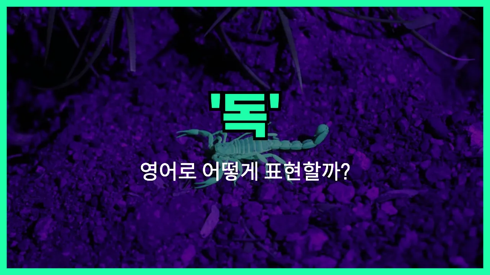

## 🌟 영어 표현 - poison

안녕하세요 👋 오늘은 '독', '독약'이라는 뜻을 가진 영어 표현을 알아보려고 해요. 바로 '**poison**'이라는 단어인데요~

'**poison**'은 사람이나 동물의 몸에 해를 끼치거나 죽게 만드는 **유해한 물질**을 의미해요. 우리가 흔히 생각하는 독약, 또는 음식이나 음료에 들어가면 위험한 성분을 말할 때 사용해요~

이 단어는 명사로 '독', '독약'이라는 뜻으로 쓰이고, 동사로는 '독을 넣다', '중독시키다'라는 의미로도 활용돼요. 예를 들어, "He put poison in the drink."라고 하면 "그가 음료에 독을 넣었어."라는 뜻이에요~

또한, 'poisonous'라는 형용사 형태로 '유독한', '독이 있는'이라는 뜻도 있으니 함께 알아두면 좋아요!

## 📖 예문

1. "그 음식에는 독이 들어 있어요."

   "There is poison in the food."

2. "그 뱀은 매우 독이 있어요."

   "That snake is very poisonous."

## 💬 연습해보기

<ul data-interactive-list>

  <li data-interactive-item>
    요즘 회사 드라마 때문에 분위기가 점점 안 좋아지는 것 같아요.
    I think that drama at work is really starting to poison the atmosphere around here.
  </li>

  <li data-interactive-item>
    부정적인 말로 대화 분위기 망치지 말아요. 다들 그냥 편하게 쉬고 싶은 거니까요.
    Try not to poison the conversation with negativity. Everyone's just <a href="/blog/in-english/117.try-to/">trying to</a> relax.
  </li>

  <li data-interactive-item>
    그 사람이 일부러 그런 건 아닌데 태도가 좀 분위기를 흐리긴 했어요.
    He didn't mean to, but his attitude sort of poisoned the mood.
  </li>

  <li data-interactive-item>
    가십이 너무 많으면 조심하지 않으면 친구 사이도 틀어질 수 있거든요.
    All that <a href="/blog/in-english/164.gossip/">gossip</a> can really poison friendships if you're not careful.
  </li>

  <li data-interactive-item>
    한 번 안 좋은 평이 나오면 새 식당에 대한 사람들 인식이 뚝 떨어지는 게 신기해요.
    It's amazing how one bad <a href="/blog/in-english/251.review/">review</a> can poison people's <a href="/blog/in-english/527.opinion/">opinions</a> of a new restaurant.
  </li>

  <li data-interactive-item>
    댓글 보려고 해요? 가끔은 그런 게 하루 기분 망치게 하거든요.
    Are you sure you want to <a href="/blog/in-english/436.read/">read</a> the comments? <a href="/blog/in-english/270.sometimes/">Sometimes</a> they just poison your day.
  </li>

  <li data-interactive-item>
    온라인에 부정적인 글 보면 뭔가 의욕이 확 줄어들죠.
    Seeing all that negativity online just poisons my <a href="/blog/in-english/306.motivation/">motivation</a> to get things done.
  </li>

  <li data-interactive-item>
    저녁 식사 자리에서 정치 얘기로 분위기 망치지 말아요.
    Let's not poison the whole evening by <a href="/blog/in-english/132.argue/">arguing</a> about <a href="/blog/in-english/607.politics/">politics</a> at dinner.
  </li>

  <li data-interactive-item>
    톡식한 직장 동료가 있으면 일하는 경험 자체가 힘들어져요.
    Having a toxic coworker can really poison your <a href="/blog/in-english/415.experience/">experience</a> at a job.
  </li>

  <li data-interactive-item>
    계속 그 생각만 하면 행복도 점점 사라질 거예요.
    If you keep dwelling on it, it's only going to poison your happiness.
  </li>

</ul>

## 🤝 함께 알아두면 좋은 표현들

### toxic

'toxic'은 "독성이 있는" 또는 "유해한"이라는 뜻이에요. 'poison'과 비슷하게 사람이나 동물, 환경에 해를 끼칠 수 있는 물질이나 상황을 묘사할 때 자주 사용해요. 또한, 비유적으로도 사람이나 관계가 해롭거나 부정적일 때도 써요.

- "Be careful, some cleaning products are toxic if inhaled."
- "조심하세요, 어떤 청소용품은 들이마시면 유해해요."

### antidote

'antidote'는 "해독제"라는 뜻으로, 'poison'의 반대 개념이에요. 독에 중독되었을 때 그 독을 중화시키거나 치료하는 약을 말해요. 비유적으로도 문제를 해결하는 방법이나 해답을 의미할 때 쓰이기도 해요.

- "The [doctor](/blog/in-english/563.doctor/) quickly administered an antidote after the snake bite."
- "의사 선생님이 뱀에 물린 후에 바로 해독제를 투여했어요."

### harmless

'harmless'는 "해가 없는" 또는 "무해한"이라는 뜻이에요. 'poison'과는 반대되는 의미로, 사람이나 동물, 환경에 전혀 해를 끼치지 않는 것을 나타낼 때 사용해요.

- "The spider may look scary, but it's actually harmless to humans."
- "그 거미가 무섭게 보일 수 있지만, 사실 사람에게는 전혀 해가 없어요."

---

오늘은 '독', '독약'이라는 뜻을 가진 영어 표현 '**poison**'에 대해 알아봤어요. 일상에서 위험한 물질이나 상황을 설명할 때 이 단어를 떠올리면 좋겠어요~ 😊

오늘 배운 표현과 예문들을 꼭 최소 3번씩 소리 내서 읽어보세요. 다음에도 더 재미있고 유익한 영어 표현으로 찾아올게요! 감사합니다!~요
