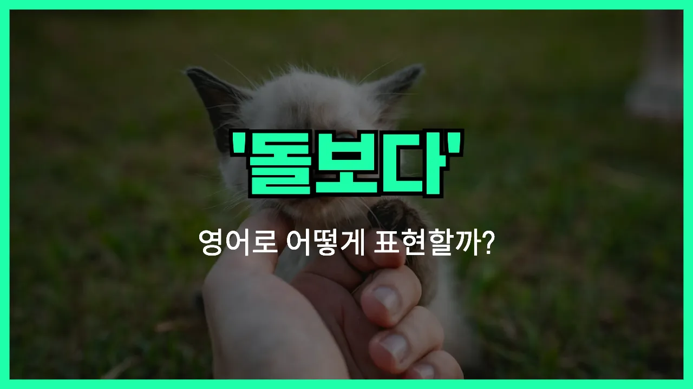

## 🌟 영어 표현 - look after

안녕하세요 👋 오늘은 일상에서 자주 쓰이는 표현인 '**돌보다**'의 영어 표현 '**look after**'에 대해 알아보려고 해요.

'**look after**'는 누군가를 **보살피거나, 챙기거나, 돌보는** 상황에서 쓰이는 아주 유용한 표현이에요. 예를 들어, 아픈 가족을 돌보거나, 아이를 봐주거나, 반려동물을 챙길 때 모두 사용할 수 있어요.

이 표현은 주로 사람이나 동물, 또는 어떤 사물을 책임지고 관리할 때 자연스럽게 쓸 수 있어요. 예를 들어, "Can you look after my dog while I'm away?"처럼요. 이럴 때 '내가 없는 동안 내 강아지 좀 돌봐줄 수 있어?'라는 의미가 돼요.

또한, 'look after'는 단순히 신체적인 돌봄뿐만 아니라, 누군가의 안부를 챙기거나, 관심을 기울이는 상황에도 쓸 수 있어요.

## 📖 예문

1. "엄마가 아기를 돌보고 있어요."

   "Mom is looking after the baby."

2. "휴가 동안 내 식물을 돌봐줄 수 있어요?"

   "Can you look after my plants while I'm on [vacation](/blog/in-english/516.vacation/)?"

## 💬 연습해보기

<ul data-interactive-list>

  <li data-interactive-item>
    이번 주말에 제가 없을 때 제 강아지 좀 돌봐줄 수 있어요? 정말 고마울 거예요.
    Can you look after my dog while I'm away this weekend? I'd really appreciate it.
  </li>

  <li data-interactive-item>
    오늘 밤 부모님이 돌아올 때까지 동생을 돌봐야 해요.
    I've got to look after my little brother until my parents get home tonight.
  </li>

  <li data-interactive-item>
    회의 중에 누가 아이들을 돌볼 건가요?
    Who's going to look after the kids during the meeting?
  </li>

  <li data-interactive-item>
    걱정 마세요, 휴가 동안 당신 식물들 제가 잘 돌볼게요.
    Don't worry, I'll look after your plants while you're on vacation.
  </li>

  <li data-interactive-item>
    엄마가 대학 갈 때 항상 나 자신을 잘 챙기라고 말씀해 주셨어요.
    My mom always <a href="/blog/in-english/114.remind/">reminded</a> me to look after myself when I <a href="/blog/in-english/402.leave/">left</a> for college.
  </li>

  <li data-interactive-item>
    잠깐 가방 좀 봐줄 수 있어요? 화장실 좀 다녀오려구요.
    Could you look after these bags for a minute? I need to use the restroom.
  </li>

  <li data-interactive-item>
    사라는 진짜 착해요, 항상 할머니 이웃 분을 잘 챙겨줘요.
    Sarah is so kind, she always looks after her elderly neighbor.
  </li>

  <li data-interactive-item>
    정말 혼자서 다 관리할 수 있어요?
    Are you sure you can look after everything by yourself?
  </li>

  <li data-interactive-item>
    펫을 키우면 잘 돌봐줘야 해요.
    When you get a pet, you have to look after it <a href="/blog/in-english/422.properly/">properly</a>.
  </li>

  <li data-interactive-item>
    제 일이 좀 바빠서 매일 많은 고객을 돌봐야 해요.
    My job is pretty demanding. I have to look after a lot of clients every day.
  </li>

</ul>

## 🤝 함께 알아두면 좋은 표현들

### take care of

'[take care of](/blog/in-english/330.take-care-of/)'는 'look after'와 비슷하게 **누군가나 무언가를 돌보다, 보살피다**라는 뜻이에요. 주로 아이, 동물, 환자, 또는 어떤 일이나 물건을 책임지고 관리할 때 사용해요.

- "Can you take care of my plants while I'm on vacation?"
- "내가 휴가 가 있는 동안 내 식물 좀 돌봐줄 수 있어요?"

### neglect

'neglect'는 'look after'의 반대말로, **돌보지 않다, 방치하다**라는 뜻이에요. 누군가나 무언가를 신경 쓰지 않고 내버려 두는 상황에서 사용해요.

- "If you neglect your health, you might get sick easily."
- "건강을 돌보지 않으면 쉽게 아플 수 있어요."

### watch over

'watch over'는 **누군가를 지켜보다, 보호하다**라는 의미로, 'look after'와 비슷하지만 좀 더 **감시하거나 보호하는 느낌**이 강해요. 주로 어린아이, 환자, 또는 위험에 처한 사람을 지켜볼 때 써요.

- "The teacher watched over the children during the field trip."
- "선생님이 소풍 가는 동안 아이들을 지켜봤어요."

---

오늘은 '**돌보다**', '**보살피다**', '**챙기다**'라는 뜻을 가진 영어 표현 '**look after**'에 대해 알아봤어요. 주변 사람이나 소중한 것들을 챙길 때 이 표현을 떠올려보면 좋겠어요 😊

오늘 배운 표현과 예문들을 꼭 최소 3번씩 소리 내서 읽어보세요. 다음에도 더 재미있고 유익한 영어 표현으로 찾아올게요! 감사합니다!
