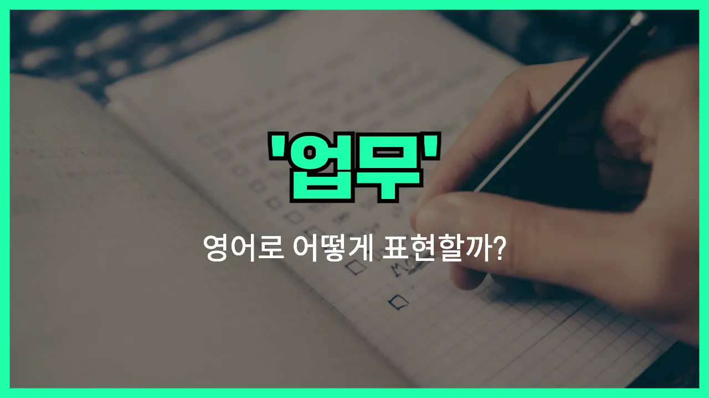

## 🌟 영어 표현 - task

안녕하세요 👋 오늘은 영어로 '업무'를 어떻게 표현하는지 알아보려고 해요. 바로 '**task**'라는 단어인데요~

'**task**'는 우리가 해야 할 일, 즉 **업무**나 **할 일**을 의미해요. 회사에서 맡은 일, 학교에서 해야 하는 과제, 집안일 등 다양한 상황에서 쓸 수 있는 단어예요~

이 단어는 주로 '해야 할 구체적인 일'이나 '지정된 임무'를 말할 때 사용돼요. 예를 들어, 상사가 "이 업무를 오늘까지 끝내 주세요"라고 할 때, 영어로는 "Please complete this task by today."라고 할 수 있어요~

또한, 여러 개의 업무가 있을 때는 'tasks'처럼 복수형으로도 자주 쓰여요. 예를 들어, "오늘 해야 할 업무가 많아요"는 "I have many tasks to do today."라고 표현할 수 있어요~

## 📖 예문

1. "이 업무를 내일까지 끝내야 해요."

   "I need to [finish](/blog/in-english/295.finish/) this task by tomorrow."

2. "오늘 해야 할 업무가 두 개 있어요."

   "I have two tasks to do today."

## 💬 연습해보기

<ul data-interactive-list>

  <li data-interactive-item>
    오늘 안에 끝내야 할 일이 엄청 많아서 오후가 엄청 길 것 같아요.
    I've got a bunch of tasks I need to finish before the end of the day. It's gonna be a long afternoon.
  </li>

  <li data-interactive-item>
    이 작업이 생각보다 훨씬 오래 걸리는데, 좀 도움을 받아야 할 것 같아요.
    This task is taking way longer than I thought. I might need some help with it.
  </li>

  <li data-interactive-item>
    매니저가 새 작업을 줬는데 솔직히 어디서부터 시작해야 할지 잘 모르겠어요.
    My manager just assigned me a new task, and <a href="/blog/in-english/336.honestly/">honestly</a>, I'm not too sure how to start.
  </li>

  <li data-interactive-item>
    어제 이야기한 그 작업 세부사항 좀 보내줄래요? 제대로 이해하고 싶어요.
    Can you <a href="/blog/in-english/292.send/">send</a> me the details for that task you mentioned yesterday? I want to <a href="/blog/in-english/232.make-sure/">make sure</a> I understand everything.
  </li>

  <li data-interactive-item>
    과제를 마지막 순간까지 잊어버리면 너무 스트레스 받아요.
    I <a href="/blog/in-english/392.hate/">hate</a> when I <a href="/blog/in-english/023.forget/">forget</a> about a task until the last minute. It really stresses me out.
  </li>

  <li data-interactive-item>
    그 사람은 그룹 프로젝트 때 항상 제일 쉬운 일만 골라서 좀 짜증나요.
    He always picks the easiest tasks during group projects. It's kind of <a href="/blog/in-english/364.annoying/">annoying</a>.
  </li>

  <li data-interactive-item>
    큰 프로젝트는 작은 일들로 쪼개서 하는 걸 좋아해요. 그래야 덜 버거운 느낌이거든요.
    I like to break up big projects into smaller tasks. It just feels less overwhelming that way.
  </li>

  <li data-interactive-item>
    이거 그룹으로 하는 과제에요, 아니면 개인별로 하는 건가요?
    Is this supposed to be a group task, or are we doing it individually?
  </li>

  <li data-interactive-item>
    네가 더블체크해주면 바로 작업 완료로 표시할게요.
    I'll mark the task as complete once you double-check it for me.
  </li>

  <li data-interactive-item>
    그 작업 하면서 어려움 있으면 알려줘요. 너무 바쁘면 제가 대신할게요.
    Let me know if you have any trouble with that task. I can cover for you if you're too <a href="/blog/in-english/372.busy/">busy</a>.
  </li>

</ul>

## 🤝 함께 알아두면 좋은 표현들

### assignment

'assignment'은 주로 학교나 직장에서 주어진 특정한 과제나 임무를 의미해요. 'task'와 비슷하게 어떤 일을 해야 할 때 쓰이지만, 보통 누군가에게 공식적으로 주어진 일이라는 뉘앙스가 더 강해요.

- "My manager gave me a new assignment to complete by Friday."
- "매니저가 금요일까지 끝내야 할 새로운 과제를 줬어요."

### responsibility

'responsibility'는 '책임'이나 '책임져야 할 일'을 의미해요. 'task'가 구체적인 업무나 할 일을 가리킨다면, 'responsibility'는 그 일에 대한 책임감이나 의무를 강조할 때 써요.

- "[Taking care of](/blog/in-english/330.take-care-of/) the team is one of my main responsibilities at work."
- "팀을 돌보는 게 직장에서 제 주요 책임 중 하나예요."

### free time

'free time'은 '자유 시간'이나 '여유 시간'을 의미해서, 'task'와는 반대되는 개념이에요. 업무나 할 일이 없는, 쉴 수 있는 시간을 말할 때 사용해요.

- "I [finally](/blog/in-english/182.finally/) have some free time after finishing all my tasks."
- "모든 업무를 끝내고 나서야 드디어 여유 시간이 생겼어요."

---

오늘은 '업무'라는 뜻을 가진 영어 표현 '**task**'에 대해 알아봤어요. 앞으로 회사나 학교에서 해야 할 일이 있을 때 이 단어를 떠올려 보세요~ 😊

오늘 배운 표현과 예문들을 꼭 소리 내서 여러 번 읽어보세요. 다음에도 더 유익한 영어 표현으로 찾아올게요! 감사합니다~
