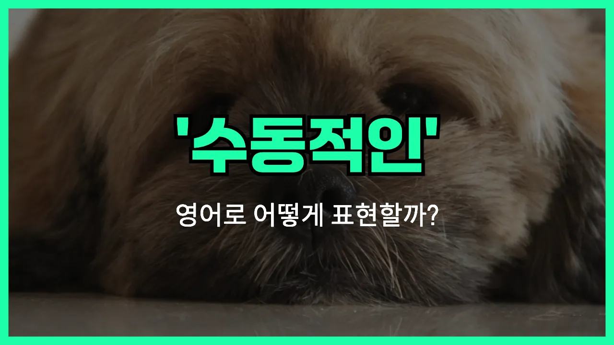

## 🌟 영어 표현 - passive

안녕하세요 👋 오늘은 영어로 '**수동적인**'이라는 뜻을 가진 표현 '**passive**'에 대해 알아보려고 해요. '**passive**'는 어떤 일에 적극적으로 나서지 않고, 남이 하는 대로 따르거나 반응만 하는 태도를 말할 때 사용해요. 즉, **소극적**이거나 **무기력**한 상태를 표현할 때 자주 쓰이는 단어예요!

이 단어는 사람의 성격, 행동, 또는 문법에서의 수동태 등 다양한 상황에서 자연스럽게 사용돼요. 예를 들어, 누군가가 항상 자신의 의견을 내지 않고 남의 말에만 따를 때 "He is very passive in meetings."라고 할 수 있어요.

또한, 영어 문법에서 수동태를 설명할 때도 'passive voice'라는 표현을 사용해요. 예를 들어, "The cake was eaten by Tom."에서 'was eaten'이 바로 수동태(passive voice)예요.

## 📖 예문

1. "그는 항상 너무 수동적이에요."

   "He is always too passive."

2. "회의에서 더 적극적으로 참여해야 해요. 너무 수동적으로 있지 마세요."

   "You should participate more actively in the meeting. Don't be so passive."

## 💬 연습해보기

<ul data-interactive-list>

  <li data-interactive-item>
    저는 보통 그룹 프로젝트에 적극적으로 참여하려고 하는데, 가끔은 좀 소극적일 때도 있어요.
    I usually <a href="/blog/in-english/117.try-to/">try to</a> get <a href="/blog/in-english/274.involve/">involved</a> in group projects, but <a href="/blog/in-english/270.sometimes/">sometimes</a> I <a href="/blog/vocab-1/039.end-up/">end up</a> being a little passive.
  </li>

  <li data-interactive-item>
    그냥 가만히 앉아서 멍하니 있지 말고, 뛰어들어서 도와줘요!
    Don't just sit there looking passive—<a href="/blog/in-english/140.jump-in/">jump in</a> and help out!
  </li>

  <li data-interactive-item>
    그 사람은 건강 관리에 아주 소극적이에요. 운동도 안 하고 병원도 안 가더라고요.
    He takes such a passive <a href="/blog/in-english/267.approach/">approach</a> to his health. He never exercises or goes to the <a href="/blog/in-english/563.doctor/">doctor</a>.
  </li>

  <li data-interactive-item>
    그녀는 전혀 소극적이지 않고, 회의에서 항상 할 말은 다 하는 스타일이에요.
    She's not passive at all, she always speaks her mind in meetings.
  </li>

  <li data-interactive-item>
    계속 소극적으로 있으면 아무도 네가 뭘 원하는지 모를 거예요.
    If you stay passive, no one's going to know what you want.
  </li>

  <li data-interactive-item>
    의견을 물어봤는데, 다들 좀 소극적이었어요. 아무도 말하려고 안 하더라고요.
    When I <a href="/blog/in-english/125.ask-for/">asked for</a> <a href="/blog/in-english/527.opinion/">opinions</a>, everyone was kind of passive. No one wanted to say anything.
  </li>

  <li data-interactive-item>
    저는 갈등을 싫어해서 논쟁할 때 소극적일 때가 있어요.
    I can be passive in arguments because I don't like <a href="/blog/in-english/753.conflict/">conflict</a>.
  </li>

  <li data-interactive-item>
    룸메이트가 집안일에 너무 소극적이라서 제가 다 하게 되거든요.
    My roommate is too passive about chores, so I usually end up doing everything.
  </li>

  <li data-interactive-item>
    그 사람은 움직이기 보다는 그냥 일이 벌어지기만 기다렸어요. 너무 소극적이었죠.
    He <a href="/blog/in-english/377.wait-for/">waited for</a> something to happen <a href="/blog/in-english/169.instead-of/">instead of</a> making a move. That was way too passive.
  </li>

  <li data-interactive-item>
    소극적인 게 항상 안 좋은 건 아니에요. 그냥 때를 잘 골라야 해요.
    Being passive isn't always a bad thing—you just need to pick your <a href="/blog/in-english/490.moment/">moments</a>.
  </li>

</ul>

## 🤝 함께 알아두면 좋은 표현들

### laid-back

'laid-back'는 "느긋한" 또는 "여유로운"이라는 뜻이에요. 이 표현은 적극적으로 나서기보다는 편안하고 긴장하지 않는 태도를 강조할 때 사용해요. 상황에 따라 'passive'와 비슷하게 보일 수 있지만, 부정적인 의미보다는 긍정적으로 여유를 즐기는 느낌이 더 강해요.

- "She's so laid-back that nothing ever seems to bother her."
- "그녀는 너무 느긋해서 어떤 일도 신경 쓰지 않는 것 같아요."

### take initiative

'take initiative'는 "주도적으로 행동하다" 또는 "솔선수범하다"라는 뜻이에요. 이 표현은 'passive'의 반대 개념으로, 스스로 먼저 나서서 일을 시작하거나 문제를 해결하려는 적극적인 태도를 나타낼 때 써요.

- "If you want to stand out at work, you need to take initiative instead of waiting for instructions."
- "직장에서 눈에 띄고 싶으면 지시를 기다리지 말고 주도적으로 행동해야 해요."

### indifferent

'[indifferent](/blog/in-english/332.indifferent/)'는 "무관심한" 또는 "관심이 없는"이라는 뜻이에요. 이 표현은 어떤 일에 대해 특별히 신경 쓰지 않거나 반응이 없는 태도를 나타내요. 'passive'와 비슷하게 적극적으로 개입하지 않는 모습을 강조할 때 사용해요.

- "He seemed indifferent to the outcome of the meeting."
- "그는 회의 결과에 별로 관심이 없는 것처럼 보였어요."

---

오늘은 '**수동적인**', '**소극적**', '**무기력**'이라는 뜻을 가진 영어 표현 '**passive**'에 대해 알아봤어요. 혹시 누군가가 너무 조용하거나 자기 의견을 잘 내지 않을 때 이 표현을 떠올리면 좋겠어요 😊

오늘 배운 표현과 예문들을 꼭 최소 3번씩 소리 내서 읽어보세요. 다음에도 더 재미있고 유익한 영어 표현으로 찾아올게요! 감사합니다!
