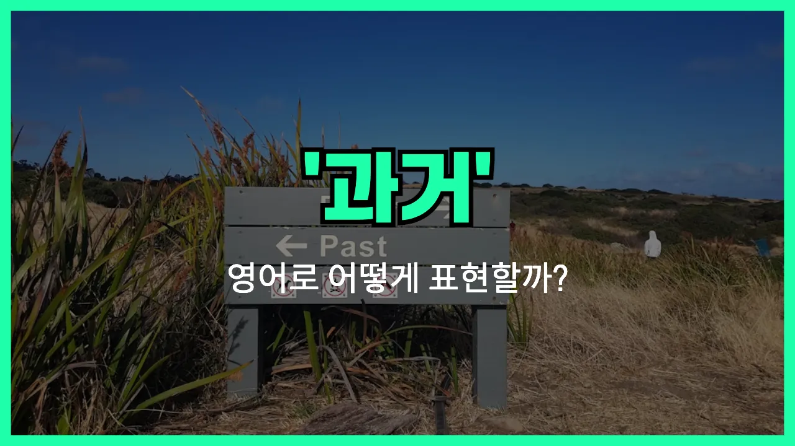

## 🌟 영어 표현 - the past

안녕하세요 👋 오늘은 우리가 자주 쓰는 단어인 '**과거**'를 영어로 어떻게 표현하는지 알아보려고 해요. 바로 '**the past**'라는 표현이에요. 'the past'는 말 그대로 **이미 지나간 시간**이나 **이전의 일**을 가리킬 때 사용해요.

이 표현은 일상 대화, 글쓰기, 그리고 공식적인 상황에서도 아주 자주 쓰여요. 예를 들어, 예전의 경험을 이야기할 때나, 과거의 실수, 혹은 역사적인 사건을 언급할 때 자연스럽게 사용할 수 있어요.

또한, 'the past'는 단순히 시간적인 의미뿐만 아니라, 어떤 사람의 **이전의 삶**이나 **경험**을 말할 때도 활용돼요. 예를 들어, "과거는 잊어버려." 또는 "과거에서 배우자."와 같은 문장에 쓸 수 있답니다!

## 📖 예문

1. "우리는 과거에서 배울 수 있어요."

   "We can [learn](/blog/in-english/245.learn/) from the past."

2. "과거는 이미 지나갔어요."

   "The past is already gone."

3. "그는 과거에 많은 실수를 했어요."

   "He made many mistakes in the past."

## 💬 연습해보기

<ul data-interactive-list>

  <li data-interactive-item>
    과거는 바꿀 수 없으니까 너무 고민하지 말아요.
    You can't change the past, so try not to stress about it too much.
  </li>

  <li data-interactive-item>
    우리 싸울 때마다 그가 계속 과거 얘기를 꺼내요.
    He keeps <a href="/blog/in-english/122.bring-up/">bringing up</a> the past every time we fight.
  </li>

  <li data-interactive-item>
    그냥 과거는 뒤로 하고 앞으로 나아가요.
    Let's just put the past behind us and move on.
  </li>

  <li data-interactive-item>
    그녀는 놓으려 해도 과거를 쉽게 잊지 못해요.
    It's hard for her to let go of the past, even though she wants to.
  </li>

  <li data-interactive-item>
    솔직히 과거는 과거예요. 앞으로를 더 신경 써야 해요.
    <a href="/blog/in-english/336.honestly/">Honestly</a>, the past is the past. We should <a href="/blog/in-english/186.focus-on/">focus on</a> what's ahead.
  </li>

  <li data-interactive-item>
    가끔은 과거로 돌아가서 실수를 고칠 수 있으면 좋겠다고 생각해요.
    <a href="/blog/in-english/270.sometimes/">Sometimes</a> <a href="/blog/in-english/118.i-wish/">I wish</a> I could go back and <a href="/blog/in-english/524.fix/">fix</a> my mistakes in the past.
  </li>

  <li data-interactive-item>
    지난 몇 년 동안 정말 많이 변했어요.
    The past few years have really changed me.
  </li>

  <li data-interactive-item>
    그는 미래 생각보다는 과거에만 계속 매달려요.
    He <a href="/blog/in-english/259.tend-to/">tends to</a> dwell on the past <a href="/blog/in-english/169.instead-of/">instead of</a> thinking about the future.
  </li>

  <li data-interactive-item>
    예전엔 다르게 했을 텐데, 많이 배웠어요.
    In the past, I would have handled things differently, but I've learned a lot.
  </li>

  <li data-interactive-item>
    우리 모두 과거에 실수하지만 그게 성장하는 방법이에요.
    We all make mistakes in the past—it's how we grow.
  </li>

</ul>

## 🤝 함께 알아두면 좋은 표현들

### bygone days

'bygone days'는 "지나간 시절" 또는 "옛날"을 의미해요. 과거의 좋은 추억이나 예전의 시간을 회상할 때 자주 쓰는 표현이에요.

- "My grandmother [often](/blog/in-english/326.often/) talks about the bygone days when life was simpler."
- "할머니는 인생이 더 단순했던 옛 시절 이야기를 자주 하세요."

### move on

'move on'은 "과거를 잊고 앞으로 나아가다"라는 뜻이에요. 과거에 얽매이지 않고 새로운 시작을 하거나 현재와 미래에 집중하자는 의미로 자주 사용돼요.

- "It's time to move on and focus on the future instead of dwelling on the past."
- "이제는 과거에 머무르지 말고 앞으로 나아가서 미래에 집중할 때예요."

### let bygones be bygones

'let bygones be bygones'는 "과거 일은 잊고 넘어가자"라는 뜻이에요. 과거의 잘못이나 오해를 더 이상 문제 삼지 않고, 서로 용서하고 앞으로 나아가자는 의미로 쓰여요.

- "We had our differences, but I think it's best to let bygones be bygones."
- "우리 사이에 다툼이 있었지만, 이제는 과거 일은 잊고 넘어가는 게 좋을 것 같아요."

---

오늘은 '**과거**'라는 뜻을 가진 영어 표현 '**the past**'에 대해 알아봤어요. 일상에서 지난 일이나 경험을 이야기할 때 이 표현을 떠올려 보세요 😊

오늘 배운 표현과 예문들을 꼭 소리 내서 여러 번 읽어보세요. 다음에도 더 유익한 영어 표현으로 찾아올게요! 감사합니다~요!

