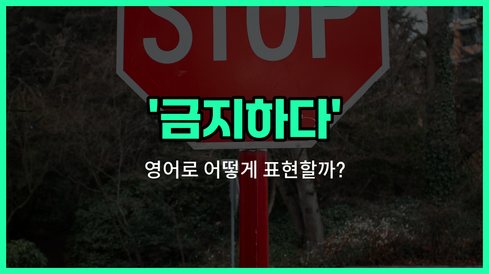

## 🌟 영어 표현 - prohibit

안녕하세요 👋 오늘은 '금지하다'라는 뜻을 가진 영어 표현을 소개해드릴게요. 바로 '**prohibit**'라는 단어에요. 'prohibit'는 어떤 행동이나 행위를 공식적으로 하지 못하게 막는다는 의미를 가지고 있어요.

이 단어는 법, 규칙, 규정 등에서 자주 사용돼요. 예를 들어, 어떤 장소에서 흡연을 금지할 때 "[Smoking](/blog/in-english/482.smoke/) is prohibited here."라고 말할 수 있어요. 즉, **어떤 행동을 공식적으로 막거나 제한하는 상황**에서 자연스럽게 쓸 수 있는 표현이에요!

또한, 'prohibit'는 '막다', '제한하다'와 같은 의미로도 활용할 수 있어서 다양한 상황에서 유용하게 사용할 수 있어요.

## 📖 예문

1. "이 공원에서는 애완동물 출입이 금지되어 있어요."

   "Pets are prohibited in this [park](/blog/in-english/463.park/)."

2. "법은 미성년자의 음주를 금지하고 있어요."

   "The [law](/blog/in-english/619.law/) prohibits minors from drinking alcohol."

## 💬 연습해보기

<ul data-interactive-list>

  <li data-interactive-item>
    우리 부모님은 나한테 자정 넘어서 밖에 있는 걸 엄격히 금지하세요. 통금시간을 진짜 엄청 엄격하게 지키시거든요.
    My parents prohibit me from staying out past midnight. They're super <a href="/blog/in-english/275.strict/">strict</a> about curfews.
  </li>

  <li data-interactive-item>
    학교에서는 수업 중에 휴대폰 사용을 금지해요. 다들 사물함에 두고 있어야 해요.
    The school prohibits using cell phones during class. You have to keep them in your locker.
  </li>

  <li data-interactive-item>
    의사 선생님이 건강 때문에 너무 단 거 먹지 말라고 하시더라고요.
    My <a href="/blog/in-english/563.doctor/">doctor</a> prohibits me from eating too much sugar because of my health.
  </li>

  <li data-interactive-item>
    대부분 항공사에서는 비행기 안에서 흡연을 금지하고 있어요.
    Most airlines prohibit smoking anywhere on the plane.
  </li>

  <li data-interactive-item>
    미안한데 공원에서는 개를 목줄 없이 못 다니게 해요. 항상 목줄을 꼭 해야 해요.
    Sorry, but the park prohibits dogs off-leash. You have to keep your pup on the leash at all times.
  </li>

  <li data-interactive-item>
    회사에서는 직원들이 기밀 정보를 공유하는 걸 금지해요. 그러면 해고당할 수도 있어요.
    The company prohibits <a href="/blog/in-english/700.employee/">employees</a> from sharing confidential information. You could get fired if you do.
  </li>

  <li data-interactive-item>
    영화관에 외부 음식을 가져오려다가 안 된다고 하더라고요.
    I <a href="/blog/in-english/117.try-to/">tried to</a> bring outside food into the movie theater, but they prohibit it.
  </li>

  <li data-interactive-item>
    이 클럽은 21세 미만 출입을 엄격히 금지해요.
    This club strictly prohibits anyone under 21 from entering.
  </li>

  <li data-interactive-item>
    어떤 종교에서는 술을 안 마셔서 가족 모임에 맥주가 없어요.
    Some religions prohibit drinking alcohol, so there's no beer at family gatherings.
  </li>

  <li data-interactive-item>
    우리 아파트는 밤 10시 이후에 시끄러운 음악 틀지 말라고 해요. 이웃들이 많이 불평하거든요.
    My apartment building prohibits <a href="/blog/in-english/311.loud/">loud</a> music after 10 PM. The neighbors <a href="/blog/in-english/499.complain/">complain</a> a lot.
  </li>

</ul>

## 🤝 함께 알아두면 좋은 표현들

### ban

'ban'은 "공식적으로 금지하다"라는 뜻이에요. 법이나 규칙, 정책 등으로 어떤 행동이나 물건을 아예 못 하게 막는 상황에서 자주 쓰여요. 'prohibit'과 거의 비슷한 의미지만, 좀 더 강한 느낌을 줄 때도 있어요.

- "The school [decided to](/blog/in-english/062.decide-to/) ban smartphones during class hours."
- "학교에서 수업 시간 동안 스마트폰 사용을 금지하기로 했어요."

### allow

'allow'는 "허락하다" 또는 "허용하다"라는 뜻으로, 'prohibit'의 반대말이에요. 어떤 행동이나 상황을 할 수 있도록 허락해 주는 경우에 사용해요.

- "The museum allows visitors to take photos without flash."
- "박물관에서는 플래시 없이 사진 찍는 건 허락해줘요."

### restrict

'restrict'는 "제한하다"라는 뜻이에요. 완전히 금지하는 건 아니지만, 어떤 행동이나 사용을 일정 부분만 허용하거나 조건을 두는 경우에 써요. 'prohibit'보다는 덜 강한 느낌이에요.

- "The company restricts [access](/blog/vocab-1/041.access/) to certain websites during work hours."
- "회사에서는 근무 시간에 특정 웹사이트 접속을 제한해요."

---

오늘은 '금지하다'라는 뜻을 가진 영어 표현 '**prohibit**'에 대해 알아봤어요. 공식적으로 어떤 행동을 막거나 제한할 때 이 표현을 떠올리면 좋겠어요 😊

오늘 배운 표현과 예문들을 꼭 소리 내서 여러 번 읽어보세요. 다음에도 더 유익한 영어 표현으로 찾아올게요! 감사합니다~!
