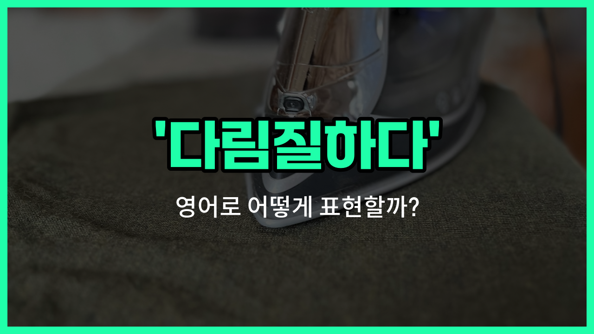

## 🌟 영어 표현 - iron

안녕하세요 👋 오늘은 옷을 깔끔하게 만들 때 자주 쓰는 표현, '**다림질하다**'의 영어 표현에 대해 알아보려고 해요. 바로 '**iron**'이라는 단어인데요~

'**iron**'은 원래 '철'이라는 뜻도 있지만, 우리가 일상에서 옷을 다릴 때 쓰는 '다림질하다'라는 의미로도 아주 많이 사용돼요. 동사로 쓸 때는 '옷을 다림질하다', 명사로는 '다리미'라는 뜻이 있어요~

예를 들어, 아침에 중요한 약속이 있어서 구겨진 셔츠를 다릴 때 "I need to iron my shirt."라고 말할 수 있어요. 또, 다림질이 끝난 후에는 "The clothes are ironed."라고 표현할 수 있답니다~

'iron'은 옷을 펴고 깔끔하게 정리할 때 꼭 필요한 단어이니, 일상에서 자주 활용해 보세요!

## 📖 예문

1. "나는 매일 아침 셔츠를 다림질해요."

   "I iron my shirt every morning."

2. "엄마가 내 옷을 다림질해 주셨어요."

   "My mom ironed my clothes for me."

## 💬 연습해보기

<ul data-interactive-list>

  <li data-interactive-item>
    내 셔츠 완전 구겨졌어. 회의 전에 꼭 다림질해야 해요.
    My shirt's all wrinkled. I really need to iron it before my meeting.
  </li>

  <li data-interactive-item>
    와이셔츠 다림질할 줄 알아요? 저 항상 엉망으로 만들어 버려요.
    Do you know how to iron a dress shirt? I always mess it up.
  </li>

  <li data-interactive-item>
    고등학교 때 엄마가 옷 다림질하는 법 알려줬어요.
    My mom taught me how to iron my clothes when I was in high school.
  </li>

  <li data-interactive-item>
    다림질하다가 좋아하는 옷 태웠어요. 너무 오래 놔둬서요. 다음엔 더 조심할게요.
    I burned my favorite dress because I <a href="/blog/in-english/402.leave/">left</a> the iron on too long. Gotta be more careful next time.
  </li>

  <li data-interactive-item>
    이 바지 좀 다림질 도와줄래요? 주름이 안 펴져서요.
    Can you help me iron these pants? The crease just <a href="/blog/in-english/456.win/">won</a>'t come out.
  </li>

  <li data-interactive-item>
    저는 아침에 안 급하게 하려고 보통 밤에 옷 다림질해요.
    I usually iron my clothes the night before work so I don't have to rush in the morning.
  </li>

  <li data-interactive-item>
    그 셔츠 진짜 잘 어울려요. 방금 다림질한 거예요?
    That shirt looks great. Did you just iron it?
  </li>

  <li data-interactive-item>
    다림질 진짜 싫은데, 가끔은 어쩔 수 없이 해야 해요.
    I <a href="/blog/in-english/392.hate/">hate</a> ironing, but <a href="/blog/in-english/270.sometimes/">sometimes</a> you just have to do it.
  </li>

  <li data-interactive-item>
    제가 제일 잘 쓰는 팁은, 반대로 뒤집어서 다림질하면 광택 안 나서 좋아요.
    Best trick I <a href="/blog/in-english/245.learn/">learned</a>: iron your clothes inside out to avoid shiny spots.
  </li>

  <li data-interactive-item>
    정장 다림질 깜빡해서 인터뷰 때 다른 옷 입었어요.
    I <a href="/blog/in-english/023.forget/">forgot</a> to iron my suit, so I had to wear something else to the interview.
  </li>

</ul>

## 🤝 함께 알아두면 좋은 표현들

### press clothes

'press clothes'는 '옷을 다림질하다'라는 뜻으로, 'iron'과 거의 같은 의미예요. 다리미로 옷의 주름을 펴서 깔끔하게 만드는 행위를 말해요. 주로 옷을 정돈하거나 중요한 자리를 앞두고 사용할 때 쓰여요.

- "I always press my shirts before a job interview."
- "저는 면접 보기 전에 항상 셔츠를 다림질해요."

### wrinkle

'[wrinkle](/blog/in-english/542.wrinkle/)'은 '주름지다' 또는 '구겨지다'라는 뜻으로, 'iron'의 반대되는 개념이에요. 옷이나 천이 다림질이 안 되어 구겨진 상태를 나타낼 때 사용해요.

- "My dress got wrinkled in the [suitcase](/blog/in-english/553.suitcase/)."
- "제 원피스가 여행가방에서 구겨졌어요."

### hang up

'hang up'은 '옷을 걸다'라는 뜻이에요. 다림질과는 다르지만, 옷이 구겨지지 않게 보관하는 방법 중 하나로, 다림질을 대신하거나 보완할 때 자주 쓰여요.

- "If you hang up your clothes right away, you might not need to iron them."
- "옷을 바로 걸어두면 다림질할 필요가 없을 수도 있어요."

---

오늘은 '다림질하다', '다리미', '옷을 펴다'라는 뜻을 가진 영어 표현 '**iron**'에 대해 알아봤어요. 앞으로 옷을 다릴 때 이 표현을 떠올리면 좋겠어요 😊

오늘 배운 표현과 예문들을 꼭 소리 내서 여러 번 읽어보세요. 다음에도 더 유익한 영어 표현으로 찾아올게요! 감사합니다~요!

