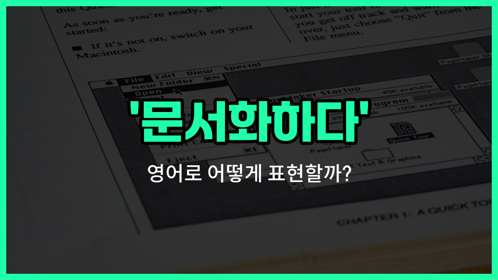

## 🌟 영어 표현 - document

안녕하세요 👋 오늘은 '문서화하다'라는 뜻을 가진 영어 표현을 소개해드리려고 해요. 바로 '**document**'라는 단어인데요~

'**document**'는 원래 명사로는 '문서', '서류'라는 뜻이 있지만, 동사로도 자주 쓰여요. 동사로 쓸 때는 **어떤 사실이나 과정을 기록하거나, 공식적으로 문서로 남기는 것**을 의미해요~

예를 들어, 회사에서 프로젝트 진행 상황을 정리해서 남길 때, 또는 연구 결과를 공식적으로 기록할 때 'document'라는 동사를 사용할 수 있어요. 이렇게 하면 나중에 참고하거나 증거로 활용할 수 있어서 아주 중요하답니다~

## 📖 예문

1. "우리는 모든 회의 내용을 문서화해야 해요."

   "We need to document all the meeting details."

2. "이 실험 결과를 잘 문서화해 주세요."

   "Please document the results of this experiment carefully."

## 💬 연습해보기

<ul data-interactive-list>

  <li data-interactive-item>
    이 프로젝트 할 때 하는 거 다 기록해두는 게 진짜 좋아요. 나중에 훨씬 편해져요.
    You should really document everything you do for this project. It makes things easier down the line.
  </li>

  <li data-interactive-item>
    코드 수정할 때마다 꼭 기록하는 거 잊지 마세요. 안 그러면 누가 봐도 뭐가 바뀐 건지 모를 거예요.
    Don't <a href="/blog/in-english/023.forget/">forget</a> to document any changes you make to the code. Otherwise, no one will know what's different.
  </li>

  <li data-interactive-item>
    누군가 우리 작업을 따라야 할 수도 있으니까 과정 하나하나 다 기록하래요.
    We're supposed to document all the steps in the process, just <a href="/blog/in-english/253.in-case/">in case</a> someone needs to follow our work.
  </li>

  <li data-interactive-item>
    매니저가 새 정책을 팀에 적용하기 전에 문서로 정리해 달라고 하더라고요.
    My manager asked me to document the new <a href="/blog/in-english/623.policy/">policy</a> before we roll it out to the team.
  </li>

  <li data-interactive-item>
    문제 겪는 거 기록해 줄 수 있어요? IT 팀에서 뭐가 문제인지 파악하는 데 도움이 될 거예요.
    Could you document the issues you're experiencing? It'll help the IT team <a href="/blog/in-english/170.figure-out/">figure out</a> what's <a href="/blog/in-english/316.wrong/">wrong</a>.
  </li>

  <li data-interactive-item>
    회의 끝날 때마다 얘기했던 거 정리해야 하는 게 좀 귀찮긴 한데요.
    Every time we <a href="/blog/in-english/295.finish/">finish</a> a meeting, I have to document what was discussed. It's a bit of a <a href="/blog/in-english/573.pain/">pain</a>, <a href="/blog/in-english/336.honestly/">honestly</a>.
  </li>

  <li data-interactive-item>
    앞으로는 고객과 주고받는 모든 걸 기록하래요. 서류 작업이 엄청 많아질 것 같아요.
    They want us to document every customer interaction <a href="/blog/in-english/540.from-now-on/">from now on</a>. It's going to be a lot of paperwork.
  </li>

  <li data-interactive-item>
    나중에 잊지 않게 여행 경험을 기록하려고 노력해요.
    I <a href="/blog/in-english/117.try-to/">try to</a> document my travel <a href="/blog/in-english/415.experience/">experiences</a> so I don't forget the details later.
  </li>

  <li data-interactive-item>
    모든 걸 기록해두면 문제가 생겨도 내가 한 일을 증명할 수 있거든요.
    If you document everything, you can prove you did your part if there's ever a problem.
  </li>

  <li data-interactive-item>
    수리 과정을 기록해둘 걸 그랬어요. 지금은 뭘 어떻게 했는지 정확히 기억이 안 나네요.
    <a href="/blog/in-english/118.i-wish/">I wish</a> I'd remembered to document the repair steps. Now I can't remember <a href="/blog/in-english/419.exactly/">exactly</a> what I did.
  </li>

</ul>

## 🤝 함께 알아두면 좋은 표현들

### record

'record'는 "기록하다"라는 뜻으로, 어떤 사실이나 정보를 글, 사진, 영상 등 다양한 형태로 남기는 것을 의미해요. 공식적인 문서뿐만 아니라 일상적인 메모나 일지 등에도 쓸 수 있어요.

- "She likes to record her daily experiences in a journal."
- "그녀는 자신의 일상 경험을 일기장에 기록하는 걸 좋아해요."

### keep track of

'keep track of'는 "~을 계속해서 기록하다" 또는 "~을 추적하다"라는 의미예요. 어떤 일이나 정보를 놓치지 않고 꾸준히 관리하거나 기록하는 상황에서 자주 사용돼요.

- "It's [important](/blog/in-english/318.important/) to keep track of your [expenses](/blog/in-english/725.expense/) when traveling."
- "여행할 때는 지출을 계속 기록하는 게 중요해요."

### overlook

'[overlook](/blog/in-english/168.overlook/)'는 "간과하다" 또는 "놓치다"라는 뜻이에요. 어떤 사실이나 정보를 기록하거나 문서화하지 않고 그냥 지나쳐버리는 상황에서 쓰여요. 'document'의 반대 의미로 볼 수 있어요.

- "He overlooked some important details in the report."
- "그는 보고서에서 몇 가지 중요한 세부사항을 놓쳤어요."

---

오늘은 '문서화하다'라는 뜻을 가진 영어 동사 'document'에 대해 알아봤어요. 업무나 학업에서 기록을 남길 때 이 표현을 꼭 활용해 보세요~ 😊

오늘 배운 표현과 예문들을 꼭 최소 3번씩 소리 내서 읽어보세요. 다음에도 더 유익한 영어 표현으로 찾아올게요! 감사합니다~
