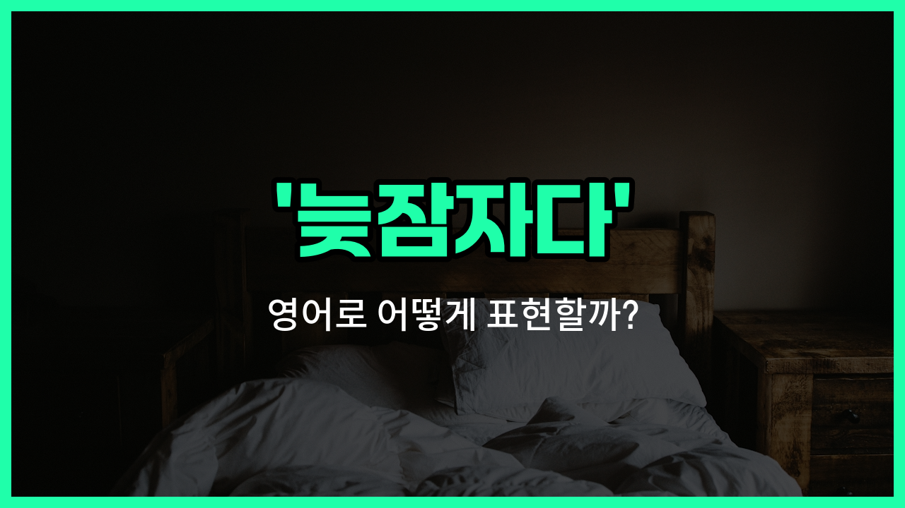

## 🌟 영어 표현 - sleep in

안녕하세요 👋 오늘은 우리가 자주 겪는 상황, 바로 '**늦잠자다**'를 영어로 어떻게 표현하는지 알아보려고 해요. 영어에서는 '**sleep in**'이라는 표현을 사용해요. 이 표현은 평소보다 더 늦게까지 자는 것을 의미해요.

예를 들어, 주말이나 휴일에 알람을 맞추지 않고 푹 자고 싶을 때 'I want to sleep in.'이라고 말할 수 있어요. 즉, **아침에 늦게까지 자거나 평소보다 늦게 일어나는 상황**에서 자연스럽게 쓸 수 있는 표현이에요!

특히, 'sleep in'은 피곤해서 늦게 일어났을 때뿐만 아니라, 일부러 늦게 일어나고 싶을 때도 쓸 수 있어서 정말 유용해요.

## 📖 예문

1. "오늘은 늦잠자고 싶어요."

   "I want to sleep in today."

2. "주말에는 보통 늦게 일어나요."

   "I usually sleep in on weekends."

## 💬 연습해보기

<ul data-interactive-list>

  <li data-interactive-item>
    주말엔 늦잠 잘 수 있어서 너무 좋아요.
    I love weekends because I get to sleep in.
  </li>

  <li data-interactive-item>
    저도 모르게 늦잠 자서 아침 수업 놓쳤어요.
    I <a href="/blog/in-english/314.accidentally/">accidentally</a> slept in and <a href="/blog/in-english/339.miss/">missed</a> my morning class.
  </li>

  <li data-interactive-item>
    알람이 안 울려서 생각보다 훨씬 늦게 일어났어요.
    My alarm didn't go off, so I slept in way later than I meant to.
  </li>

  <li data-interactive-item>
    내일은 알람 끄고 한번 늦잠 자볼까요?
    Let's not set an alarm tomorrow and just sleep in for once.
  </li>

  <li data-interactive-item>
    매일 늦잠 자고 싶은데 출근이 아침 8시라 아쉬워요.
    <a href="/blog/in-english/118.i-wish/">I wish</a> I could sleep in every day, but work starts at eight.
  </li>

  <li data-interactive-item>
    힘든 한 주 끝나고 오늘 아침에 늦잠 잤는데 진짜 기분 최고였어요.
    After a long week, I <a href="/blog/in-english/182.finally/">finally</a> slept in this morning and it felt great.
  </li>

  <li data-interactive-item>
    브런치 먹으러 만날래요? 아니면 늦잠 잘 거예요?
    Do you want to meet for brunch? Or will you be sleeping in?
  </li>

  <li data-interactive-item>
    그 친구는 보통 일요일에 늦잠 자요, 늦게까지 일해서요.
    She usually sleeps in on Sundays since she works <a href="/blog/in-english/391.late/">late</a>.
  </li>

  <li data-interactive-item>
    아이들이 늦잠 자서 집 안이 오랜만에 조용했어요.
    The kids slept in, so the house was actually quiet for a change.
  </li>

  <li data-interactive-item>
    늦잠 자려고 했는데 옆집 개가 일찍 깨워서 못 잤어요.
    I <a href="/blog/in-english/117.try-to/">tried to</a> sleep in, but my neighbor's dog woke me up early.
  </li>

</ul>

## 🤝 함께 알아두면 좋은 표현들

### hit the snooze button

'hit the snooze button'은 알람이 울렸을 때 스누즈 버튼을 눌러서 **조금 더 자는 것**을 의미해요. 즉, 바로 일어나지 않고 몇 분 더 자려고 할 때 자주 쓰는 표현이에요.

- "I hit the snooze button three times this morning before finally getting up."
- "오늘 아침에 일어나기 전에 스누즈 버튼을 세 번이나 눌렀어요."

### get up early

'get up early'는 **일찍 일어나다**라는 뜻이에요. 'sleep in'과는 반대되는 의미로, 아침 일찍 일어나서 하루를 시작할 때 쓰는 표현이에요.

- "She likes to get up early and go for a run before work."
- "그녀는 일찍 일어나서 출근 전에 달리기를 하곤 해요."

### pull an all-nighter

'[pull an all-nighter](/blog/in-english/133.pull-all-nighter/)'는 **밤을 새우다**라는 뜻이에요. 잠을 자지 않고 밤새 무언가를 하는 상황을 말해요. 보통 공부나 일을 하느라 밤을 새울 때 자주 쓰는 표현이에요.

- "I had to pull an all-nighter to [finish](/blog/in-english/295.finish/) my project [on time](/blog/vocab-1/043.on-time/)."
- "프로젝트를 제시간에 끝내려고 밤을 새웠어요."

---

오늘은 '**늦잠자다**'라는 뜻을 가진 영어 표현 '**sleep in**'에 대해 알아봤어요. 주말이나 휴일에 푹 쉬고 싶을 때 이 표현을 꼭 떠올려 보세요 😊

오늘 배운 표현과 예문들을 꼭 최소 3번씩 소리 내서 읽어보세요. 다음에도 더 재미있고 유익한 영어 표현으로 찾아올게요! 감사합니다!~요

