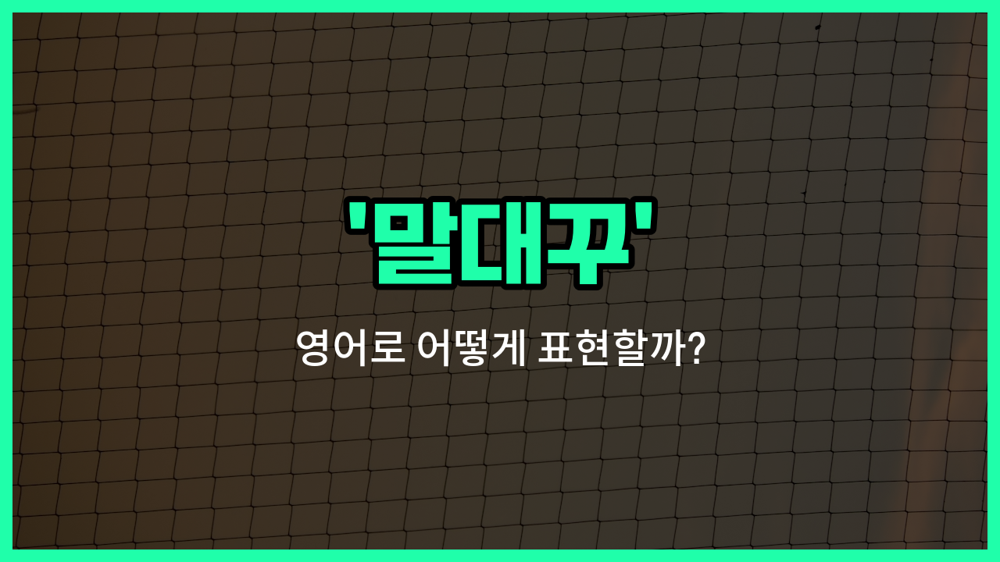

## 🌟 영어 표현 - backtalk

안녕하세요 👋 오늘은 '말대꾸'라는 뜻을 가진 영어 표현을 소개해드리려고 해요. 바로 '**backtalk**'라는 단어인데요~

'**backtalk**'는 누군가의 말에 예의 없이 되받아치거나, 반항하는 태도로 대답하는 것을 의미해요. 주로 아이들이 부모님이나 선생님께 예의 없이 말할 때 자주 쓰이는 표현이에요~

예를 들어, 부모님이 "숙제해!"라고 했을 때 아이가 "왜 내가 해야 해?"라고 따지거나, 말대꾸를 할 때 바로 이 'backtalk'라는 단어를 사용할 수 있어요~

이 단어는 명사로 쓰이며, 주로 부정적인 상황에서 사용돼요. 누군가에게 예의 없이 말하거나, 권위에 도전하는 느낌을 줄 때 딱 맞는 표현이에요~

## 📖 예문

1. "그는 선생님께 말대꾸를 했어요."

   "He gave the teacher some backtalk."

2. "부모님께 말대꾸하지 마세요."

   "Don't give your parents any backtalk."

## 💬 연습해보기

<ul data-interactive-list>

  <li data-interactive-item>
    우리 남동생이 어젯밤에 엄마한테 말대꾸하다가 혼났어요. 진짜 언제 그만둬야 할지 몰라요!
    My little brother got in trouble for giving our mom some backtalk last night. He never knows when to stop!
  </li>

  <li data-interactive-item>
    방 청소하라고 할 때 말대꾸 하지 말았으면 해요. 그냥 시키는 대로 해줘요, 알겠죠?
    I don't want to hear any backtalk from you when I ask you to <a href="/blog/in-english/523.clean/">clean</a> your room. Just do it, okay?
  </li>

  <li data-interactive-item>
    그녀가 눈을 굴리면서 선생님한테 조금 말대꾸했어요. 그리 똑똑한 행동은 아니었어요.
    She rolled her eyes and gave the teacher a little backtalk. Not the smartest move.
  </li>

  <li data-interactive-item>
    저녁 식사 도중에 말대꾸가 너무 많아서 아빠가 화 풀러 나가셨어요.
    There was so much backtalk at the dinner table, my dad just <a href="/blog/in-english/402.leave/">left</a> to <a href="/blog/in-english/085.cool-off/">cool off</a>.
  </li>

  <li data-interactive-item>
    제가 십대였을 때 말대꾸해서 자주 방에 갇혔었어요.
    I <a href="/blog/in-english/143.used-to/">used to</a> get grounded all the time for backtalk when I was a teenager.
  </li>

  <li data-interactive-item>
    조금 말대꾸했더니 갑자기 일주일 동안 게임 못 하게 됐어요. 너무 불공평해요!
    A little backtalk and suddenly I'm banned from playing video games for a week. So unfair!
  </li>

  <li data-interactive-item>
    우리 사장님은 말대꾸 절대 안 받아줘요. 그냥 다들 '네' 하고 빨리 끝내길 기대하거든요.
    My boss has zero tolerance for backtalk. He expects everyone to just say "yes" and <a href="/blog/in-english/557.get-on/">get on</a> with it.
  </li>

  <li data-interactive-item>
    코치님한테 말대꾸했다가 연습 때 추가로 더 뛰게 됐어요.
    After I gave my coach some backtalk, he made me run <a href="/blog/in-english/265.extra/">extra</a> laps at <a href="/blog/in-english/247.practice/">practice</a>.
  </li>

  <li data-interactive-item>
    내 사촌들 말대꾸하는 거 봤어야 해요. 둘 다 완전 고집 세거든요.
    You <a href="/blog/in-english/257.should've/">should've</a> seen the backtalk between my cousins. They're both so stubborn.
  </li>

  <li data-interactive-item>
    일할 때 누가 말대꾸하면 그냥 침착하게 넘어가는 게 최고예요, 반응하지 말고요.
    When someone gives you backtalk at work, it's best to just stay <a href="/blog/in-english/380.calm/">calm</a> and not react.
  </li>

</ul>

## 🤝 함께 알아두면 좋은 표현들

### talk back

'[talk back](/blog/in-english/037.talk-back/)'은 'backtalk'과 거의 같은 의미로, 윗사람이나 어른에게 말대꾸하거나 반항적으로 대답하는 것을 뜻해요. 주로 아이들이 부모님이나 선생님에게 예의 없이 대답할 때 자주 쓰여요.

- "Don't talk back to your mother when she's scolding you."
- "엄마가 혼내실 때 말대꾸하지 마세요."

### answer respectfully

'answer respectfully'는 '공손하게 대답하다'라는 뜻이에요. 말대꾸(backtalk)와는 반대되는 개념으로, 상대방에게 예의 바르고 존중하는 태도로 대답하는 상황에서 사용해요.

- "Please answer respectfully when your teacher asks you a question."
- "선생님이 질문하실 때는 공손하게 대답하세요."

### keep one's mouth shut

'keep one's mouth shut'은 '입을 다물다', 즉 불필요하게 말하지 않고 조용히 있는다는 뜻이에요. 말대꾸를 하지 않고 가만히 있는 상황에서 자주 쓰여요.

- "He [decided to](/blog/in-english/062.decide-to/) keep his mouth shut [instead of](/blog/in-english/169.instead-of/) [arguing](/blog/in-english/132.argue/) with his boss."
- "그는 상사와 말다툼하는 대신 그냥 입을 다물기로 했어요."

---

오늘은 '말대꾸', '반항', '되받아침'이라는 뜻을 가진 영어 표현 '**backtalk**'에 대해 알아봤어요. 누군가에게 예의 없이 되받아치는 상황이 떠오를 때 이 표현을 떠올려보면 좋겠어요~ 😊

오늘 배운 표현과 예문들을 꼭 소리 내서 여러 번 읽어보세요. 다음에도 더 유익한 영어 표현으로 찾아올게요! 감사합니다~

