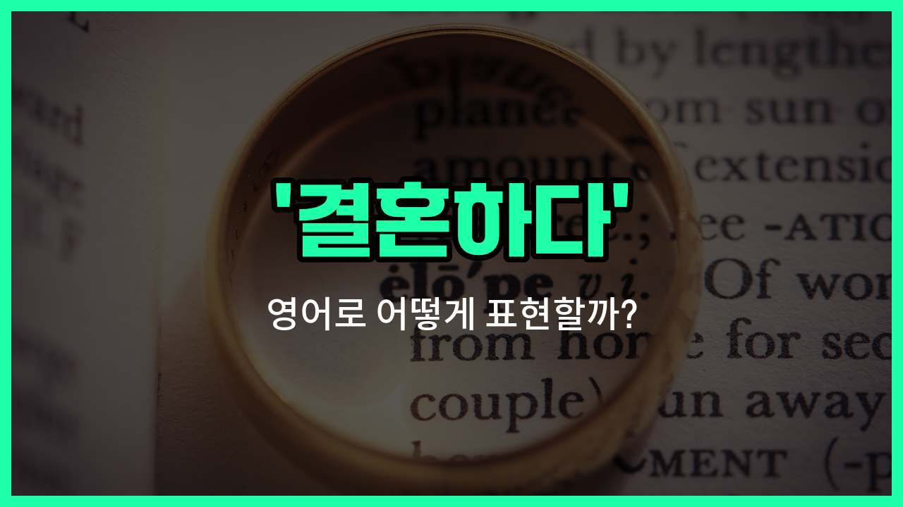

## 🌟 영어 표현 - get married

안녕하세요 👋 오늘은 '결혼하다'라는 뜻을 가진 영어 표현을 소개해드릴게요. 바로 '**get married**'라는 표현이에요. 이 표현은 두 사람이 공식적으로 부부가 되는 것을 의미해요. 즉, 결혼식을 올리고 법적으로나 사회적으로 부부가 되는 상황을 말할 때 사용해요!

'get married'는 일상 대화에서 정말 자주 쓰이는 표현이에요. 예를 들어, 친구가 결혼 소식을 전할 때 "I'm going to get married next year!"라고 말할 수 있어요. 또는, 누군가 결혼했는지 물어보고 싶을 때는 "Did you get married?"라고 물어볼 수 있어요.

또한, '혼인하다', '부부가 되다'와 같은 의미로도 자연스럽게 쓸 수 있으니 상황에 맞게 활용해보세요!

## 📖 예문

1. "그들은 지난달에 결혼했어요."

   "They got married last month."

2. "언제 결혼할 계획이에요?"

   "When are you planning to get married?"

## 💬 연습해보기

<ul data-interactive-list>

  <li data-interactive-item>
    우리 누나는 다음 여름에 결혼해요. 결혼 준비에 완전 신나 있더라고요.
    My sister's going to get married next summer. She's so excited about planning the wedding.
  </li>

  <li data-interactive-item>
    우리가 이렇게 빨리 결혼할 줄 몰랐는데, 진짜 다들 깜짝 놀랐어요.
    We didn't think they'd get married so soon, but they surprised us all.
  </li>

  <li data-interactive-item>
    진짜 결혼할 준비 됐어요? 아니면 좀 더 기다릴 생각이에요?
    Are you guys really ready to get married, or do you want to wait a bit longer?
  </li>

  <li data-interactive-item>
    5년 사귀고 나서 드디어 결혼하기로 했대요.
    After dating for five years, they <a href="/blog/in-english/182.finally/">finally</a> <a href="/blog/in-english/062.decide-to/">decided to</a> get married.
  </li>

  <li data-interactive-item>
    어떤 사람들은 큰 결혼식 원하지만 난 그냥 조용하고 작은 게 좋아요.
    Some people want to get married in a big ceremony, but I'd <a href="/blog/in-english/191.prefer/">prefer</a> something small.
  </li>

  <li data-interactive-item>
    언젠가 결혼할 것 같아요?
    Do you think you'll ever get married?
  </li>

  <li data-interactive-item>
    우리 부모님은 진짜 어렸을 때 결혼하셨어요.
    My parents actually got married when they were really young.
  </li>

  <li data-interactive-item>
    걔는 지금 당장 결혼하고 싶은지 잘 모르겠대요.
    She said she's not sure if she wants to get married <a href="/blog/in-english/525.right-now/">right now</a>.
  </li>

  <li data-interactive-item>
    걔네는 베가스에서 즉흥적으로 결혼했어요. 완전 즉흥적이었죠!
    They got married in Vegas on a whim. It was so <a href="/blog/in-english/129.spontaneous/">spontaneous</a>!
  </li>

  <li data-interactive-item>
    우리가 결혼한 지 벌써 10년이라니 믿기지가 않아요. 시간 진짜 빠르네요!
    I can't believe it's already been ten years since we got married. Time flies!
  </li>

</ul>

## 🤝 함께 알아두면 좋은 표현들

### tie the knot

'[tie](/blog/in-english/396.tie/) the knot'은 '결혼하다'를 의미하는 영어 관용 표현이에요. 결혼식에서 두 사람이 하나로 묶인다는 의미에서 유래했어요. 일상 대화에서 결혼을 좀 더 친근하고 가볍게 말할 때 자주 써요.

- "After dating for five years, they finally decided to tie the knot next spring."
- "5년 동안 사귄 끝에, 그들은 드디어 내년 봄에 결혼하기로 했어요."

### walk down the aisle

'walk down the aisle'은 결혼식에서 신부가 통로를 걸어가는 모습을 말하지만, 비유적으로 '결혼하다'라는 뜻으로도 자주 써요. 결혼식 자체를 강조할 때 많이 사용해요.

- "Everyone was surprised when she [announced](/blog/in-english/816.announce/) she would walk down the aisle this summer."
- "그녀가 이번 여름에 결혼한다고 발표해서 모두가 깜짝 놀랐어요."

### break up

'break up'은 '헤어지다'라는 뜻으로, 연인이나 부부가 관계를 끝내는 상황에서 사용해요. 'get married'의 반대 의미로, 결혼이나 연애 관계가 끝나는 것을 나타낼 때 써요.

- "They decided to break up after [realizing](/blog/in-english/166.realize/) they wanted different things in life."
- "서로 원하는 게 다르다는 걸 깨닫고, 그들은 헤어지기로 했어요."

---

오늘은 '결혼하다'라는 뜻을 가진 영어 표현 '**get married**'에 대해 알아봤어요. 앞으로 결혼과 관련된 이야기를 할 때 이 표현을 꼭 떠올려보세요 😊

오늘 배운 표현과 예문들을 소리 내서 여러 번 읽어보면 더 자연스럽게 쓸 수 있을 거예요. 다음에도 더 유익한 영어 표현으로 찾아올게요! 감사합니다~!
