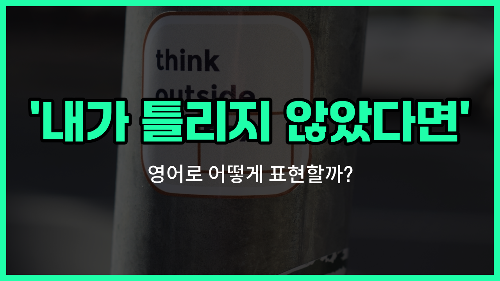

## 🌟 영어 표현 - Unless I'm mistaken

안녕하세요 👋 오늘은 일상 대화에서 자주 쓰이는 표현인 '**내가 틀리지 않았다면**'을 영어로 어떻게 말하는지 알아볼 거예요. 바로 '**Unless I'm mistaken**'이라는 표현이에요.

이 표현은 **내가 알고 있는 정보가 맞다면** 또는 **내가 실수하지 않았다면**이라는 의미로, 상대방에게 조심스럽게 자신의 의견이나 정보를 전달할 때 자주 사용돼요. 즉, 자신이 말하는 내용에 약간의 확신은 있지만 혹시나 틀릴 수도 있다는 겸손한 뉘앙스를 담고 있어요!

예를 들어, 친구와 대화를 하다가 "내가 틀리지 않았다면, 그 영화는 내일 개봉해요."라고 말하고 싶을 때 자연스럽게 쓸 수 있어요.

## 📖 예문

1. "내가 틀리지 않았다면, 회의는 오후 3시에 시작해요."

   "Unless I'm mistaken, the meeting starts at 3 p.m."

2. "내가 맞다면, 그는 이미 출발했어요."

   "Unless I'm mistaken, he has already [left](/blog/in-english/402.leave/)."

## 💬 연습해보기

<ul data-interactive-list>

  <li data-interactive-item>
    내가 잘못 기억하는 거 아니면, 너 약속 내일인 거 맞아, 오늘 아니야. 내 기억엔 그런 것 같아.
    Unless I'm mistaken, your appointment's actually tomorrow, not today. I could be <a href="/blog/in-english/316.wrong/">wrong</a>, but that's what I remember.
  </li>

  <li data-interactive-item>
    그곳 최근에 다시 열었을 거야, 내가 틀리지 않았다면. 인스타그램에서 본 것 같던데.
    That place reopened recently, unless I'm mistaken. I think I saw something about it on Instagram.
  </li>

  <li data-interactive-item>
    내가 기억하는 대로라면, 너 데이브 파티에서 그녀 만난 적 있잖아. 맞게 기억하는 거지?
    Unless I'm mistaken, you've met her before at Dave's party. Am I remembering that right?
  </li>

  <li data-interactive-item>
    그 사람이 여섯 시쯤 돌아올 거야, 내가 틀리지 않았다면. 근데 한 번 더 확인해볼게.
    He should be back around six, unless I'm mistaken. Let me double-check though.
  </li>

  <li data-interactive-item>
    내가 잘못 기억하지 않는 한, 여기 네가 제일 좋아하는 식당이지? 네가 그 집 피자 엄청 좋아한다고 했던 것 같아.
    Unless I'm mistaken, this is your favorite restaurant, isn't it? I thought you said you loved their pizza.
  </li>

  <li data-interactive-item>
    내 기억이 맞다면, 우리 도서관 말고 커피숍에서 만나기로 한 거야. 문자 확인해볼게.
    Unless I'm mistaken, we're supposed to meet at the coffee shop, not the library. Let me check our texts.
  </li>

  <li data-interactive-item>
    그 여자 시애틀 출신이야, 내가 착각하는 게 아니라면. 너 그 사람 알아?
    She's from Seattle, unless I'm mistaken. Do you know her?
  </li>

  <li data-interactive-item>
    내 기억에 따르면 오늘 점심 사는 건 네 차례야. 내가 지난번에 샀던 것 같아.
    Unless I'm mistaken, it's your turn to buy lunch. I think I got it last time.
  </li>

  <li data-interactive-item>
    너 아직 열쇠 가지고 있잖아, 내가 틀리지 않았다면. 벌써 돌려줬어?
    You <a href="/blog/in-english/254.still/">still</a> have the keys, unless I'm mistaken. Did you already give them back?
  </li>

  <li data-interactive-item>
    그 영화 작년에 개봉했을 거야, 내가 잘못 기억하지 않는 한. 아직 안 봤어?
    That movie came out last year, unless I'm mistaken. Haven't you seen it yet?
  </li>

</ul>

## 🤝 함께 알아두면 좋은 표현들

### If I'm not wrong

'If I'm not wrong'은 '내가 틀리지 않았다면'과 거의 같은 의미로, 자신이 말하는 정보가 맞는지 확신이 없을 때 조심스럽게 말할 때 써요. 상대방에게 정정할 기회를 주는 뉘앙스가 있어요.

- "If I'm not wrong, the meeting starts at 3 PM."
- "내가 틀리지 않았다면, 회의는 오후 3시에 시작해요."

### Correct me if I'm wrong

'[Correct](/blog/in-english/288.correct/) me if I'm wrong'은 '내가 틀렸으면 말해줘'라는 뜻으로, 자신이 말한 내용이 틀릴 수도 있다는 점을 인정하면서 상대방에게 확인을 부탁할 때 써요. 겸손하고 예의 있게 의견을 제시할 때 자주 사용해요.

- "Correct me if I'm wrong, but I think this is your first time here."
- "제가 틀렸으면 말씀해 주세요, 근데 이번이 여기 처음이신 것 같아요."

### I'm certain that

'I'm certain that'은 '나는 ~을 확신해'라는 뜻으로, 자신이 말하는 내용에 대해 확신이 있을 때 쓰는 표현이에요. 'Unless I'm mistaken'과는 반대로, 자신감 있게 정보를 전달할 때 사용해요.

- "I'm certain that she will [arrive](/blog/in-english/403.arrive/) [on time](/blog/vocab-1/043.on-time/)."
- "저는 그녀가 제시간에 도착할 거라고 확신해요."

---

오늘은 '**내가 틀리지 않았다면**'이라는 뜻을 가진 영어 표현 '**Unless I'm mistaken**'에 대해 알아봤어요. 누군가에게 정보를 전달할 때 이 표현을 사용하면 더 자연스럽고 공손하게 말할 수 있겠죠? 😊

오늘 배운 표현과 예문들을 꼭 최소 3번씩 소리 내서 읽어보세요. 다음에도 더 재미있고 유익한 영어 표현으로 찾아올게요! 감사합니다!~요

