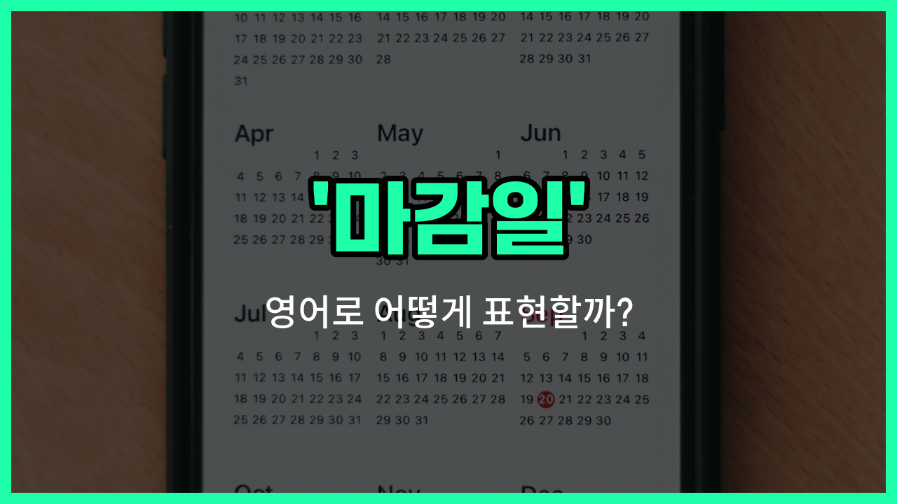

## 🌟 영어 표현 - deadline

안녕하세요 👋 오늘은 영어로 '**마감일**'을 어떻게 표현하는지 알아보려고 해요. 바로 '**deadline**'이라는 단어를 사용해요. 이 단어는 어떤 일을 반드시 끝내야 하는 **최종 기한**이나 **제출해야 하는 날짜**를 의미해요.

학교 과제, 회사 프로젝트, 각종 신청서 등 우리가 일상에서 자주 접하는 상황에서 'deadline'이라는 표현을 많이 사용해요. 예를 들어, 과제 제출일이 다가올 때 "The deadline for the assignment is tomorrow."라고 말할 수 있어요.

또한, 'deadline'은 주로 명사로 쓰이며, '기한', '제출일'과 같은 의미로 활용돼요. 업무나 학업에서 중요한 약속이나 목표를 정할 때 꼭 필요한 단어예요!

## 📖 예문

1. "프로젝트 마감일이 다음 주 월요일이에요."

   "The deadline for the project is next Monday."

2. "과제 제출일을 놓치지 마세요."

   "Don't [miss](/blog/in-english/339.miss/) the assignment deadline."

## 💬 연습해보기

<ul data-interactive-list>

  <li data-interactive-item>
    완전 오늘이 마감인 거 깜빡했어요. 지금 막 일 끝내려고 난리 났어요.
    I totally <a href="/blog/in-english/023.forget/">forgot</a> the deadline was today. Now I'm scrambling to <a href="/blog/in-english/295.finish/">finish</a> my work.
  </li>

  <li data-interactive-item>
    마감이 다음 주 금요일 맞아요? 저는 좀 더 빨리인 줄 알았어요.
    Are you sure the deadline is next Friday? I thought it was sooner.
  </li>

  <li data-interactive-item>
    마감 꼭 지켜야 해요, 안 그러면 감점 당해요.
    We have to meet the deadline or we'll get docked points.
  </li>

  <li data-interactive-item>
    내일 큰 마감 때문에 회사에서 야근하고 있어요.
    I'm staying <a href="/blog/in-english/391.late/">late</a> at the office because there's a big deadline tomorrow.
  </li>

  <li data-interactive-item>
    마감만 있으면 결국 밤새는 거 같아요.
    Every time there's a deadline, I <a href="/blog/vocab-1/039.end-up/">end up</a> <a href="/blog/in-english/133.pull-all-nighter/">pulling an all-nighter</a>.
  </li>

  <li data-interactive-item>
    선생님이 그 과제 마감일 연장해 주셨어요?
    Did the teacher extend the deadline for that assignment?
  </li>

  <li data-interactive-item>
    마감 다가오니까 너무 부담돼요.
    I feel so much pressure with this deadline coming up.
  </li>

  <li data-interactive-item>
    마감 놓치지 않으려고 달력부터 확인할게요.
    Let me check the calendar to <a href="/blog/in-english/232.make-sure/">make sure</a> I don't miss the deadline.
  </li>

  <li data-interactive-item>
    상사가 마감일을 앞당겨서 이제 더 빨리 일해야 해요.
    My boss just moved up the deadline, so I need to work faster now.
  </li>

  <li data-interactive-item>
    솔직히 마감 직전에 제일 열심히 하게 돼요.
    <a href="/blog/in-english/336.honestly/">Honestly</a>, I do my best work right before a deadline.
  </li>

</ul>

## 🤝 함께 알아두면 좋은 표현들

### due date

'due date'는 '마감일'과 비슷하게 어떤 과제나 프로젝트, 지불 등이 완료되어야 하는 날짜를 의미해요. 주로 숙제, 과제, 청구서 등에서 많이 사용돼요.

- "The due date for the assignment is next Monday."
- "과제 마감일이 다음 주 월요일이에요."

### extension

'extension'은 '마감일 연장'이라는 뜻으로, 원래 정해진 마감일을 더 뒤로 미루는 상황에서 사용해요. 마감일을 지키기 어려울 때 흔히 요청하거나 이야기하는 표현이에요.

- "She asked her professor for an extension on the paper."
- "그녀는 교수님께 논문 마감일을 연장해 달라고 요청했어요."

### open-ended

'open-ended'는 '마감일이 없는' 또는 '끝이 정해지지 않은'이라는 뜻이에요. 어떤 일이나 프로젝트에 특정한 마감일이 없어서 자유롭게 진행할 수 있을 때 사용해요.

- "The project is open-ended, so you can [work on](/blog/in-english/370.work-on/) it at your own pace."
- "이 프로젝트는 마감일이 없어서 네가 원하는 속도로 진행해도 돼요."

---

오늘은 '**마감일**', '**기한**', '**제출일**'이라는 뜻을 가진 영어 표현 '**deadline**'에 대해 알아봤어요. 앞으로 중요한 일정이 있을 때 이 표현을 꼭 활용해 보세요 😊

오늘 배운 표현과 예문들을 꼭 최소 3번씩 소리 내서 읽어보세요. 다음에도 더 재미있고 유익한 영어 표현으로 찾아올게요! 감사합니다!
