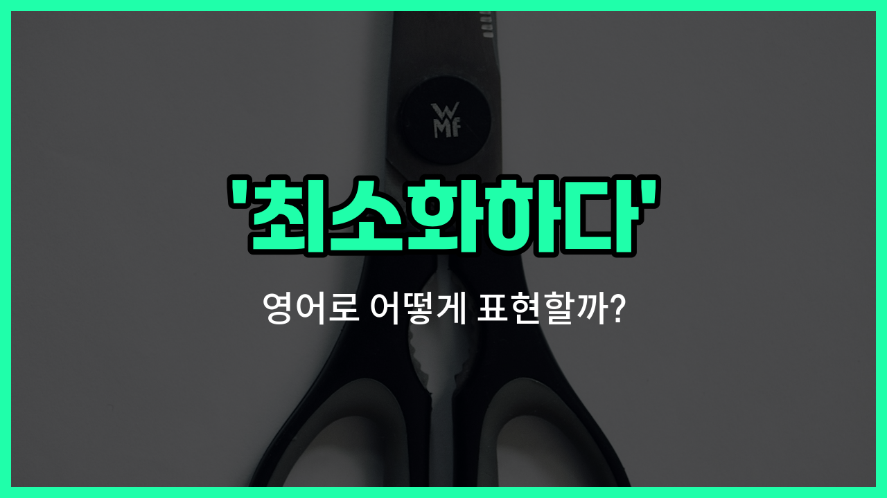

## 🌟 영어 표현 - minimize

안녕하세요 👋 오늘은 '최소화하다'라는 뜻을 가진 영어 표현을 소개해드릴게요. 바로 '**minimize**'라는 단어인데요. 이 단어는 어떤 것을 **가장 작게 만들다** 또는 **줄이다**라는 의미로 자주 사용돼요.

예를 들어, 실수나 위험, 비용 등을 최대한 줄이고 싶을 때 'minimize'를 쓸 수 있어요. 일상생활이나 비즈니스 상황 모두에서 정말 유용하게 쓰이는 단어랍니다~!

예를 들어, "우리는 비용을 최소화해야 해요."라고 말하고 싶을 때 "We need to minimize [costs](/blog/in-english/664.cost/)."라고 표현할 수 있어요.

또한, "실수를 최소화하려고 노력하고 있어요."는 "I'm [trying to](/blog/in-english/117.try-to/) minimize mistakes."라고 할 수 있답니다~.

## 📖 예문

1. "환경 오염을 최소화하는 것이 중요해요."

   "It's [important](/blog/in-english/318.important/) to minimize environmental pollution."

2. "시간 낭비를 최소화하고 싶어요."

   "I want to minimize wasted time."

## 💬 연습해보기

<ul data-interactive-list>

  <li data-interactive-item>
    아기가 자는 동안에는 최대한 조용히 해요.
    Let's try to minimize the noise while the baby's sleeping.
  </li>

  <li data-interactive-item>
    그 친구는 식사 준비로 주방에 있는 시간을 최대한 줄이려고 해요.
    She always tries to minimize her time in the kitchen by <a href="/blog/in-english/528.meal/">meal</a> prepping.
  </li>

  <li data-interactive-item>
    스트레스를 줄이려고 보통 할 일 목록을 만들어요.
    To minimize stress, I usually make a to-do list.
  </li>

  <li data-interactive-item>
    이번 프로젝트에서 비용을 최대한 줄이려고 노력 중이에요.
    They're working to minimize costs on this project.
  </li>

  <li data-interactive-item>
    기말고사 공부할 때는 산만하지 않게 집중하세요.
    <a href="/blog/in-english/232.make-sure/">Make sure</a> you minimize distractions when you study for finals.
  </li>

  <li data-interactive-item>
    이 앱은 화면 보는 시간을 줄이는 데 도움을 줘요.
    The app helps you minimize your screen time.
  </li>

  <li data-interactive-item>
    평일에는 설탕 섭취를 최대한 줄이려고 해요.
    I try to minimize my sugar intake during the week.
  </li>

  <li data-interactive-item>
    선크림을 바르면 피부 손상을 줄일 수 있어요.
    Wearing <a href="/blog/in-english/552.sunscreen/">sunscreen</a> can help minimize skin damage.
  </li>

  <li data-interactive-item>
    종이가 부족해서 인쇄할 때 양을 좀 줄여줄래요?
    Could you minimize how much you print? We're low on paper.
  </li>

  <li data-interactive-item>
    모든 걸 두 번 확인해서 위험을 줄여야 해요.
    We should minimize the <a href="/blog/in-english/676.risk/">risk</a> by double-checking everything.
  </li>

</ul>

## 🤝 함께 알아두면 좋은 표현들

### reduce

'reduce'는 '줄이다' 또는 '감소시키다'라는 뜻으로, 어떤 양이나 정도를 더 작게 만드는 것을 의미해요. 'minimize'와 비슷하게 무언가를 줄이고 싶을 때 자주 쓰는 표현이에요.

- "We need to reduce our [expenses](/blog/in-english/725.expense/) to [save](/blog/in-english/293.save/) more money."
- "우리가 돈을 더 모으려면 지출을 줄여야 해요."

### maximize

'maximize'는 '최대화하다'라는 뜻으로, 어떤 것을 가능한 한 가장 크게 만들거나 늘리는 것을 의미해요. 'minimize'의 반대말로, 무언가를 극대화하고 싶을 때 사용해요.

- "The company wants to maximize its [profits](/blog/in-english/663.profit/) this year."
- "그 회사는 올해 이익을 최대화하고 싶어 해요."

### keep to a minimum

'keep to a minimum'은 '최소한으로 유지하다'라는 뜻이에요. 어떤 것을 아주 적은 수준으로 유지하려고 할 때 쓰는 표현으로, 'minimize'와 비슷한 의미예요.

- "Please keep noise to a minimum during the meeting."
- "회의 중에는 소음을 최소한으로 해 주세요."

---

오늘은 '최소화하다'라는 뜻의 영어 표현 '**minimize**'에 대해 알아봤어요. 앞으로 무언가를 줄이거나 작게 만들고 싶을 때 이 단어를 떠올려보세요 😊

오늘 배운 표현과 예문들을 꼭 소리 내서 여러 번 읽어보시고, 실제 상황에서 활용해보세요! 다음에도 더 유익한 영어 표현으로 찾아올게요. 감사합니다!
