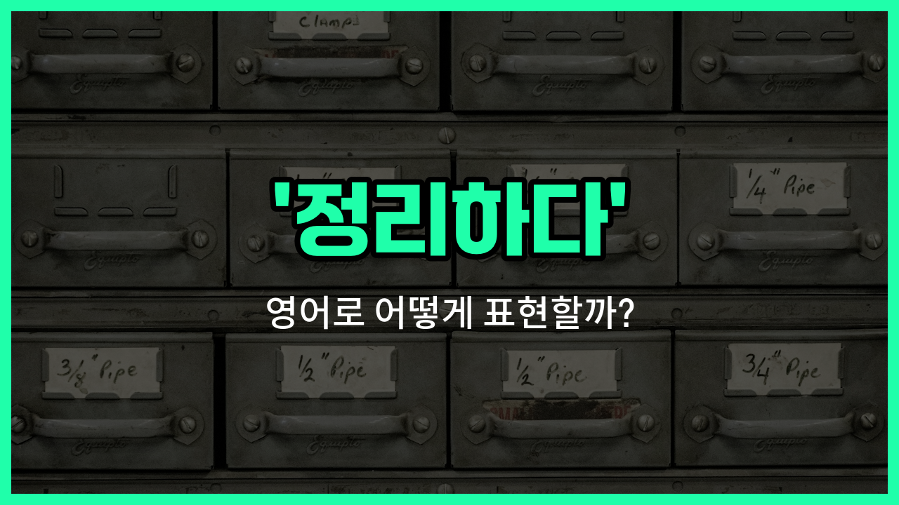

## 🌟 영어 표현 - tidy up

안녕하세요 👋 오늘은 일상에서 자주 쓰는 표현인 '**정리하다**'의 영어 표현 '**tidy up**'에 대해 알아보려고 해요.

'**tidy up**'는 공간이나 물건을 **정돈하거나 깔끔하게 치우는** 상황에서 자주 사용돼요. 예를 들어, 방이 어질러져 있을 때, 책상 위가 지저분할 때, 또는 집안 곳곳을 정리할 때 쓸 수 있는 표현이에요.

이 표현은 동사로 쓰이며, '정돈하다', '치우다'와 같은 의미로 활용돼요. 특히, 집안일이나 사무실에서 자주 들을 수 있는 말이에요. 예를 들어, "방 좀 정리해!"라고 말하고 싶을 때 "Tidy up your room!"이라고 할 수 있어요.

## 📖 예문

1. "책상을 정리해 주세요."

   "Please tidy up the desk."

2. "저는 매일 아침 방을 정리해요."

   "I tidy up my room every morning."

3. "파티가 끝난 후에 모두 함께 집을 정리했어요."

   "We all tidied up the house after the party."

## 💬 연습해보기

<ul data-interactive-list>

  <li data-interactive-item>
    진짜 방 좀 치워야겠어요. 완전 엉망진창이에요.
    I really need to tidy up my room. It's a total mess <a href="/blog/in-english/525.right-now/">right now</a>.
  </li>

  <li data-interactive-item>
    제가 집에 오시기 전에 주방 좀 정리할게요.
    Let me just tidy up the kitchen before you come over.
  </li>

  <li data-interactive-item>
    손님들 오시기 전에 정리 좀 도와줄 수 있어요?
    Can you help me tidy up before our guests <a href="/blog/in-english/403.arrive/">arrive</a>?
  </li>

  <li data-interactive-item>
    저는 항상 하루 끝에 책상 정리하려고 해요. 그래야 내일 새롭게 시작하니까요.
    I always <a href="/blog/in-english/117.try-to/">try to</a> tidy up my desk <a href="/blog/in-english/411.At-the-end-of-the-day/">at the end of the day</a>. That way I start fresh tomorrow.
  </li>

  <li data-interactive-item>
    애들 자고 난 다음에 거실 정리했어요.
    She tidied up the living room after her kids <a href="/blog/in-english/240.go-to-bed/">went to bed</a>.
  </li>

  <li data-interactive-item>
    좀 치워야겠어요. 저희 부모님이 나중에 들르시거든요.
    We should tidy up a bit. My parents are stopping by later.
  </li>

  <li data-interactive-item>
    필요한 거 찾으려고 이 서류들 좀 정리할 거예요.
    I'm just going to tidy up these papers so I can find what I need.
  </li>

  <li data-interactive-item>
    요리하고 나서 조리대 정리하고 모든 걸 제자리에 두는 걸 좋아해요.
    After <a href="/blog/in-english/461.cook/">cooking</a>, I like to tidy up the counters and put everything away.
  </li>

  <li data-interactive-item>
    이메일 정리해야 해요. 받은 편지함이 너무 많아서요.
    I have to tidy up my emails. My inbox is out of control.
  </li>

  <li data-interactive-item>
    옷장 정리하고 오래된 옷은 기부했어요.
    He tidied up his closet and donated some old clothes to charity.
  </li>

</ul>

## 🤝 함께 알아두면 좋은 표현들

### clean up

'[clean](/blog/in-english/523.clean/) up'은 "청소하다" 또는 "깨끗이 치우다"라는 뜻이에요. 'tidy up'과 비슷하게 어질러진 공간이나 물건을 정돈하고 청결하게 만드는 상황에서 자주 사용돼요.

- "Let's clean up the kitchen after dinner."
- "저녁 먹고 나서 부엌을 깨끗이 치우자고 했어요."

### mess up

'mess up'은 "어지럽히다" 또는 "엉망으로 만들다"라는 뜻이에요. 'tidy up'의 반대말로, 정돈된 상태를 흐트러뜨리거나 지저분하게 만드는 상황에서 써요.

- "The kids messed up their room while playing."
- "아이들이 놀다가 방을 엉망으로 만들어놨어요."

### organize

'[organize](/blog/in-english/355.organize/)'는 "정리하다" 또는 "체계적으로 배열하다"라는 뜻이에요. 'tidy up'보다 좀 더 계획적으로 물건이나 일정을 정돈하는 느낌이 강해요.

- "I need to organize my desk before I start working."
- "일 시작하기 전에 책상을 정리해야겠어요."

---

오늘은 '**정리하다**'라는 뜻을 가진 영어 표현 '**tidy up**'에 대해 알아봤어요. 집이나 사무실에서 무언가를 정돈할 때 이 표현을 떠올리면 좋겠어요 😊

오늘 배운 표현과 예문들을 꼭 소리 내서 여러 번 읽어보세요. 다음에도 더 유익한 영어 표현으로 찾아올게요! 감사합니다!

