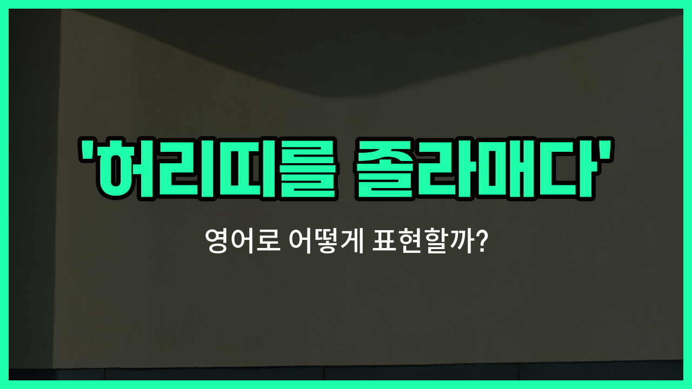

## 🌟 영어 표현 - tighten one's belt

안녕하세요 👋 오늘은 우리가 자주 쓰는 표현인 '**허리띠를 졸라매다**'의 영어 표현에 대해 알아보려고 해요. 바로 '**tighten one's belt**'라는 표현이에요.

이 표현은 말 그대로 허리띠를 더 조여서 허리를 가늘게 만든다는 뜻이지만, 실제로는 **돈을 아끼거나 절약해야 할 때** 자주 쓰여요. 즉, 경제적으로 힘들거나 지출을 줄여야 할 상황에서 '절약하다', '긴축하다'라는 의미로 사용돼요!

예를 들어, 갑자기 예상치 못한 지출이 생겼거나, 수입이 줄어서 생활비를 줄여야 할 때 이 표현을 쓸 수 있어요. 영어권에서도 'We have to tighten our belts.'라고 하면 '우리 허리띠를 졸라매야 해.' 즉, '절약해야 해.'라는 의미로 자연스럽게 받아들여져요.

## 📖 예문

1. "이번 달에는 허리띠를 졸라매야 할 것 같아요."

   "I think we need to tighten our belts this month."

2. "회사가 어려워져서 모두가 허리띠를 졸라매고 있어요."

   "Everyone is tightening their belts because the company is struggling."

## 💬 연습해보기

<ul data-interactive-list>

  <li data-interactive-item>
    일자리 잃고 나서 완전 허리 졸라매야 했어요. 이제 매일 밤 외식은 꿈도 못 꾸겠네요.
    Ever since I <a href="/blog/in-english/457.lose/">lost</a> my job, I've really had to tighten my belt. No more eating out every night.
  </li>

  <li data-interactive-item>
    휴가 자금 모으려면 앞으로 몇 달간은 좀 아껴 써야 해요.
    We're <a href="/blog/in-english/117.try-to/">trying to</a> <a href="/blog/in-english/293.save/">save</a> for a <a href="/blog/in-english/516.vacation/">vacation</a>, so we need to tighten our belts for the next couple of months.
  </li>

  <li data-interactive-item>
    회사가 요즘 좀 힘들어서 모두가 허리 졸라매라는 지시 받았어요.
    The company isn't doing well, so everyone's been told to tighten their belts.
  </li>

  <li data-interactive-item>
    요즘 돈이 좀 빠듯해서 고급 커피는 아끼고 있어요.
    Money is a bit tight <a href="/blog/in-english/525.right-now/">right now</a>, so we're tightening our belts and skipping the fancy coffee.
  </li>

  <li data-interactive-item>
    새 집 사고 나서 예상치 못한 지출 때문에 꽤 아껴 써야 했어요.
    After buying their new house, they had to tighten their belts to cover all the unexpected <a href="/blog/in-english/725.expense/">expenses</a>.
  </li>

  <li data-interactive-item>
    가격 다 올라서 올해 다들 허리 졸라매고 사는 중이에요.
    Yeah, we've all had to tighten our belts this year with <a href="/blog/in-english/640.price/">prices</a> going up everywhere.
  </li>

  <li data-interactive-item>
    부모님이 힘들 때 허리 졸라매는 법을 항상 가르쳐 주셨거든요.
    My parents always taught me how to tighten my belt when things got <a href="/blog/in-english/183.tough/">tough</a> financially.
  </li>

  <li data-interactive-item>
    대학원 시작하고 나서 학자금 대출도 한계라 계속 허리 졸라매고 있어요.
    She's been tightening her belt since starting grad school because student loans only stretch <a href="/blog/in-english/283.so-far/">so far</a>.
  </li>

  <li data-interactive-item>
    팬데믹 때 다들 허리 졸라매면서 꼭 필요한 것만 신경 썼어요.
    During the pandemic, a lot of people had to tighten their belts and <a href="/blog/in-english/186.focus-on/">focus on</a> essentials.
  </li>

  <li data-interactive-item>
    지금은 힘들지만 허리 졸라매야 빨리 다시 일어설 수 있을 거예요.
    I know it's not fun, but tightening your belt now will help you get back on your feet faster.
  </li>

</ul>

## 🤝 함께 알아두면 좋은 표현들

### cut back on expenses

'[cut back on](/blog/in-english/059.cut-back-on/) expenses'는 "지출을 줄이다"라는 뜻이에요. 돈을 아끼기 위해 불필요한 소비를 줄이거나 예산을 조정할 때 자주 쓰는 표현이에요.

- "With the rising [cost](/blog/in-english/664.cost/) of living, many families have to cut back on expenses."
- "물가가 오르다 보니까 많은 가정이 지출을 줄여야 해요."

### splurge

'[splurge](/blog/in-english/731.splurge/)'는 "돈을 펑펑 쓰다" 또는 "사치하다"라는 뜻이에요. 허리띠를 졸라매는 것과는 반대로, 돈을 아끼지 않고 원하는 대로 쓰는 상황에서 사용해요.

- "After getting her bonus, she [decided to](/blog/in-english/062.decide-to/) splurge on a fancy dinner."
- "보너스를 받은 후에 그녀는 비싼 저녁 식사에 돈을 펑펑 썼어요."

### live within one's means

'live within one's means'는 "분수에 맞게 살다" 또는 "자신의 수입 안에서 살다"라는 뜻이에요. 허리띠를 졸라매는 것과 비슷하게, 자신의 경제 상황에 맞춰서 소비를 조절하는 것을 강조할 때 써요.

- "It's [important](/blog/in-english/318.important/) to live within your means to avoid getting into [debt](/blog/in-english/662.debt/)."
- "빚을 지지 않으려면 분수에 맞게 사는 게 중요해요."

---

오늘은 '**허리띠를 졸라매다**'라는 뜻을 가진 영어 표현 '**tighten one's belt**'에 대해 알아봤어요. 앞으로 절약하거나 긴축해야 할 상황이 오면 이 표현을 떠올려보면 좋겠어요 😊

오늘 배운 표현과 예문들을 꼭 소리 내서 여러 번 읽어보세요. 다음에도 더 유익한 영어 표현으로 찾아올게요! 감사합니다!

