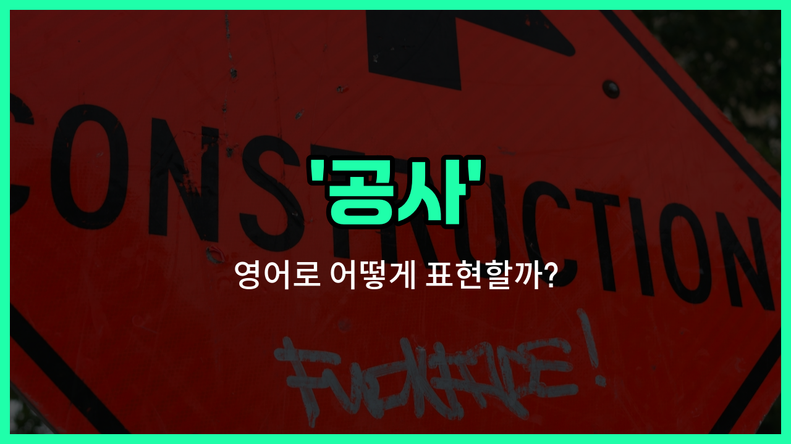

## 🌟 영어 표현 - construction

안녕하세요 👋 오늘은 일상에서 자주 듣는 단어인 '**공사**'의 영어 표현 '**construction**'에 대해 알아보려고 해요.

'**construction**'은 무언가를 짓거나 만드는 **과정**을 의미해요. 즉, 건물, 도로, 다리 등 다양한 구조물을 새로 만들거나, 기존의 것을 고치는 상황에서 자주 쓰이는 단어예요.

예를 들어, 길을 지나가다가 "공사 중"이라는 표지판을 본 적 있으시죠? 이럴 때 영어로는 "Under construction"이라고 표현해요. 또, 아파트를 새로 짓는 것도 "The construction of a new apartment"라고 할 수 있어요.

'**construction**'은 명사로만 사용되고, '건설', '시공'과 같은 의미로도 넓게 쓰여요. 그래서 건설 현장, 시공 현장 등 다양한 상황에서 자연스럽게 활용할 수 있어요!

## 📖 예문

1. "이 도로는 공사 중이에요."

   "This road is under construction."

2. "새 병원 건설이 다음 달에 시작돼요."

   "The construction of the new hospital will begin next month."

## 💬 연습해보기

<ul data-interactive-list>

  <li data-interactive-item>
    우리 동네 길에 지금 공사가 한창이에요. 아침마다 엄청 시끄러워서 힘들어요.
    There's a lot of construction happening on my street <a href="/blog/in-english/525.right-now/">right now</a>. It's so noisy in the mornings.
  </li>

  <li data-interactive-item>
    드디어 시내 새 쇼핑몰 공사가 시작된 것 같아요.
    I think they're <a href="/blog/in-english/182.finally/">finally</a> starting construction on the new shopping center downtown.
  </li>

  <li data-interactive-item>
    먼지 때문에 미안해요. 우리 집 주방에서 공사 중이라서 그래요.
    Sorry about all the dust. We're having some construction done in the kitchen.
  </li>

  <li data-interactive-item>
    건설 노동자분들이 매일 엄청 일찍 시작해서 늦잠 자기가 어렵네요.
    The construction workers start really early every day, so <a href="/blog/in-english/111.hard-to/">it's hard to</a> <a href="/blog/in-english/825.sleep-in/">sleep in</a>.
  </li>

  <li data-interactive-item>
    메인 스트리트에 공사 많이 하는 거 봤어요? 길이 몇 블록이나 막혔더라고요.
    Did you see all the construction on Main Street? <a href="/blog/in-english/384.traffic/">Traffic</a> is backed up for blocks.
  </li>

  <li data-interactive-item>
    우리 사무실 건물이 공사 중이라서 옆문으로 들어가야 해요.
    Our office building is under construction, so we have to use the side entrance.
  </li>

  <li data-interactive-item>
    앞에 붙은 안내판 보니까 공사가 다음 여름까지 끝난대요.
    The construction should be finished by next summer, according to the signs out front.
  </li>

  <li data-interactive-item>
    회사 가는 길에 도로 공사 중이라서 지금은 더 일찍 나가야 해요.
    They're doing road construction on my way to work. I have to <a href="/blog/in-english/402.leave/">leave</a> <a href="/blog/in-english/397.earlier/">earlier</a> now.
  </li>

  <li data-interactive-item>
    이 고속도로 공사는 정말 끝날 기미가 안 보여서 너무 길어요.
    There's been construction on this highway for what feels like forever.
  </li>

  <li data-interactive-item>
    우리 이웃이 뒷마당에 새 수영장 공사를 막 시작했어요.
    Our neighbors just started construction on a new pool in their backyard.
  </li>

</ul>

## 🤝 함께 알아두면 좋은 표현들

### under construction

'under construction'은 "공사 중인"이라는 뜻이에요. 건물이나 도로, 시설 등이 아직 완공되지 않고 공사가 진행 중일 때 자주 쓰는 표현이에요.

- "The new shopping mall is [still](/blog/in-english/254.still/) under construction, so it [won](/blog/in-english/456.win/)'t open until next year."
- "새 쇼핑몰이 아직 공사 중이라서 내년까지는 오픈하지 않을 거예요."

### demolition

'demolition'은 "철거" 또는 "해체"라는 뜻이에요. 기존의 건물이나 구조물을 부수거나 없애는 작업을 말해요. 공사와는 반대되는 개념으로, 새로 짓는 것이 아니라 없애는 것을 의미해요.

- "The old factory is scheduled for demolition next month."
- "그 오래된 공장은 다음 달에 철거될 예정이에요."

### renovation

'renovation'은 "리노베이션" 또는 "수리, 보수 공사"라는 뜻이에요. 기존 건물이나 공간을 더 좋게 고치거나 새롭게 꾸미는 작업을 말해요. 완전히 새로 짓는 construction과는 달리, 기존 것을 개선하는 데 초점이 있어요.

- "We're planning a major renovation of our kitchen this summer."
- "이번 여름에 우리 집 주방을 대대적으로 리모델링할 계획이에요."

---

오늘은 '**공사**'라는 뜻을 가진 영어 표현 '**construction**'에 대해 알아봤어요. 앞으로 길을 걷다가 공사 현장을 볼 때 이 표현이 떠오르면 좋겠어요 😊

오늘 배운 표현과 예문들을 꼭 소리 내서 여러 번 읽어보세요. 다음에도 더 유익한 영어 표현으로 찾아올게요! 감사합니다!
