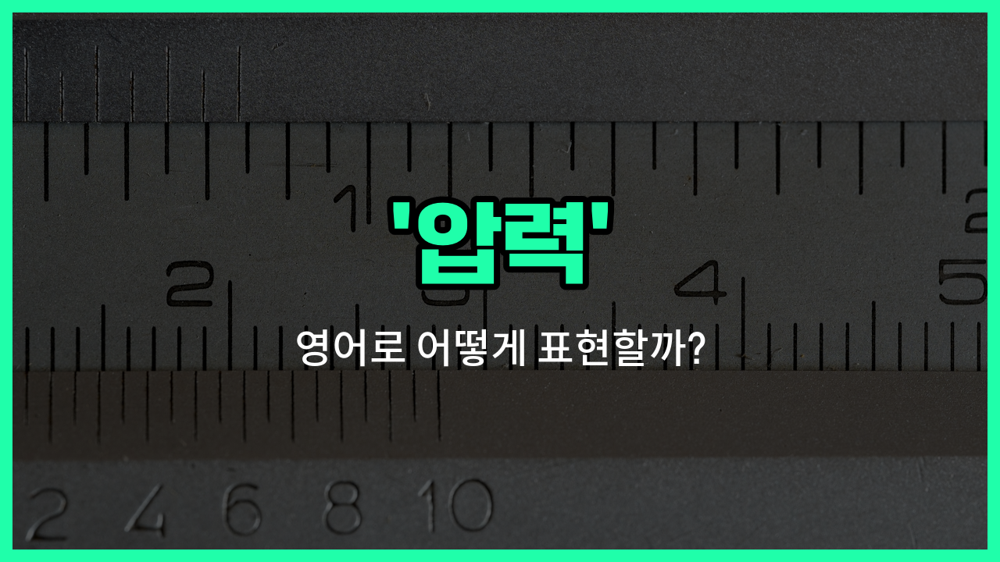

## 🌟 영어 표현 - pressure

안녕하세요 👋 오늘은 일상에서 자주 쓰이는 단어인 '**압력**'의 영어 표현 '**pressure**'에 대해 알아보려고 해요.

'**pressure**'는 무언가를 누르거나 밀어서 생기는 힘, 즉 **물리적인 힘**을 의미할 때 가장 기본적으로 사용돼요. 예를 들어, 타이어에 공기를 넣을 때 '공기 압력'을 말할 수 있죠. 하지만 이 단어는 단순히 물리적인 힘뿐만 아니라, **심리적인 압박**이나 **스트레스**를 표현할 때도 자주 쓰여요!

예를 들어, 시험을 앞두고 느끼는 부담감이나, 누군가가 어떤 행동을 하도록 강요할 때도 'pressure'라는 단어를 사용할 수 있어요. 그래서 '압박', '누름'과 같은 의미로도 자연스럽게 활용된답니다~

## 📖 예문

1. "타이어의 압력을 확인해 주세요."

   "Please check the pressure of the tires."

2. "그는 시험에 대한 압박을 많이 느끼고 있어요."

   "He feels a lot of pressure about the exam."

3. "상사가 나에게 더 열심히 일하라고 압박을 주고 있어요."

   "My boss is putting pressure on me to work harder."

## 💬 연습해보기

<ul data-interactive-list>

  <li data-interactive-item>
    마감일이 다가올수록 점점 압박감이 느껴졌어요.
    I could feel the pressure building up as the <a href="/blog/in-english/830.deadline/">deadline</a> got closer.
  </li>

  <li data-interactive-item>
    우리 부모님은 완벽한 성적을 요구하신 적이 없어요.
    My parents never put much pressure on me to get <a href="/blog/in-english/413.perfect/">perfect</a> grades.
  </li>

  <li data-interactive-item>
    비행기가 착륙할 때 기내 압력 때문에 귀가 아팠어요.
    The pressure in the <a href="/blog/in-english/478.airplane/">airplane</a> cabin hurt my ears during landing.
  </li>

  <li data-interactive-item>
    그녀는 압박감 속에서 더 잘하고 항상 최고의 결과를 내요.
    She thrives <a href="/blog/in-english/491.under-pressure/">under pressure</a> and always delivers her best work.
  </li>

  <li data-interactive-item>
    당장 결정을 강요하고 싶지 않아요.
    I don't want to pressure you into <a href="/blog/vocab-1/010.make-a-decision/">making a decision</a> <a href="/blog/in-english/525.right-now/">right now</a>.
  </li>

  <li data-interactive-item>
    새 학교에서 어울려야 한다는 압박감이 커요.
    There's a lot of pressure to fit in at a new school.
  </li>

  <li data-interactive-item>
    그는 팀장이라는 자리에서 오는 부담 때문에 힘들어했어요.
    He struggled with the pressure of being the team captain.
  </li>

  <li data-interactive-item>
    연례 건강 검진 중에 의사가 제 혈압을 측정했어요.
    The <a href="/blog/in-english/563.doctor/">doctor</a> checked my <a href="/blog/in-english/585.blood-pressure/">blood pressure</a> during my annual <a href="/blog/in-english/570.check-up/">check-up</a>.
  </li>

  <li data-interactive-item>
    가끔은 모든 압박감에서 벗어나 잠깐 쉬어야 할 때가 있어요.
    <a href="/blog/in-english/270.sometimes/">Sometimes</a> I just need to step away and <a href="/blog/in-english/202.take-a-break/">take a break</a> from all this pressure.
  </li>

  <li data-interactive-item>
    또래 압력 때문에 하기 싫은 일도 거절하기 어려울 때가 있어요.
    Peer pressure can <a href="/blog/in-english/244.make-it/">make it</a> <a href="/blog/in-english/183.tough/">tough</a> to say no to things you don't want to do.
  </li>

</ul>

## 🤝 함께 알아두면 좋은 표현들

### under stress

'under stress'는 "스트레스를 받는 상태"를 의미해요. 압력(pressure)과 비슷하게, 외부 상황이나 일로 인해 심리적으로 부담을 느끼는 상황을 나타낼 때 자주 써요.

- "She has been under a lot of stress at work lately."
- "그녀는 요즘 직장에서 스트레스를 많이 받고 있어요."

### relaxed

'relaxed'는 "긴장이 풀린" 또는 "편안한" 상태를 의미해요. 압력(pressure)과는 반대되는 개념으로, 부담이나 스트레스 없이 여유롭고 편안한 상태를 나타낼 때 사용해요.

- "I feel so relaxed when I'm on [vacation](/blog/in-english/516.vacation/) by the beach."
- "해변에서 휴가를 보내면 정말 마음이 편안해져요."

### feel the heat

'feel the heat'는 "압박감을 느끼다" 또는 "압력을 받다"라는 뜻의 구어체 표현이에요. 주로 경쟁이 치열하거나 누군가의 기대가 높을 때 부담을 느끼는 상황에서 사용해요.

- "The team started to feel the heat as the deadline approached."
- "마감일이 다가오자 팀원들이 압박감을 느끼기 시작했어요."

---

오늘은 '**압력**', '**압박**', '**누름**'이라는 뜻을 가진 영어 표현 '**pressure**'에 대해 알아봤어요. 일상에서 물리적인 힘뿐만 아니라 심리적인 부담을 표현할 때도 쓸 수 있으니 꼭 기억해 두세요~ 😊

오늘 배운 표현과 예문들을 꼭 최소 3번씩 소리 내서 읽어보세요. 다음에도 더 재미있고 유익한 영어 표현으로 찾아올게요! 감사합니다!~요

