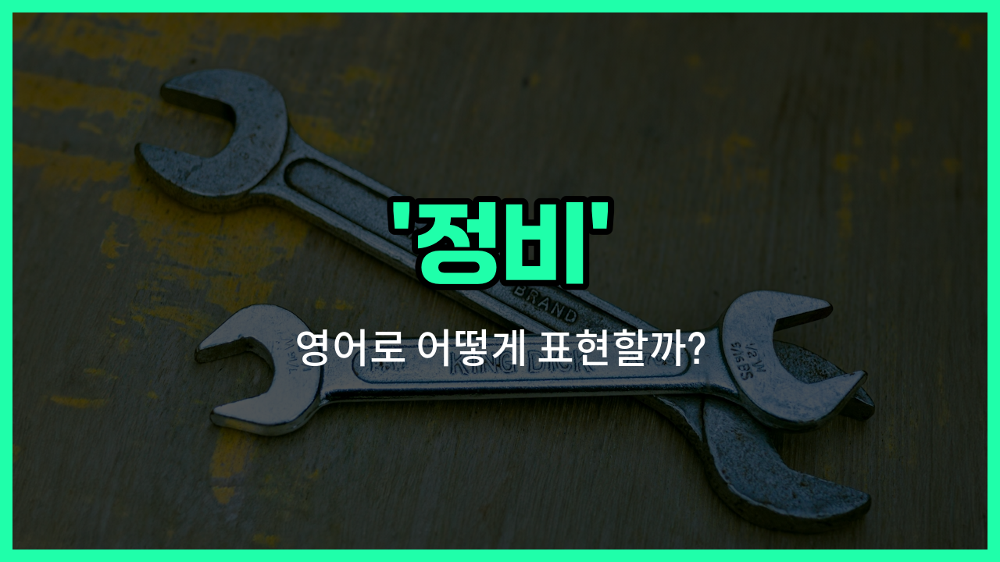

## 🌟 영어 표현 - maintenance

안녕하세요 👋 오늘은 '정비', '유지보수', '관리'라는 뜻을 가진 영어 표현을 소개해드릴게요. 바로 '**maintenance**'라는 단어에요.

'**maintenance**'는 어떤 기계나 시설, 시스템 등이 제대로 작동하도록 **정기적으로 점검하고 고치는 것**을 의미해요. 즉, 고장이 나지 않도록 미리 관리하거나, 문제가 생겼을 때 수리하는 모든 과정을 포함하는 단어에요!

이 단어는 자동차, 컴퓨터, 건물, 기계 등 다양한 분야에서 아주 자주 사용돼요. 예를 들어, 자동차를 오래 쓰기 위해 정기적으로 점검하고 오일을 교체하는 것도 'maintenance'라고 할 수 있어요.

또한, 컴퓨터 시스템이나 소프트웨어를 최신 상태로 유지하는 것도 'maintenance'라고 표현해요. 그래서 일상생활이나 직장에서도 정말 많이 쓰이는 단어에요.

## 📖 예문

1. "이 기계는 정기적인 정비가 필요해요."

   "This machine needs regular maintenance."

2. "건물 유지보수 비용이 많이 들어요."

   "The building maintenance [costs](/blog/in-english/664.cost/) a lot."

3. "컴퓨터 시스템을 관리하는 데 시간이 걸려요."

   "It takes time to do computer [system](/blog/in-english/432.system/) maintenance."

## 💬 연습해보기

<ul data-interactive-list>

  <li data-interactive-item>
    차에서 이상한 소리가 나요. 정비 맡기는 게 좋을 것 같아요.
    My car's making a <a href="/blog/in-english/296.weird/">weird</a> noise. I should <a href="/blog/in-english/281.probably/">probably</a> take it in for some maintenance.
  </li>

  <li data-interactive-item>
    저희는 몇 달마다 엘리베이터 정기점검을 해요. 그래서 오늘은 엘리베이터가 잠시 닫혀 있어요.
    We have regular maintenance scheduled for the elevators every few months. <a href="/blog/in-english/116.that-is-why/">That's why</a> they're closed today.
  </li>

  <li data-interactive-item>
    요즘 인터넷 상태가 자꾸 안 좋아요. 라우터 정비할 때가 된 것 같아요.
    Our internet's been acting up a lot lately. Maybe it's time for some maintenance on the router.
  </li>

  <li data-interactive-item>
    이번 주말에는 체육관이 정비 때문에 문을 닫아요. 운동은 쉬어야겠네요.
    The <a href="/blog/in-english/431.gym/">gym</a> is closed this weekend for maintenance. Guess I'll have to <a href="/blog/in-english/369.skip/">skip</a> my workout.
  </li>

  <li data-interactive-item>
    노트북은 정기적으로 점검해줘야 잘 돌아가요. 업데이트 같은 사소한 게 큰 차이를 만들어요.
    You should do routine maintenance on your laptop to keep it running smoothly. Little things like updates make a big difference.
  </li>

  <li data-interactive-item>
    폭풍이 지나가고 나서 건물이 많이 수리를 필요로 했어요. 일주일 내내 밖에서 작업했어요.
    After the storm, our building needed a lot of maintenance. They were working outside all week.
  </li>

  <li data-interactive-item>
    자전거 점검을 깜빡했더니 이제 기어가 제대로 안 바뀌네요.
    I <a href="/blog/in-english/023.forget/">forgot</a> all about my bike maintenance and now the gears <a href="/blog/in-english/456.win/">won</a>'t shift <a href="/blog/in-english/422.properly/">properly</a>.
  </li>

  <li data-interactive-item>
    그녀는 집 관리에 정말 철저해요. 수리를 꾸준히 해서 집 상태가 항상 좋아요.
    She's really good about maintenance. Her house is always in great shape because she <a href="/blog/vocab-1/027.keep-up-with/">keeps up with</a> <a href="/blog/in-english/863.repair/">repairs</a>.
  </li>

  <li data-interactive-item>
    시에서 수도관 점검 중이라 오늘 오후에 수도가 잠깐 끊길 수 있어요.
    The city's doing maintenance on the water pipes, so the water might be off this afternoon.
  </li>

  <li data-interactive-item>
    지난달에 에어컨을 갑작스럽게 수리했는데, 비용이 정말 많이 나왔어요.
    We had some unexpected maintenance on our AC last month. It was so <a href="/blog/in-english/317.expensive/">expensive</a>!
  </li>

</ul>

## 🤝 함께 알아두면 좋은 표현들

### upkeep

'upkeep'은 '정비'나 '유지 관리'를 의미하는 단어예요. 주로 건물, 차량, 기계 등 어떤 것을 좋은 상태로 유지하기 위해 정기적으로 점검하고 손보는 것을 말해요.

- "Regular upkeep of your car can [prevent](/blog/in-english/290.prevent/) expensive repairs in the future."
- "차를 정기적으로 관리하면 나중에 비싼 수리비를 막을 수 있어요."

### neglect

'neglect'는 '정비'의 반대말로, 어떤 것을 돌보지 않고 방치하는 것을 의미해요. 기계나 시설을 제대로 관리하지 않아서 상태가 나빠지는 상황에 자주 써요.

- "The old building fell into disrepair [due to](/blog/in-english/335.due-to/) years of neglect."
- "그 오래된 건물은 오랫동안 방치돼서 상태가 많이 나빠졌어요."

### servicing

'servicing'은 '정비'와 비슷하게, 기계나 차량 등을 점검하고 필요한 수리를 하는 것을 뜻해요. 주로 자동차나 기계류의 정기 점검을 말할 때 많이 사용해요.

- "My car is due for servicing next week."
- "내 차는 다음 주에 정기 점검을 받아야 해요."

---

오늘은 '정비', '유지보수', '관리'라는 뜻을 가진 영어 표현 '**maintenance**'에 대해 알아봤어요. 앞으로 기계나 시설을 관리할 때 이 단어를 떠올려보면 좋겠어요 😊

오늘 배운 표현과 예문들을 꼭 소리 내서 여러 번 읽어보세요. 다음에도 더 유익한 영어 표현으로 찾아올게요! 감사합니다!

