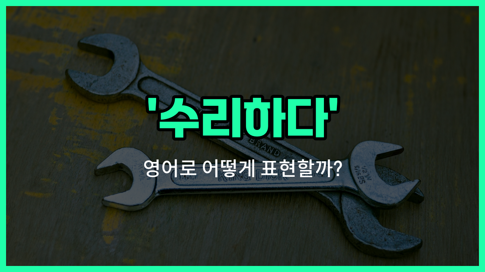

## 🌟 영어 표현 - repair

안녕하세요 👋 '**수리하다**', '**고치다**'라는 뜻을 가진 영어 표현을 아시나요? 오늘은 '**repair**'에 대해 이야기해보려고 해요. '**repair**'는 망가진 물건이나 고장이 난 부분을 다시 원래대로 고치거나 복구하는 것을 의미해요.

이 단어는 전자제품, 자동차, 집, 옷 등 다양한 물건이 고장 났을 때 자연스럽게 사용할 수 있어요. 예를 들어, 휴대폰 화면이 깨졌을 때 "I need to repair my phone screen."이라고 말할 수 있어요.

또는, "The mechanic repaired my car yesterday."라고 하면 "어제 정비사가 내 차를 고쳤어요."라는 의미에요.

'**repair**'는 동사로 '수리하다', '고치다'라는 뜻으로 자주 쓰이고, 명사로는 '수리', '보수'라는 의미로도 사용돼요. 상황에 따라 적절하게 활용해 보세요!

## 📖 예문

1. "이 신발을 수리할 수 있어요?"

   "Can you repair these shoes?"

2. "컴퓨터가 고장 나서 수리 중이에요."

   "The computer is being repaired because it [broke down](/blog/in-english/544.break-down/)."

## 💬 연습해보기

<ul data-interactive-list>

  <li data-interactive-item>
    내 노트북이 안 켜져서 수리해야 할 것 같아요.
    My laptop <a href="/blog/in-english/456.win/">won</a>'t <a href="/blog/in-english/310.turn-on/">turn on</a>. I think I need to get it repaired.
  </li>

  <li data-interactive-item>
    브레이크에서 꽤 심하게 삐걱거려서 차를 정비소에 맡겼어요.
    I took my car to the shop to repair the brakes. They were squeaking pretty badly.
  </li>

  <li data-interactive-item>
    내일 배관공이 와서 부엌에 새는 수도꼭지 고친대요.
    The plumber is coming tomorrow to repair the leaky faucet in the kitchen.
  </li>

  <li data-interactive-item>
    지난주에 폰 화면이 깨져서 직접 고쳐야 했어요.
    My phone screen cracked last week, so I had to repair it myself.
  </li>

  <li data-interactive-item>
    세탁기 고칠 수 있는 사람 알아요? 내 세탁기가 갑자기 안 돼서요.
    Do you know anyone who can repair a washing machine? Mine just stopped working.
  </li>

  <li data-interactive-item>
    폭풍 후에 파손된 전선들 고치는데 몇 주 걸렸어요.
    After the storm, it took weeks to repair all the power lines that were damaged.
  </li>

  <li data-interactive-item>
    집주인이 이번 주 안에 깨진 창문 고쳐주기로 했어요.
    The landlord promised to repair the broken window by the end of the week.
  </li>

  <li data-interactive-item>
    자전거 고치려 했는데 체인 수리 방법을 못 찾겠더라고요.
    I <a href="/blog/in-english/117.try-to/">tried to</a> repair my bike but I couldn't <a href="/blog/in-english/170.figure-out/">figure out</a> how to <a href="/blog/in-english/524.fix/">fix</a> the chain.
  </li>

  <li data-interactive-item>
    벤이 안경에 테이프로 수리하려는 거 봤어요? 완전 웃겼어요.
    Did you see Ben trying to repair his glasses with tape? It looked so funny.
  </li>

  <li data-interactive-item>
    가끔은 오래된 가전제품 고치는 것보다 새로 사는 게 더 싸요.
    <a href="/blog/in-english/270.sometimes/">Sometimes</a> it's cheaper to just buy a new appliance than to repair the old one.
  </li>

</ul>

## 🤝 함께 알아두면 좋은 표현들

### fix

'fix'는 '고치다', '수리하다'라는 뜻으로, 일상 대화에서 아주 자주 쓰이는 표현이에요. 망가진 물건이나 문제가 있는 상황을 다시 정상적으로 만들 때 사용해요.

- "Can you fix my phone? The screen is cracked."
- "내 핸드폰 좀 고쳐줄 수 있어요? 화면이 깨졌어요."

### restore

'restore'는 '복원하다', '원래 상태로 되돌리다'라는 의미예요. 단순히 고치는 것뿐만 아니라, 예전의 좋은 상태로 다시 만드는 뉘앙스가 있어요. 오래된 물건이나 건물, 예술품 등에 자주 쓰여요.

- "They restored the old painting to its [original](/blog/in-english/424.original/) beauty."
- "그들은 오래된 그림을 원래의 아름다움으로 복원했어요."

### break

'break'는 '고장내다', '부수다'라는 뜻으로, 'repair'의 반대말이에요. 어떤 물건이 망가지거나 더 이상 제대로 작동하지 않을 때 쓰는 표현이에요.

- "Be careful not to break the vase. It's very fragile."
- "그 꽃병 깨지지 않게 조심하세요. 아주 약해요."

---

오늘은 '**수리하다**', '**고치다**', '**복구하다**'라는 뜻을 가진 영어 표현 '**repair**'에 대해 알아봤어요. 혹시 물건이 고장 났을 때 이 표현을 떠올리면 좋겠어요 😊

오늘 배운 표현과 예문들을 꼭 최소 3번씩 소리 내서 읽어보세요. 다음에도 더 재미있고 유익한 영어 표현으로 찾아올게요! 감사합니다!
