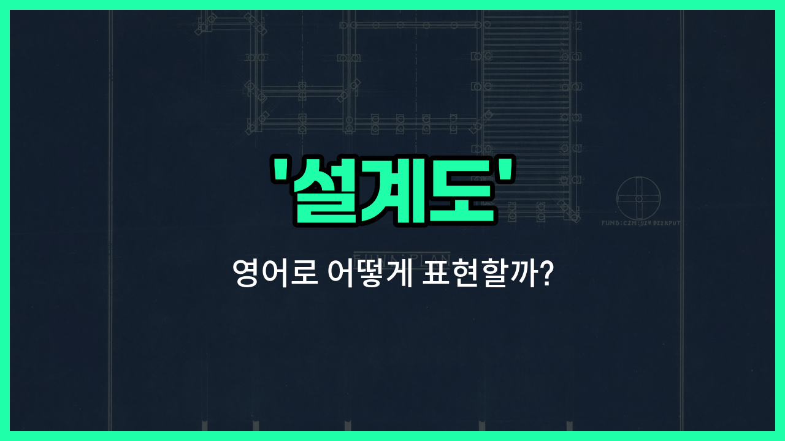

## 🌟 영어 표현 - blueprint

안녕하세요 👋 오늘은 영어로 '설계도'를 어떻게 표현하는지 알아보려고 해요. 바로 '**blueprint**'라는 단어인데요~

'**blueprint**'는 원래 건축이나 기계 설계에서 쓰이는 '설계도'를 의미해요. 즉, 건물을 짓거나 기계를 만들 때 필요한 **자세한 도면**을 말해요~

하지만 요즘에는 단순히 도면뿐만 아니라, **미래에 대한 계획이나 구상**을 의미할 때도 자주 사용돼요. 예를 들어, 어떤 프로젝트의 전체적인 계획을 세울 때도 'blueprint'라는 단어를 쓸 수 있어요~

예를 들어, "우리 회사의 5년 계획"을 영어로 말하고 싶을 때 "a five-year blueprint for our company"라고 할 수 있어요. 이처럼 'blueprint'는 구체적인 설계도뿐만 아니라, **계획**이나 **청사진**이라는 의미로도 넓게 쓰인답니다~

## 📖 예문

1. "이 건물의 설계도를 보여줄 수 있나요?"

   "Can you show me the blueprint of this building?"

2. "그들은 성공을 위한 청사진을 가지고 있어요."

   "They have a blueprint for success."

## 💬 연습해보기

<ul data-interactive-list>

  <li data-interactive-item>
    건축 시작하기 전에, 설계도를 한 번 더 꼼꼼히 봐야 해요.
    Before we start building, we need to look over the blueprint one more time.
  </li>

  <li data-interactive-item>
    이 집은 건축가 설계도를 딱 그대로 따라 지었어요. 결과가 정말 멋졌어요.
    This house followed the architect's blueprint <a href="/blog/in-english/419.exactly/">exactly</a>. It <a href="/blog/vocab-1/038.turn-out/">turned out</a> great.
  </li>

  <li data-interactive-item>
    새 커뮤니티 센터 설계도 봤어요? 완전 멋지더라고요.
    Did you see the blueprint for the new community center? It looks awesome.
  </li>

  <li data-interactive-item>
    이번 프로젝트는 설계도가 없어서 그냥 즉흥적으로 만들어 가는 중이에요.
    We don't have a blueprint for this project, so we're just <a href="/blog/in-english/244.make-it/">making it</a> up as we go.
  </li>

  <li data-interactive-item>
    명확한 설계도가 있으면 일 처리가 훨씬 수월해져요.
    <a href="/blog/in-english/270.sometimes/">Sometimes</a>, having a clear blueprint makes everything a lot easier.
  </li>

  <li data-interactive-item>
    옛날 설계도를 쓰고 있는데, 몇 군데는 좀 바꾸고 있어요.
    They're using the old blueprint, but making a few changes.
  </li>

  <li data-interactive-item>
    엔지니어가 설계도를 탁자 위에 펼쳐서 다 같이 볼 수 있게 했어요.
    The engineer spread the blueprint on the table so we could all see.
  </li>

  <li data-interactive-item>
    우리 앱은 아직 설계도가 없으니까, 아이디어부터 좀 내봐요.
    Our app doesn't have a blueprint yet, so let's <a href="/blog/in-english/227.brainstorm/">brainstorm</a> some ideas first.
  </li>

  <li data-interactive-item>
    그렇게 주방을 리모델링하려면 확실한 설계도가 꼭 필요해요.
    You need a solid blueprint before you try renovating a kitchen like that.
  </li>

  <li data-interactive-item>
    솔직히 인생에도 설계도가 있으면 좋겠어요. 훨씬 간편할 텐데!
    <a href="/blog/in-english/336.honestly/">Honestly</a>, <a href="/blog/in-english/118.i-wish/">I wish</a> life came with a blueprint. Things would be so much simpler!
  </li>

</ul>

## 🤝 함께 알아두면 좋은 표현들

### roadmap

'roadmap'은 "로드맵" 또는 "계획표"라는 뜻으로, 어떤 목표를 달성하기 위한 단계별 계획이나 방향성을 나타낼 때 사용해요. 'blueprint'가 구체적인 설계도라면, 'roadmap'은 큰 그림의 진행 계획에 더 가까워요.

- "The company unveiled its five-year roadmap for product development."
- "그 회사는 향후 5년간의 제품 개발 로드맵을 공개했어요."

### improvise

'improvise'는 "즉흥적으로 하다" 또는 "즉석에서 만들다"라는 뜻이에요. 'blueprint'처럼 미리 계획하거나 설계하지 않고, 상황에 맞게 즉석에서 해결하거나 만들어내는 것을 의미해요. 설계도와는 반대되는 개념이에요.

- "We didn't have a plan, so we had to improvise during the meeting."
- "우리는 계획이 없어서 회의 중에 즉흥적으로 대처해야 했어요."

### template

'template'은 "템플릿" 또는 "견본, 양식"이라는 뜻이에요. 어떤 것을 만들 때 기본이 되는 틀이나 형식을 의미해서, 'blueprint'와 비슷하게 무언가를 만들기 위한 기준이나 출발점으로 자주 사용돼요.

- "She [used](/blog/in-english/171.used/) a template to design all the invitations for the event."
- "그녀는 행사 초대장을 모두 디자인할 때 템플릿을 사용했어요."

---

오늘은 '설계도', '청사진', '계획'이라는 뜻을 가진 영어 표현 '**blueprint**'에 대해 알아봤어요. 앞으로 무언가를 계획하거나 구상할 때 이 단어를 떠올려보면 좋겠어요~ 😊

오늘 배운 표현과 예문들을 꼭 소리 내서 여러 번 읽어보세요. 다음에도 더 유익한 영어 표현으로 찾아올게요! 감사합니다~

