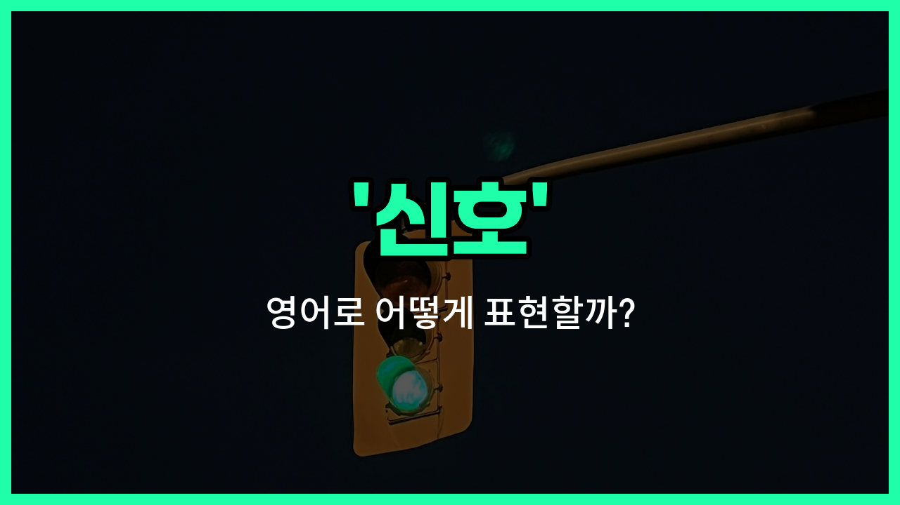

## 🌟 영어 표현 - signal

안녕하세요 👋 오늘은 일상에서 자주 쓰이는 영어 단어 '**signal**'에 대해 알아보려고 해요. 'signal'은 '신호', '신호를 보내다', '신호음'과 같은 의미로 사용돼요.

'**signal**'은 어떤 행동이나 소리, 빛 등으로 정보를 전달하거나 알리는 것을 의미해요. 예를 들어, 횡단보도에서 파란불이 켜지는 것도 하나의 신호이고, 누군가 손을 흔들어서 "이쪽으로 오세요"라고 알리는 것도 신호라고 할 수 있어요.

이 단어는 명사로 '신호', 동사로 '신호를 보내다'라는 뜻으로 모두 활용할 수 있어요. 일상 대화뿐만 아니라 교통, 통신, 스포츠 등 다양한 상황에서 자연스럽게 쓰인답니다!

## 📖 예문

1. "그는 나에게 출발하라는 신호를 보냈어요."

   "He gave me the signal to start."

2. "휴대폰 신호가 약해요."

   "The phone signal is weak."

3. "심판이 휘슬을 불어 신호를 보냈어요."

   "The referee signaled with a whistle."

## 💬 연습해보기

<ul data-interactive-list>

  <li data-interactive-item>
    신호등이 초록불로 바뀌어서 드라이브 시작했어요. 교차로에서 좀 기다렸거든요.
    The <a href="/blog/in-english/384.traffic/">traffic</a> signal turned green, so we started driving. I was waiting at the intersection for a while.
  </li>

  <li data-interactive-item>
    준비 되면 신호 좀 줄래요? 아직 끝내지 않은 거 방해하고 싶지 않아서요.
    Can you give me a signal when you're ready to <a href="/blog/in-english/402.leave/">leave</a>? I don't want to <a href="/blog/in-english/382.interrupt/">interrupt</a> you if you're not done yet.
  </li>

  <li data-interactive-item>
    여기선 핸드폰 신호가 안 잡혀요. 우리가 거의 외딴 곳에 있는 것 같아요.
    My phone doesn't have any signal out here. We must be in the middle of nowhere.
  </li>

  <li data-interactive-item>
    도움이 필요하다는 신호로 손을 들었어요. 선생님이 바로 알아채셨죠.
    He raised his hand as a signal that he needed help. The teacher <a href="/blog/in-english/061.notice/">noticed</a> him right away.
  </li>

  <li data-interactive-item>
    그 시끄러운 소리가 떠나야 한다는 신호 같았어요. 모두가 출구로 향하기 시작했어요.
    I think that <a href="/blog/in-english/311.loud/">loud</a> noise was a signal that we should leave. Everyone started heading for the exit.
  </li>

  <li data-interactive-item>
    심판 신호 봤어요? 파울을 선언한 것 같아요.
    Did you catch the signal from the referee? I think he called a foul.
  </li>

  <li data-interactive-item>
    매니저 신호 없으면 쇼를 시작 못 했어요. 다들 무대 뒤에서 기다리고 있었죠.
    We couldn't start the show until we got the signal from the manager. Everyone was waiting backstage.
  </li>

  <li data-interactive-item>
    그녀의 웃음이 아이디어가 마음에 들었다는 확실한 신호였어요. 덕분에 자신감이 생겼어요.
    Her smile was a clear signal that she liked the idea. It made me feel more <a href="/blog/in-english/420.confident/">confident</a>.
  </li>

  <li data-interactive-item>
    특정 휘파람 소리가 신호가 되면 강아지가 들어와요. 우리만의 약속 같은 거예요.
    The dog knows to come inside when I use a certain whistle as a signal. It's kind of our thing.
  </li>

  <li data-interactive-item>
    GPS가 신호를 잃어서 길을 물어봐야 했어요. 잠깐 정말 헷갈렸거든요.
    I <a href="/blog/in-english/457.lose/">lost</a> signal on my GPS, so I had to <a href="/blog/in-english/125.ask-for/">ask for</a> directions. It was really confusing for a bit.
  </li>

</ul>

## 🤝 함께 알아두면 좋은 표현들

### give a sign

'give a sign'은 "신호를 보내다" 또는 "암시를 주다"라는 뜻이에요. 누군가에게 어떤 행동을 하라는 신호나 힌트를 줄 때 자주 사용해요.

- "If you need help during the meeting, just give me a sign."
- "회의 중에 도움이 필요하면 그냥 나한테 신호만 줘요."

### ignore the signal

'[ignore](/blog/in-english/348.ignore/) the signal'은 "신호를 무시하다"라는 의미예요. 누군가가 보낸 신호나 암시를 일부러 못 본 척하거나 신경 쓰지 않을 때 쓰는 표현이에요.

- "She ignored the signal and kept talking."
- "그녀는 신호를 무시하고 계속 말을 했어요."

### read between the lines

'[read](/blog/in-english/436.read/) between the lines'는 "행간을 읽다" 또는 "숨은 의미를 파악하다"라는 뜻이에요. 직접적으로 드러나지 않은 신호나 암시를 눈치채고 이해할 때 쓰는 표현이에요.

- "You have to read between the lines to understand what he really means."
- "그 사람이 진짜로 무슨 말을 하고 싶은지 알아내려면 행간을 잘 읽어야 해요."

---

오늘은 '신호', '신호를 보내다', '신호음'이라는 뜻을 가진 영어 표현 '**signal**'에 대해 알아봤어요. 앞으로 신호와 관련된 상황에서 이 단어를 떠올려 보세요 😊

오늘 배운 표현과 예문들을 꼭 최소 3번씩 소리 내서 읽어보세요. 다음에도 더 재미있고 유익한 영어 표현으로 찾아올게요! 감사합니다!
