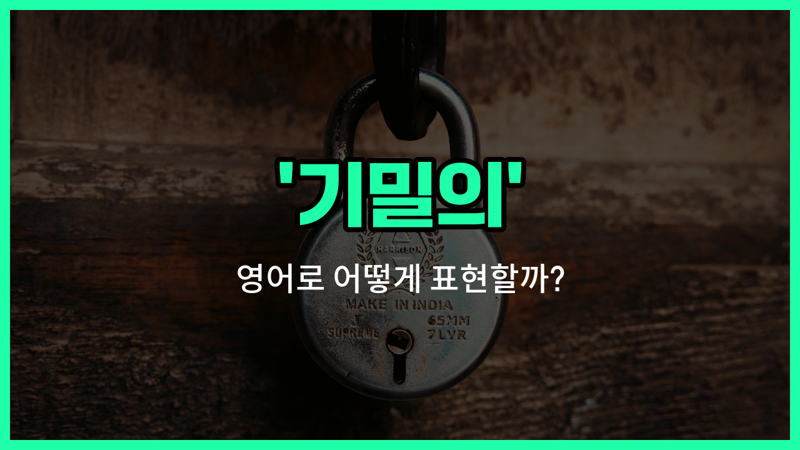

## 🌟 영어 표현 - confidential

안녕하세요 👋 오늘은 '기밀의', '비밀의'라는 뜻을 가진 영어 표현을 소개해드릴게요. 바로 '**confidential**'이에요. 이 단어는 **공개되면 안 되는 중요한 정보**나 **내부적으로만 공유되는 내용**을 말할 때 자주 사용돼요.

예를 들어, 회사의 중요한 문서나 정부의 비밀 자료처럼 외부에 알려지면 안 되는 정보를 설명할 때 'confidential'이라는 단어를 써요. 누군가에게 "이건 기밀이야"라고 말하고 싶을 때 "This is confidential."이라고 표현할 수 있어요.

또한, 'confidential'은 주로 문서, 보고서, 회의 등 공식적인 상황에서 많이 쓰여요. 일상 대화에서는 '비밀의', '내부의'라는 의미로도 자연스럽게 사용할 수 있어요.

## 📖 예문

1. "이 문서는 기밀이에요."

   "This [document](/blog/in-english/824.document/) is confidential."

2. "회의 내용은 비밀로 유지해 주세요."

   "Please keep the meeting details confidential."

## 💬 연습해보기

<ul data-interactive-list>

  <li data-interactive-item>
    이 정보는 완전 비밀이에요. 아무한테도 알려주지 말아 주세요.
    This information is strictly confidential. Please don't <a href="/blog/in-english/248.share/">share</a> it with anyone.
  </li>

  <li data-interactive-item>
    내가 말한 거 비밀로 지켜줄 수 있어요? 좀 개인적인 거라서요.
    Can you keep what I told you confidential? It's kind of personal.
  </li>

  <li data-interactive-item>
    그 사람 회사 들어갈 때 비밀 유지 계약서에 서명했어요.
    He signed a confidential <a href="/blog/in-english/754.agreement/">agreement</a> with the company when he started.
  </li>

  <li data-interactive-item>
    의사는 법적으로 환자 기록을 다 비밀로 해야 해요.
    The <a href="/blog/in-english/563.doctor/">doctor</a> has to keep all <a href="/blog/in-english/562.patient/">patient</a> records confidential by <a href="/blog/in-english/619.law/">law</a>.
  </li>

  <li data-interactive-item>
    미안해요, 그건 비밀이라 말할 수 없어요.
    Sorry, that's confidential. I'm not allowed to talk about it.
  </li>

  <li data-interactive-item>
    내 친구가 비밀 프로젝트 하느라 아무한테도 얘기 못 해요.
    My friend <a href="/blog/in-english/370.work-on/">works on</a> a confidential project, so he can't really discuss it with anyone.
  </li>

  <li data-interactive-item>
    합병 관련 비밀 메모를 전 직원에게 보냈대요.
    They <a href="/blog/in-english/292.send/">sent</a> out a confidential memo to all <a href="/blog/in-english/700.employee/">employees</a> about the <a href="/blog/in-english/690.merger/">merger</a>.
  </li>

  <li data-interactive-item>
    이 회의가 비밀 회의예요, 아니면 누구나 참여 가능한가요?
    Is this a confidential meeting, or can anyone join?
  </li>

  <li data-interactive-item>
    그녀 메일에 다음 주까지 내용 비밀이라고 적혀 있었어요.
    Her email said the details are confidential until next week.
  </li>

  <li data-interactive-item>
    파일 보기 전에 비밀 문서에 서명해야 했어요.
    I had to sign a confidential document before I could see the files.
  </li>

</ul>

## 🤝 함께 알아두면 좋은 표현들

### classified

'classified'는 '기밀의' 또는 '분류된'이라는 뜻으로, 주로 정부나 군사 관련 문서, 정보 등이 외부에 공개되지 않도록 보호되는 상태를 나타낼 때 사용해요. 'confidential'과 비슷하게 비밀로 유지해야 하는 정보를 말할 때 쓰여요.

- "The details of the project are classified and cannot be shared with the public."
- "그 프로젝트의 세부 사항은 기밀이라서 대중에게 공유할 수 없어요."

### top secret

'top secret'은 '최고 기밀의'라는 뜻으로, 'confidential'보다 더 높은 수준의 비밀을 의미해요. 극소수의 사람만 접근할 수 있는 아주 중요한 정보를 말할 때 사용해요.

- "Only a handful of people have [access](/blog/vocab-1/041.access/) to the top secret files."
- "최고 기밀 파일에는 소수의 사람만 접근할 수 있어요."

### public

'public'은 '공공의', '공개된'이라는 뜻으로, 누구나 접근할 수 있고 비밀이 아닌 정보를 나타낼 때 사용해요. 'confidential'의 반대말로 볼 수 있어요.

- "The report is now public and [available](/blog/in-english/188.available/) for everyone to [read](/blog/in-english/436.read/)."
- "이제 그 보고서는 공개돼서 누구나 읽을 수 있어요."

---

오늘은 '**기밀의**', '**비밀의**'라는 뜻을 가진 영어 표현 '**confidential**'에 대해 알아봤어요. 중요한 정보를 다룰 때 이 단어를 꼭 기억해두면 좋겠어요 😊

오늘 배운 표현과 예문들을 꼭 최소 3번씩 소리 내서 읽어보세요. 다음에도 더 재미있고 유익한 영어 표현으로 찾아올게요! 감사합니다!
