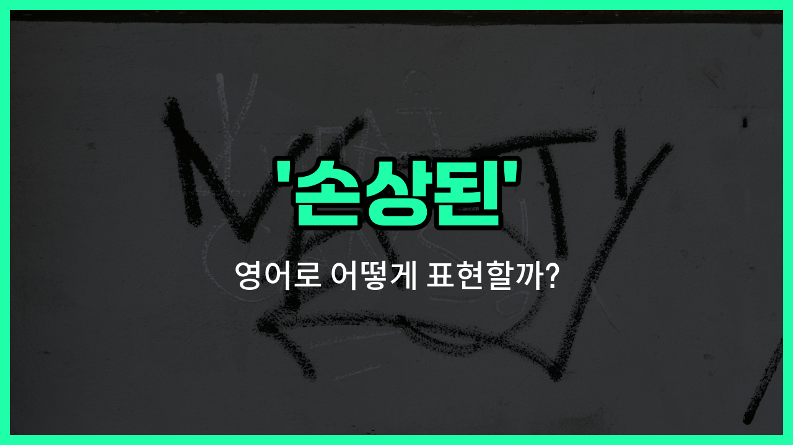

## 🌟 영어 표현 - corrupted

안녕하세요 👋 오늘은 무언가가 망가지거나 제대로 작동하지 않을 때 쓰는 영어 표현, '**corrupted**'에 대해 알아보려고 해요.

'**corrupted**'는 주로 '손상된', '부패한', '오염된'이라는 뜻으로 사용돼요. 컴퓨터 파일이 열리지 않거나 데이터가 망가졌을 때, 혹은 도덕적으로 타락한 상태를 표현할 때도 쓸 수 있어요!

예를 들어, 중요한 문서 파일이 열리지 않을 때 "The file is corrupted."라고 말할 수 있어요. 이때 'corrupted'는 파일이 손상되어 정상적으로 사용할 수 없다는 의미에요.

또한, 'corrupted'는 사람이나 조직이 부패하거나 타락한 경우에도 사용돼요. 예를 들어, "The official was corrupted by money."라고 하면 "그 공무원은 돈 때문에 부패했어."라는 뜻이에요.

## 📖 예문

1. "이 사진 파일이 손상됐어요."

   "This photo file is corrupted."

2. "그 정치인은 부패했어요."

   "The politician is corrupted."

## 💬 연습해보기

<ul data-interactive-list>

  <li data-interactive-item>
    내 폰이 사진을 더 이상 열지를 못해요. 파일이 손상된 것 같아요.
    My phone <a href="/blog/in-english/456.win/">won</a>'t open the photos anymore. I think the files got corrupted.
  </li>

  <li data-interactive-item>
    동영상 재생해보려 했는데, 손상돼서 열리지 않대요.
    I tried playing the video, but it said it's corrupted and can't be opened.
  </li>

  <li data-interactive-item>
    정전 이후에 문서 여러 개가 손상됐어요.
    After the power outage, a bunch of my <a href="/blog/in-english/824.document/">documents</a> were corrupted.
  </li>

  <li data-interactive-item>
    이 USB가 손상된 건지 좀 확인해줄래요? 파일이 안 보여서요.
    Can you check if this USB drive is corrupted? It won't show my files.
  </li>

  <li data-interactive-item>
    저장 파일이 손상돼서 모든 진행 상황을 다 날렸어요.
    I <a href="/blog/in-english/457.lose/">lost</a> all my <a href="/blog/in-english/859.progress/">progress</a> because the <a href="/blog/in-english/293.save/">save</a> file got corrupted.
  </li>

  <li data-interactive-item>
    그 오래된 하드 조심해요—이미 손상된 상태예요.
    Be careful with that old hard drive—it's already corrupted.
  </li>

  <li data-interactive-item>
    남동생이 내 노트북 떨어뜨려서 윈도우가 파일 몇 개가 손상됐다고 해요.
    My little brother <a href="/blog/in-english/361.drop/">dropped</a> my laptop, and now Windows says some files are corrupted.
  </li>

  <li data-interactive-item>
    다운로드가 중간에 멈췄는데 설치 파일이 손상됐어요.
    The download stopped halfway and now the installer is corrupted.
  </li>

  <li data-interactive-item>
    미안해요, 첨부파일을 보낼 수가 없네요. 여기서 파일이 손상된 것 같아요.
    Sorry, I can't <a href="/blog/in-english/292.send/">send</a> that attachment. The file looks corrupted on my end.
  </li>

  <li data-interactive-item>
    데이터가 손상되면 백업으로 복원해야 할 수도 있어요.
    If your data gets corrupted, you might need to use backup to restore it.
  </li>

</ul>

## 🤝 함께 알아두면 좋은 표현들

### damaged

'damaged'는 '손상된'이라는 뜻으로, 물리적으로 망가졌거나 기능이 저하된 상태를 말해요. 파일, 물건, 신체 등 다양한 상황에서 쓸 수 있어요.

- "The package [arrived](/blog/in-english/403.arrive/) damaged, so I had to return it."
- "택배가 손상된 상태로 도착해서 반품해야 했어요."

### intact

'intact'는 '손상되지 않은', '온전한'이라는 뜻이에요. 어떤 것이 원래 상태 그대로 보존되어 변형이나 손상이 없을 때 사용해요. 'corrupted'의 반대말이에요.

- "[Despite](/blog/in-english/341.despite/) the accident, the data remained intact."
- "사고가 있었지만 데이터는 온전하게 남아 있었어요."

### contaminated

'contaminated'는 '오염된'이라는 뜻으로, 주로 물질이나 환경, 데이터 등이 외부의 해로운 요소로 인해 더럽혀졌을 때 써요. 'corrupted'와 비슷하게 원래의 순수한 상태가 망가졌다는 의미를 담고 있어요.

- "The water [supply](/blog/in-english/638.supply/) was contaminated after the chemical spill."
- "화학물질이 유출된 후에 수돗물이 오염됐어요."

---

오늘은 '**손상된**', '**부패한**', '**오염된**'이라는 뜻을 가진 영어 표현 '**corrupted**'에 대해 알아봤어요. 파일이나 데이터가 망가졌을 때, 혹은 도덕적으로 타락한 상황을 표현할 때 이 단어를 떠올려 보세요! 😊

오늘 배운 표현과 예문들을 꼭 최소 3번씩 소리 내서 읽어보세요. 다음에도 더 재미있고 유익한 영어 표현으로 찾아올게요! 감사합니다!~요

