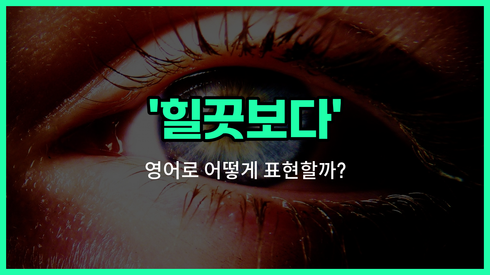

## 🌟 영어 표현 - glance at

안녕하세요 👋 오늘은 '힐끗보다'라는 뜻을 가진 영어 표현을 소개해드릴게요. 바로 '**glance at**'이에요. 이 표현은 무언가를 **짧은 시간 동안 빠르게 보는 것**을 의미해요. 즉, 오랫동안 집중해서 보는 것이 아니라, 잠깐 눈길을 주는 상황에서 사용해요!

예를 들어, 누군가를 힐끗 쳐다보거나, 시계를 잠깐 보는 상황에서 자연스럽게 쓸 수 있어요. 'glance at'은 주로 사람, 사물, 문서 등 다양한 대상을 잠깐 볼 때 활용돼요.

예를 들어, "I glanced at my watch."라고 하면 "나는 시계를 힐끗 봤어."라는 뜻이에요. 또는, "She glanced at the paper."라고 하면 "그녀는 종이를 잠깐 봤어."라는 의미로 쓸 수 있어요.

## 📖 예문

1. "나는 시계를 힐끗 봤어요."

   "I glanced at my watch."

2. "그는 문을 힐끗 봤어요."

   "He glanced at the door."

## 💬 연습해보기

<ul data-interactive-list>

  <li data-interactive-item>
    메뉴를 잠깐 봤는데 벌써 뭘 시킬지 다 정했어요.
    I just glanced at the menu but I already know what I want to order.
  </li>

  <li data-interactive-item>
    시간이 궁금해서 휴대폰을 잠깐 봤어요.
    He glanced at his phone to check the time real <a href="/blog/in-english/439.quick/">quick</a>.
  </li>

  <li data-interactive-item>
    이 보고서 한번 쓱 봐줘서 중요한 거 빠뜨렸나 확인해 줄래요?
    Can you glance at this report and tell me if I <a href="/blog/in-english/339.miss/">missed</a> anything <a href="/blog/in-english/318.important/">important</a>?
  </li>

  <li data-interactive-item>
    걔가 들어올 때 눈길 줬는데 어디서 본 것 같더라고요.
    I glanced at her when she walked in because she looked <a href="/blog/in-english/256.familiar/">familiar</a>.
  </li>

  <li data-interactive-item>
    선생님이 제 시험지를 살짝 보시고는 고개를 끄덕여서 다 잘 한 것 같아요.
    The teacher glanced at my paper and nodded, so I guess I did it right.
  </li>

  <li data-interactive-item>
    엄마가 방 건너편에서 저를 살짝 봤는데 제가 집중하고 있는지 확인하려고 그랬어요.
    My mom glanced at me from across the room to see if I was paying attention.
  </li>

  <li data-interactive-item>
    시험 시작 전에 노트를 잠깐 훑어봤어요.
    I only had time to glance at my notes before the exam started.
  </li>

  <li data-interactive-item>
    날씨 앱 보고 우산 챙길까 말까 결정했어요.
    She glanced at the weather app and <a href="/blog/in-english/062.decide-to/">decided to</a> bring an umbrella just <a href="/blog/in-english/253.in-case/">in case</a>.
  </li>

  <li data-interactive-item>
    회의 중에 시계를 잠깐 봤는데 시간이 얼마나 남았나 궁금해서요.
    He glanced at his watch during the meeting to see how much time was <a href="/blog/in-english/402.leave/">left</a>.
  </li>

  <li data-interactive-item>
    가격표 보고 셔츠 너무 비싸서 다시 놓았어요.
    I glanced at the <a href="/blog/in-english/640.price/">price</a> tag and put the shirt back because it was way too <a href="/blog/in-english/317.expensive/">expensive</a>.
  </li>

</ul>

## 🤝 함께 알아두면 좋은 표현들

### take a peek

'take a peek'은 "살짝 들여다보다" 또는 "몰래 힐끗 보다"라는 뜻이에요. 주로 호기심이 생겨서 조심스럽게 잠깐 보는 상황에서 많이 써요.

- "She took a peek at her birthday present before anyone [noticed](/blog/in-english/061.notice/)."
- "아무도 모르게 그녀가 생일 선물을 살짝 들여다봤어요."

### stare at

'[stare at](/blog/in-english/087.stare-at/)'은 "빤히 쳐다보다"라는 뜻이에요. 오랫동안 집중해서 한 대상을 바라보는 상황에서 사용돼요. 'glance at'와는 반대로, 짧게 보는 것이 아니라 오래 보는 느낌이에요.

- "It's rude to stare at people in public."
- "공공장소에서 사람을 빤히 쳐다보는 건 예의가 아니에요."

### ignore

'[ignore](/blog/in-english/348.ignore/)'는 "무시하다"라는 뜻이에요. 'glance at'처럼 잠깐이라도 보는 것이 아니라, 아예 관심을 두지 않고 신경 쓰지 않는 상황에서 써요. 완전히 반대되는 의미예요.

- "He ignored the message and continued working."
- "그는 메시지를 아예 무시하고 계속 일했어요."

---

오늘은 '힐끗보다'라는 뜻을 가진 영어 표현 '**glance at**'에 대해 알아봤어요. 누군가를 잠깐 쳐다보거나, 무언가를 빠르게 볼 때 이 표현을 떠올려보세요! 😊

오늘 배운 표현과 예문들을 꼭 최소 3번씩 소리 내서 읽어보세요. 다음에도 더 재미있고 유익한 영어 표현으로 찾아올게요! 감사합니다!~요

