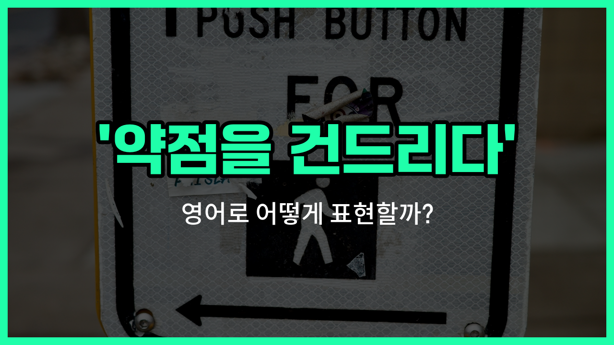

## 🌟 영어 표현 - push someone's buttons

안녕하세요 👋 오늘은 누군가의 '약점을 건드리다'라는 뜻을 가진 영어 표현을 소개해드릴게요. 바로 '**push someone's buttons**'라는 표현이에요.

이 표현은 누군가를 일부러 자극하거나, 화나게 하거나, 민감한 부분을 건드릴 때 자주 사용돼요. 즉, 상대방이 예민하게 반응할 만한 부분을 알고 그걸 건드려서 감정을 흔드는 상황에 딱 맞는 표현이에요!

예를 들어, 친구가 계속해서 내가 싫어하는 이야기를 반복해서 해서 짜증이 날 때 "He really knows how to push my buttons."라고 말할 수 있어요. 이때는 '그 사람은 내 약점을 정말 잘 건드려요.'라는 의미가 돼요.

또한, 이 표현은 주로 부정적인 상황에서 쓰이지만, 가끔은 장난스럽게도 사용할 수 있어요. 하지만 대부분은 누군가를 화나게 하거나 불편하게 만들 때 쓰인다는 점 기억해 주세요!

## 📖 예문

1. "그녀는 내 약점을 건드리는 걸 정말 잘해요."

   "She really knows how to push my buttons."

2. "동생이 계속 장난을 쳐서 나를 화나게 했어요."

   "My little brother kept pushing my buttons and made me angry."

## 💬 연습해보기

<ul data-interactive-list>

  <li data-interactive-item>
    내 남동생은 항상 내 약점을 잘 건드려서 진짜 화나게 해요.
    My little brother always knows how to push my buttons. He loves getting a reaction out of me.
  </li>

  <li data-interactive-item>
    걔한테 휘둘리지 마요, 그냥 일부러 자극하려는 거니까요.
    Don't let her get to you, she's just <a href="/blog/in-english/117.try-to/">trying to</a> push your buttons.
  </li>

  <li data-interactive-item>
    그가 일부러 그런 건 아니라는 거 알지만, 그 말이 정말 화나게 했어요.
    I know he didn't mean anything by it, but what he said really pushed my buttons.
  </li>

  <li data-interactive-item>
    이미 스트레스 받는 상태일 때 내 동료가 진짜 잘 건드려서 힘들어요.
    My coworker is so good at pushing my buttons when I'm already stressed out.
  </li>

  <li data-interactive-item>
    어떤 사람들은 진짜 꼭 꼬집어 자극할 줄 알죠, 그렇죠?
    Some people just know <a href="/blog/in-english/419.exactly/">exactly</a> how to push your buttons, don't they?
  </li>

  <li data-interactive-item>
    그 사람은 늘 내 요리 가지고 장난치는데, 하루 피곤할 때 진짜 짜증나요.
    He always jokes about my <a href="/blog/in-english/461.cook/">cooking</a>, and it really pushes my buttons after a long day.
  </li>

  <li data-interactive-item>
    내 약점 건드리지 마요, 오늘은 기분 별로 안 좋아요.
    Stop trying to push my buttons, I'm not in the mood today.
  </li>

  <li data-interactive-item>
    왜 항상 저녁 먹기 전에 날 건드려야 해요?
    Why do you always have to push my buttons right before dinner?
  </li>

  <li data-interactive-item>
    걔는 내 화 좀 돋우려고 눈치없이 눈치까지 굴렸어요.
    She rolled her eyes, just to push my buttons a little more.
  </li>

  <li data-interactive-item>
    그 주제 다시 꺼내면 걔 진짜 화낼 걸 알아요.
    You know you're pushing his buttons by <a href="/blog/in-english/122.bring-up/">bringing up</a> that topic again.
  </li>

</ul>

## 🤝 함께 알아두면 좋은 표현들

### get under someone's skin

'get under someone's skin'은 누군가를 짜증나게 하거나 신경 쓰이게 만든다는 뜻이에요. 상대방의 감정을 자극해서 불편하게 만드는 상황에서 자주 써요.

- "Her constant [complaining](/blog/in-english/499.complain/) really gets under my skin."
- "그녀가 계속 불평을 하니까 정말 신경이 거슬려요."

### hit a nerve

'hit a nerve'는 누군가의 민감한 부분이나 약점을 건드려서 감정적으로 반응하게 만든다는 의미예요. 상대방이 예민하게 받아들이는 주제를 언급했을 때 자주 사용해요.

- "I must have hit a nerve when I mentioned his past mistakes."
- "내가 그의 과거 실수를 언급했을 때 뭔가 예민한 부분을 건드린 것 같아요."

### let it slide

'let it slide'는 누군가의 행동이나 말이 마음에 안 들어도 그냥 넘어가거나 신경 쓰지 않는다는 뜻이에요. 상대방이 약점을 건드려도 별로 반응하지 않고 무시할 때 쓰는 표현이에요.

- "He made a rude comment, but I [decided to](/blog/in-english/062.decide-to/) let it slide."
- "그가 무례한 말을 했지만 그냥 넘어가기로 했어요."

---

오늘은 '약점을 건드리다'라는 뜻을 가진 영어 표현 '**push someone's buttons**'에 대해 알아봤어요. 누군가가 일부러 나를 자극할 때 이 표현을 떠올려 보세요! 😊

오늘 배운 표현과 예문들을 꼭 최소 3번씩 소리 내서 읽어보세요. 다음에도 더 재미있고 유익한 영어 표현으로 찾아올게요! 감사합니다!
