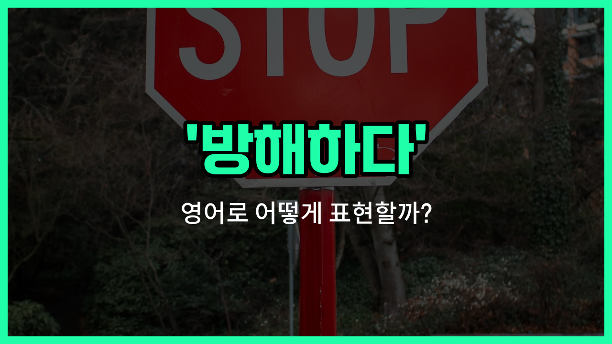

## 🌟 영어 표현 - obstruct

안녕하세요 👋 오늘은 '방해하다'라는 뜻을 가진 영어 표현을 소개해드릴게요. 바로 '**obstruct**'라는 단어에요. 이 단어는 어떤 일이나 행동이 원활하게 진행되는 것을 **막거나 저지하는 상황**에서 자주 사용돼요.

예를 들어, 길을 막고 있어서 사람들이 지나가지 못하게 할 때, 또는 누군가의 계획이나 진행을 방해할 때 쓸 수 있어요. 'obstruct'는 물리적으로 막는 것뿐만 아니라, 비유적으로도 사용할 수 있어서 정말 유용한 단어에요!

예를 들어, "공사 차량이 도로를 막고 있어요."라고 할 때 "The [construction](/blog/in-english/858.construction/) vehicle is obstructing the road."라고 표현할 수 있어요.

또는, "그는 내 시야를 방해했어요."라고 할 때 "He obstructed my view."라고 말할 수 있어요.

## 📖 예문

1. "그들은 진입로를 막고 있어요."

   "They are obstructing the entrance."

2. "누군가가 내 일을 방해하고 있어요."

   "Someone is obstructing my work."

## 💬 연습해보기

<ul data-interactive-list>

  <li data-interactive-item>
    나무가 쓰러져서 길이 막혀서 차들이 몇 시간 동안 꼼짝 못 했어요.
    The road was blocked by a fallen tree, which really obstructed <a href="/blog/in-english/384.traffic/">traffic</a> for hours.
  </li>

  <li data-interactive-item>
    당신 시야를 가리려던 건 아니었어요, 여기로 좀 옮길게요, 이제 더 잘 보일 거예요.
    I didn't mean to obstruct your view, let me move over here so you can see better.
  </li>

  <li data-interactive-item>
    저 큰 상자들이 문 앞을 막고 있어요. 저기 다른 데로 좀 옮길 수 있을까요?
    Those big boxes are obstructing the doorway. Can we move them somewhere else?
  </li>

  <li data-interactive-item>
    질문이 발표 흐름을 방해했다면 죄송해요. 끝날 때까지 기다릴게요.
    Sorry if my questions are obstructing the flow of your presentation. I'll wait until the end.
  </li>

  <li data-interactive-item>
    어젯밤 구름이 달그림자를 가려서 잘 볼 수가 없었어요.
    <a href="/blog/in-english/273.cloud/">Clouds</a> obstructed our view of the eclipse last night, so we couldn't see it clearly.
  </li>

  <li data-interactive-item>
    가방 때문에 출구를 막지 않도록 조심해 주세요. 그거 안전에 진짜 안 좋아요.
    Be careful not to obstruct the exit with your bags. It's a safety hazard.
  </li>

  <li data-interactive-item>
    시위대가 건물 입구를 막으려고 했어요.
    The protesters <a href="/blog/in-english/117.try-to/">tried to</a> obstruct the entrance to the building.
  </li>

  <li data-interactive-item>
    그렇게 큰 모자는 영화관에서 누군가 시야를 가릴 수 있어요.
    Wearing a large hat like that might obstruct someone's view at the movie theater.
  </li>

  <li data-interactive-item>
    햇빛이 눈에 들어오지 않게 손으로 막았어요.
    She put her hand up to obstruct the sun from getting in her eyes.
  </li>

  <li data-interactive-item>
    새로 짓는 건물이 공원 뷰를 가릴 거예요. 정말 아쉬워요.
    The new construction is going to obstruct our view of the <a href="/blog/in-english/463.park/">park</a>. That's such a bummer.
  </li>

</ul>

## 🤝 함께 알아두면 좋은 표현들

### hinder

'hinder'는 "방해하다" 또는 "지연시키다"라는 뜻이에요. 어떤 일이나 진행을 어렵게 만들거나 속도를 늦추는 상황에서 자주 사용돼요. 'obstruct'와 비슷하게 누군가의 행동이나 계획을 막거나 방해할 때 쓰는 표현이에요.

- "Heavy traffic can hinder emergency vehicles from reaching the scene quickly."
- "심한 교통 체증 때문에 응급차가 현장에 빨리 도착하는 걸 방해할 수 있어요."

### facilitate

'[facilitate](/blog/in-english/876.facilitate/)'는 "용이하게 하다" 또는 "촉진하다"라는 뜻으로, 어떤 일이 더 쉽게 진행되도록 도와주는 상황에서 사용돼요. 'obstruct'의 반대말로, 방해하는 것이 아니라 오히려 일이 잘 되도록 돕는다는 의미예요.

- "Good communication can facilitate teamwork and [improve](/blog/in-english/394.improve/) results."
- "좋은 소통은 팀워크를 촉진하고 결과를 더 좋게 만들어줘요."

### get in the way

'[get in the way](/blog/in-english/100.get-in-the-way/)'는 "방해가 되다" 또는 "길을 막다"라는 뜻이에요. 일상 대화에서 누군가의 행동이나 사물이 어떤 일의 진행을 방해할 때 자주 쓰는 표현이에요. 'obstruct'와 비슷하게 누군가의 계획이나 움직임을 막는 상황에 사용돼요.

- "Please move your bag; it's getting in the way."
- "가방 좀 옮겨줄래요? 방해가 되고 있어요."

---

오늘은 '방해하다', '막다', '저지하다'라는 뜻을 가진 영어 표현 '**obstruct**'에 대해 알아봤어요. 앞으로 누군가나 무언가가 길을 막거나 일을 방해할 때 이 단어를 떠올려보면 좋겠어요 😊

오늘 배운 표현과 예문들을 꼭 소리 내서 여러 번 읽어보세요. 다음에도 더 유익한 영어 표현으로 찾아올게요! 감사합니다!
