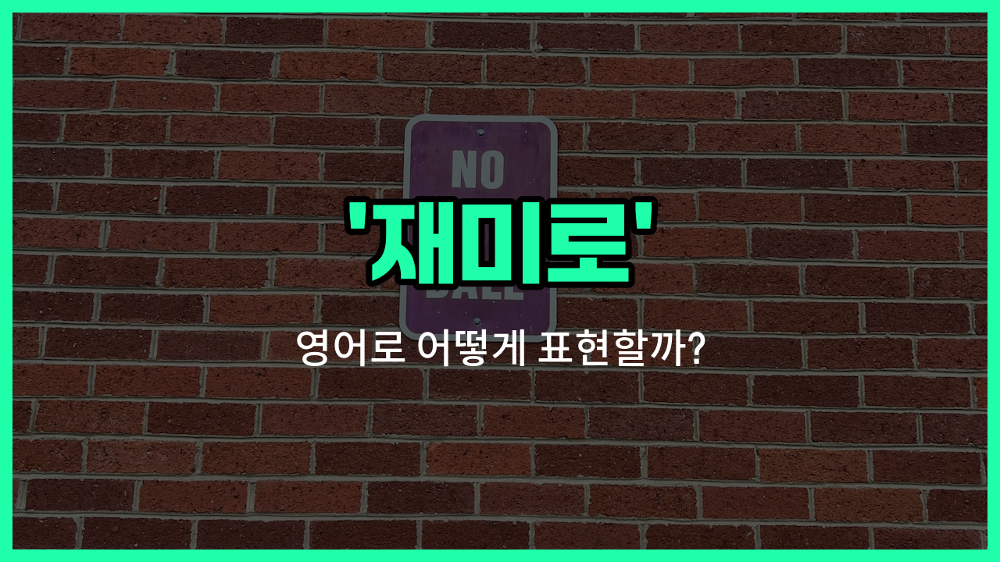

## 🌟 영어 표현 - for fun

안녕하세요 👋 오늘은 일상에서 자주 쓰는 표현인 '**재미로**'를 영어로 어떻게 말하는지 알아보려고 해요. 바로 '**for fun**'이라는 표현이에요.

'**for fun**'은 말 그대로 **재미를 위해서**, **즐거움을 목적으로** 어떤 행동을 할 때 쓰는 표현이에요. 즉, 특별한 목적이나 이유 없이, 단순히 재미있어서 무언가를 할 때 자연스럽게 사용할 수 있어요!

예를 들어, 친구들과 게임을 할 때 이기려고 하는 게 아니라 그냥 재미로 할 때 "We are just playing for fun."이라고 말할 수 있어요.

또는, 누군가가 왜 사진을 찍었냐고 물어보면 "I took the photo for fun."이라고 대답할 수 있어요. 이처럼 'for fun'은 가볍고 즐거운 분위기를 전달할 때 정말 유용하게 쓸 수 있는 표현이에요.

## 📖 예문

1. "우리는 그냥 재미로 농구를 하고 있어요."

   "We are just playing basketball for fun."

2. "그는 장난삼아 그 영상을 만들었어요."

   "He made the video for fun."

## 💬 연습해보기

<ul data-interactive-list>

  <li data-interactive-item>
    우리 지난주말에 그냥 재밌어서 해변에 갔었어요. 완전 힐링됐어요.
    We just went to the beach for fun last weekend. It was so relaxing.
  </li>

  <li data-interactive-item>
    걔 기타 배우기 시작했는데 그냥 재미로 했는데 지금은 밴드에 들어가고 싶대요.
    He started <a href="/blog/in-english/245.learn/">learning</a> guitar for fun, but now he wants to join a band.
  </li>

  <li data-interactive-item>
    가끔 쿠키 굽긴 하는데 다 먹고 싶은 건 아니고 그냥 재미로 해요.
    <a href="/blog/in-english/270.sometimes/">Sometimes</a> I <a href="/blog/in-english/462.bake/">bake</a> cookies for fun, even if I don't really want to eat them all.
  </li>

  <li data-interactive-item>
    우리 엉뚱한 영상 만들었는데 그게 갑자기 온라인에서 엄청 핫해졌어요.
    We made a silly video for fun and ended up going viral online.
  </li>

  <li data-interactive-item>
    금요일 밤마다 친구들이랑 보드게임 하는 거 재밌어서 하는 거에요. 우리만의 시간 같은 거죠.
    My friends and I play board games for fun on Friday nights. It's our thing.
  </li>

  <li data-interactive-item>
    댄스 완전 못하는데도 그냥 재미로 댄스 수업 등록했어요.
    She signed up for the dance class just for fun, even though she can't dance at all.
  </li>

  <li data-interactive-item>
    이번 주말에 재미로 등산 갈래요? 날씨 좋대요.
    Do you want <a href="/blog/in-english/450.to-go/">to go</a> hiking this weekend for fun? I heard the weather's nice.
  </li>

  <li data-interactive-item>
    도자기 수업 재미로 들었는데 머그컵이 넘쳐버렸어요.
    I took a pottery class for fun, and now I have way too many mugs.
  </li>

  <li data-interactive-item>
    가장 창의적인 사람이 누군지 보려고 이상한 이야기를 만들어 봤어요, 그냥 재미로요.
    They made up a <a href="/blog/in-english/296.weird/">weird</a> <a href="/blog/in-english/537.story/">story</a> for fun, just to see who could be the most creative.
  </li>

  <li data-interactive-item>
    일 끝나고 그림 그리는 걸 좋아해요. 그게 스트레스 푸는 데 도움돼서요.
    He likes to paint for fun after work to help him relax.
  </li>

</ul>

## 🤝 함께 알아두면 좋은 표현들

### just for kicks

'just for kicks'는 "단순히 재미로" 또는 "장난삼아"라는 뜻이에요. 뭔가를 진지한 목적 없이 오로지 즐거움을 위해 할 때 쓰는 표현이에요.

- "We went skydiving just for kicks last weekend."
- "우리는 지난 주말에 그냥 재미로 스카이다이빙을 했어요."

### for a reason

'for a reason'은 "이유가 있어서"라는 뜻으로, 단순히 재미나 충동이 아니라 분명한 목적이나 이유가 있을 때 쓰는 표현이에요. 'for fun'의 반대 의미로 볼 수 있어요.

- "She didn't quit her job for fun; she did it for a reason."
- "그녀는 재미로 일을 그만둔 게 아니라, 분명한 이유가 있어서 그만뒀어요."

### for the heck of it

'for the heck of it'은 "별다른 이유 없이", "그냥 재미로"라는 뜻이에요. 뭔가 특별한 목적 없이 단순히 해보고 싶어서 하는 행동을 나타낼 때 써요.

- "He bought a new hat for the heck of it."
- "그는 그냥 재미로 새 모자를 샀어요."

---

오늘은 '**재미로**'라는 뜻을 가진 영어 표현 '**for fun**'에 대해 알아봤어요. 앞으로 누군가에게 이유 없이 무언가를 할 때 이 표현을 떠올려 보세요 😊

오늘 배운 표현과 예문들을 꼭 최소 3번씩 소리 내서 읽어보세요. 다음에도 더 재미있고 유익한 영어 표현으로 찾아올게요! 감사합니다!
