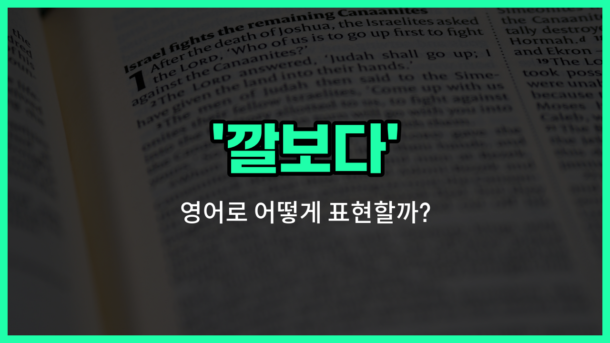

## 🌟 영어 표현 - look down

안녕하세요 👋 오늘은 누군가를 '깔보다', '무시하다'라는 뜻을 가진 영어 표현을 소개해드리려고 해요. 바로 '**look down**'이라는 표현이에요.

'**look down**'은 직역하면 '아래를 보다'라는 뜻이지만, 실제로는 **다른 사람을 자신보다 못하다고 여기거나 무시하는 태도**를 나타낼 때 자주 사용돼요. 즉, 상대방을 얕잡아보고 존중하지 않는 느낌을 줄 때 쓰는 표현이에요!

이 표현은 일상 대화뿐만 아니라 영화나 드라마에서도 자주 들을 수 있어요. 예를 들어, 누군가가 다른 사람을 무시하는 행동을 할 때 "He always looks down on others."라고 말할 수 있어요.

또한, 'look down' 뒤에 'on'을 붙여서 'look down on' 형태로 많이 사용된다는 점도 기억해두면 좋아요.

## 📖 예문

1. "그는 항상 다른 사람을 깔봐요."

   "He always looks down on others."

2. "가난하다고 사람을 무시하면 안 돼요."

   "You shouldn't look down on people because they are poor."

## 💬 연습해보기

<ul data-interactive-list>

  <li data-interactive-item>
    돈이 없다고 사람을 깔보는 거 너무 싫어요.
    I <a href="/blog/in-english/392.hate/">hate</a> it when people look down on others just because they have less money.
  </li>

  <li data-interactive-item>
    그녀는 정말 열심히 일하는데도 항상 상사가 자신을 무시하는 것 같대요.
    She always feels like her boss looks down on her, even though she works really hard.
  </li>

  <li data-interactive-item>
    대학 안 갔다고 그를 무시하지 마요. 걔 진짜 똑똑해요.
    Don't look down on him just because he didn't go to college. He's really smart.
  </li>

  <li data-interactive-item>
    커서 배운 게 아무도 무시하지 말라는 거였어요.
    Growing up, I was taught never to look down on anyone.
  </li>

  <li data-interactive-item>
    어떤 사람들은 햄버거 가게 알바를 깔보는데 그 일 진짜 힘들어요.
    Some people look down on fast food jobs, but they're actually really <a href="/blog/in-english/183.tough/">tough</a>.
  </li>

  <li data-interactive-item>
    회의에서 내가 실수한 뒤에 그가 나를 깔봤어요.
    He looked down on me after I made that mistake in the meeting.
  </li>

  <li data-interactive-item>
    내 취미를 왜 항상 깔보는 거예요? 난 재밌게 하고 있어요.
    Why do you always look down on my hobbies? I enjoy them.
  </li>

  <li data-interactive-item>
    걔네들은 자기 동네 사람이 아니면 다 무시하는 경향이 있어요.
    They <a href="/blog/in-english/259.tend-to/">tend to</a> look down on anyone who's not from their neighborhood.
  </li>

  <li data-interactive-item>
    말하는 걸 보니 걔가 우리를 무시하는 게 느껴졌어요.
    I could tell by the way she spoke that she looked down on us.
  </li>

  <li data-interactive-item>
    걔는 착한 척 하려고 하는데 사실은 다 무시하는 게 보여요.
    He <a href="/blog/in-english/117.try-to/">tries to</a> act nice, but you can tell he looks down on everyone.
  </li>

</ul>

## 🤝 함께 알아두면 좋은 표현들

### belittle

'belittle'은 "남을 깎아내리다" 또는 "과소평가하다"라는 뜻이에요. 다른 사람의 능력이나 가치를 일부러 낮게 평가하거나 무시할 때 자주 쓰는 표현이에요.

- "She always tries to belittle her coworkers' achievements."
- "그녀는 항상 동료들의 성과를 깎아내리려고 해요."

### look up to

'[look up](/blog/in-english/121.look-up/) to'는 "존경하다" 또는 "우러러보다"라는 뜻이에요. 누군가를 높이 평가하고 본받고 싶어 할 때 쓰는 표현으로, 'look down'의 반대 의미예요.

- "Many young athletes look up to [professional](/blog/in-english/333.professional/) [players](/blog/in-english/768.player/) as role models."
- "많은 젊은 운동선수들이 프로 선수들을 롤모델로 존경해요."

### treat as an equal

'treat as an equal'은 "동등하게 대하다"라는 뜻이에요. 상대방을 깔보거나 우러러보지 않고, 같은 위치에서 공평하게 대하는 태도를 나타내요. 'look down'과는 반대되는 긍정적인 의미예요.

- "It's [important](/blog/in-english/318.important/) to treat everyone as an equal, [regardless of](/blog/in-english/226.regardless-of/) their background."
- "누구든지 배경에 상관없이 동등하게 대하는 게 중요해요."

---

오늘은 '깔보다', '무시하다', '얕보다'라는 뜻을 가진 영어 표현 '**look down**'에 대해 알아봤어요. 누군가를 존중하지 않는 태도를 영어로 표현하고 싶을 때 이 표현을 떠올려보면 좋겠어요 😊

오늘 배운 표현과 예문들을 꼭 소리 내서 여러 번 읽어보세요. 다음에도 더 유익한 영어 표현으로 찾아올게요! 감사합니다!

