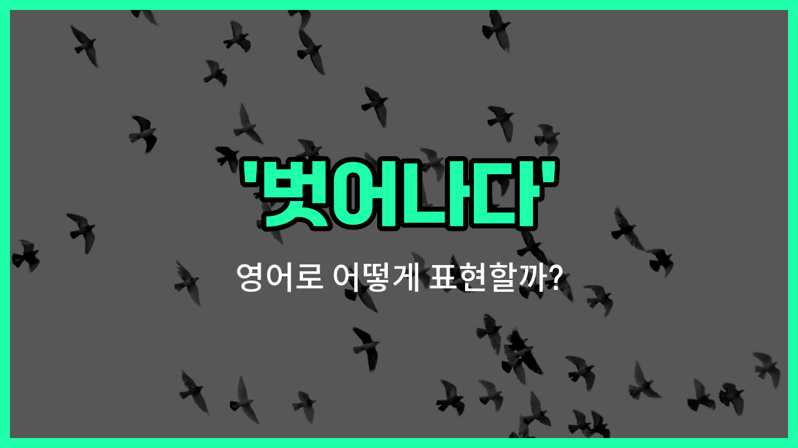

## 🌟 영어 표현 - break free

안녕하세요 👋 오늘은 '벗어나다', '탈출하다'라는 뜻을 가진 영어 표현을 소개해드릴게요. 바로 '**break free**'라는 표현이에요.

'**break free**'는 어떤 구속이나 억압, 혹은 제한된 상황에서 **스스로를 해방시키거나 탈출하는 것**을 의미해요. 단순히 물리적으로 탈출하는 것뿐만 아니라, 감정적으로나 심리적으로도 자유로워지는 상황에 자주 쓰여요!

예를 들어, 힘든 관계에서 벗어나고 싶을 때, 혹은 나쁜 습관에서 자유로워지고 싶을 때도 이 표현을 사용할 수 있어요. 영화나 노래 가사에서도 자주 등장하는 표현이라서 익숙하게 느껴질 거예요.

## 📖 예문

1. "그는 결국 부모님의 기대에서 벗어났어요."

   "He [finally](/blog/in-english/182.finally/) broke free from his parents' expectations."

2. "우리는 일상에서 벗어나고 싶어요."

   "We want to break free from our daily routine."

## 💬 연습해보기

<ul data-interactive-list>

  <li data-interactive-item>
    나는 내 일상에서 벗어나고 싶어서 지난 주말에 잠깐 여행 다녀왔어요.
    I felt like I needed to break free from my routine, so I took a little trip last weekend.
  </li>

  <li data-interactive-item>
    가끔은 그냥 자유롭게 내 맘대로 하고 싶을 때가 있잖아요.
    <a href="/blog/in-english/270.sometimes/">Sometimes</a> you just want to break free and do your own thing for a while.
  </li>

  <li data-interactive-item>
    그 여자는 드디어 그 독한 관계에서 벗어났어요.
    She finally <a href="/blog/in-english/175.manage-to/">managed to</a> break free from that toxic relationship.
  </li>

  <li data-interactive-item>
    올해는 내 나쁜 습관들 다 없애려고 진짜 노력 중이에요.
    I'm really <a href="/blog/in-english/117.try-to/">trying to</a> break free of all my bad habits this year.
  </li>

  <li data-interactive-item>
    대학 졸업하고 나서는 세상에 뭐가 더 있는지 보고 싶어서 자유로워지고 싶었대요.
    After college, he wanted to break free and see what else was out there.
  </li>

  <li data-interactive-item>
    그는 부모님 기대에서 벗어났으면 좋겠다고 계속 생각하더라고요.
    He wishes he could break free from his parents' expectations.
  </li>

  <li data-interactive-item>
    그 프로그램은 자유로워져서 꿈을 따라가는 이야기예요.
    That show is all about breaking free and following your dreams.
  </li>

  <li data-interactive-item>
    시간 좀 걸렸지만 결국 그녀는 자기 편안한 구역에서 벗어날 수 있었어요.
    It took a while, but she eventually broke free of her comfort zone.
  </li>

  <li data-interactive-item>
    그냥 이 스트레스 다 잊고 하루 이틀 정도는 자유롭고 싶어요.
    I just want to break free from all this stress for a day or two.
  </li>

  <li data-interactive-item>
    그는 계속 밀고 나가서 결국 사람들 사이에서 빠져나왔어요.
    He kept pushing until he could break free from the crowd.
  </li>

</ul>

## 🤝 함께 알아두면 좋은 표현들

### escape from

'escape from'은 "~로부터 탈출하다" 또는 "~에서 벗어나다"라는 뜻이에요. 주로 물리적으로나 심리적으로 억압되거나 제한된 상황에서 벗어나는 것을 말할 때 사용해요.

- "She managed to escape from her [strict](/blog/in-english/275.strict/) upbringing and live life on her own [terms](/blog/in-english/755.terms/)."
- "그녀는 엄격한 가정환경에서 벗어나서 자기 방식대로 살게 되었어요."

### feel trapped

'feel trapped'는 "갇혀 있다고 느끼다" 또는 "벗어날 수 없다고 느끼다"라는 의미예요. 어떤 상황이나 관계, 환경에서 자유롭지 못하고 억압받는 느낌을 받을 때 자주 써요. 'break free'의 반대되는 느낌이에요.

- "He felt trapped in his job and longed for a change."
- "그는 직장에서 벗어날 수 없다고 느껴서 변화를 간절히 바랐어요."

### cut loose

'cut loose'는 "자유로워지다" 또는 "속박에서 벗어나다"라는 뜻이에요. 주로 스트레스나 책임감, 규칙 등에서 벗어나 자유롭게 행동하거나 즐길 때 많이 써요. 'break free'와 비슷한 뉘앙스예요.

- "After the exams, the students just wanted to cut loose and have some fun."
- "시험이 끝나고 나서 학생들은 그냥 자유롭게 놀고 싶어 했어요."

---

오늘은 '벗어나다', '탈출하다'라는 뜻을 가진 영어 표현 '**break free**'에 대해 알아봤어요. 혹시 답답한 상황이나 억압에서 벗어나고 싶을 때 이 표현을 떠올려보면 좋겠어요 😊

오늘 배운 표현과 예문들을 꼭 최소 3번씩 소리 내서 읽어보세요. 다음에도 더 재미있고 유익한 영어 표현으로 찾아올게요! 감사합니다!~요

