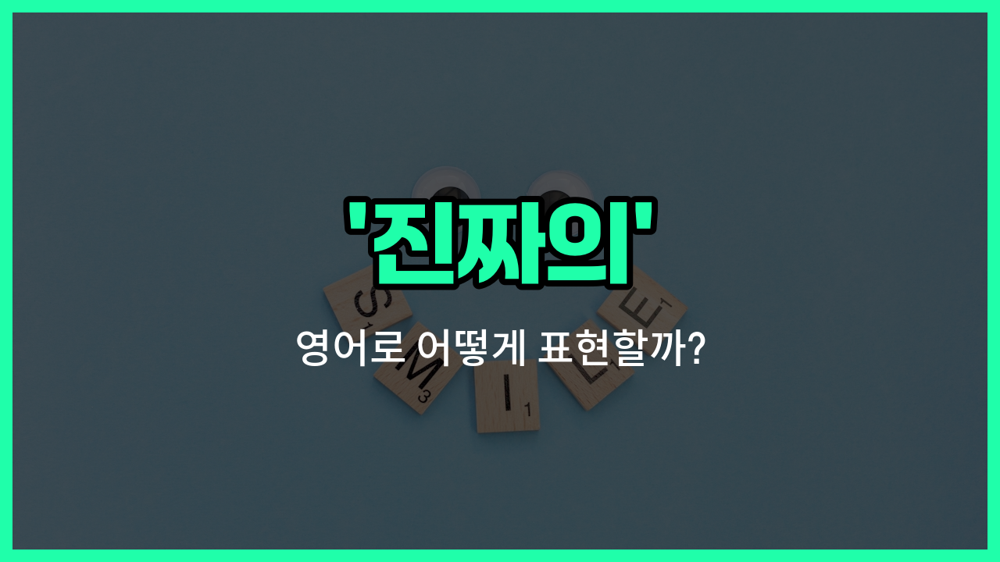

## 🌟 영어 표현 - genuine

안녕하세요 👋 오늘은 영어로 '진짜의', '진실된'이라는 뜻을 가진 표현 '**genuine**'에 대해 알아보려고 해요.

'**genuine**'은 어떤 것이 **진짜임을 강조**할 때 자주 쓰이는 단어예요. 즉, 가짜가 아니라 **진짜**, **순수한** 상태를 말할 때 사용해요. 예를 들어, 진짜 가죽, 진짜 감정, 진실된 마음 등 다양한 상황에서 쓸 수 있어요.

이 단어는 물건뿐만 아니라 사람의 감정이나 태도에도 자주 사용돼요. 누군가의 미소가 진심에서 우러나온 것일 때 "genuine smile"이라고 표현할 수 있어요.

## 📖 예문

1. "이 가방은 진짜 가죽으로 만들어졌어요."

   "This bag is made of genuine leather."

2. "그녀는 항상 진실된 관심을 보여줘요."

   "She always shows genuine interest."

3. "그의 사과는 진심이었어요."

   "His apology was genuine."

## 💬 연습해보기

<ul data-interactive-list>

  <li data-interactive-item>
    그녀의 미소가 완전 진짜인 거 딱 알겠더라구요. 가짜 미소는 진짜 멀리서도 바로 티 나잖아요.
    I could tell her smile was totally genuine. You can always spot a fake smile a mile away.
  </li>

  <li data-interactive-item>
    이 가죽 자켓 진짜 고급스러워서 완전 좋네요, 온라인에서 싸구려랑은 차원이 달라요.
    This leather jacket feels so genuine, not like those cheap ones online.
  </li>

  <li data-interactive-item>
    솔직히 걔 진짜 좋은 사람인 거 같아요. 그냥 꾸미는 사람은 아닌 듯해요.
    <a href="/blog/in-english/336.honestly/">Honestly</a>, he seems like a genuinely good guy. I don't think he's pretending.
  </li>

  <li data-interactive-item>
    저 사인 진짜 맞아요? 아니면 그냥 인쇄한 거예요?
    Is that autograph genuine, or did you just print it?
  </li>

  <li data-interactive-item>
    진심 어린 조언 고마워요, 지금 딱 그런 말이 필요했거든요.
    Thanks for your genuine <a href="/blog/in-english/379.advice/">advice</a>, I really needed to hear that <a href="/blog/in-english/525.right-now/">right now</a>.
  </li>

  <li data-interactive-item>
    그 사람 진짜로 다른 사람들 삶에 관심 갖는 게 느껴져서 진짜 신선해요.
    She shows genuine interest in other people's lives. It's really refreshing.
  </li>

  <li data-interactive-item>
    그냥 파티 같이 할 사람 말고 진짜 우정 찾고 싶어요.
    I want to find some genuine friendships, not just people to party with.
  </li>

  <li data-interactive-item>
    걔 진심으로 사과했는데, 정말 마음에서 우러난 거 알겠더라구요.
    He gave me a genuine apology, and you could tell he really meant it.
  </li>

  <li data-interactive-item>
    그 소식 듣고 그들의 흥분이 진짜라서 나도 덩달아 기뻤어요.
    Their excitement was so genuine when they got the <a href="/blog/in-english/536.news/">news</a>. It made me so happy too.
  </li>

  <li data-interactive-item>
    진짜 반응 받고 싶으면, 놀라게 해야 해요. 믿어요, 진짜로요.
    If you want to get a genuine reaction, you have to surprise her, <a href="/blog/in-english/880.trust/">trust</a> me.
  </li>

</ul>

## 🤝 함께 알아두면 좋은 표현들

### authentic

'authentic'는 "진짜의", "진품의"라는 뜻으로, 어떤 것이 진짜임을 강조할 때 사용해요. 특히 물건이나 정보, 감정 등이 거짓이 아니라는 점을 강조할 때 자주 써요.

- "This painting is authentic, not a copy."
- "이 그림은 진품이고, 복제품이 아니에요."

### sincere

'[sincere](/blog/in-english/903.sincere/)'는 "진심 어린", "성실한"이라는 뜻이에요. 누군가의 말이나 행동이 거짓이나 꾸밈이 없이 진심에서 우러나왔음을 강조할 때 사용해요.

- "She gave me a sincere apology for her mistake."
- "그녀는 자신의 실수에 대해 진심 어린 사과를 했어요."

### fake

'fake'는 "가짜의", "위조된"이라는 뜻으로, 'genuine'의 반대말이에요. 진짜가 아닌, 속이거나 꾸며낸 것을 말할 때 써요.

- "The watch looked [expensive](/blog/in-english/317.expensive/), but it [turned out](/blog/vocab-1/038.turn-out/) to be fake."
- "그 시계는 비싸 보였지만, 알고 보니 가짜였어요."

---

오늘은 '**진짜의**', '**진실된**', '**순수한**'이라는 뜻을 가진 영어 표현 '**genuine**'에 대해 알아봤어요. 앞으로 누군가의 마음이나 물건이 진짜임을 말하고 싶을 때 이 표현을 떠올려보세요 😊

오늘 배운 표현과 예문들을 꼭 소리 내서 여러 번 읽어보세요. 다음에도 더 유익한 영어 표현으로 찾아올게요! 감사합니다!

