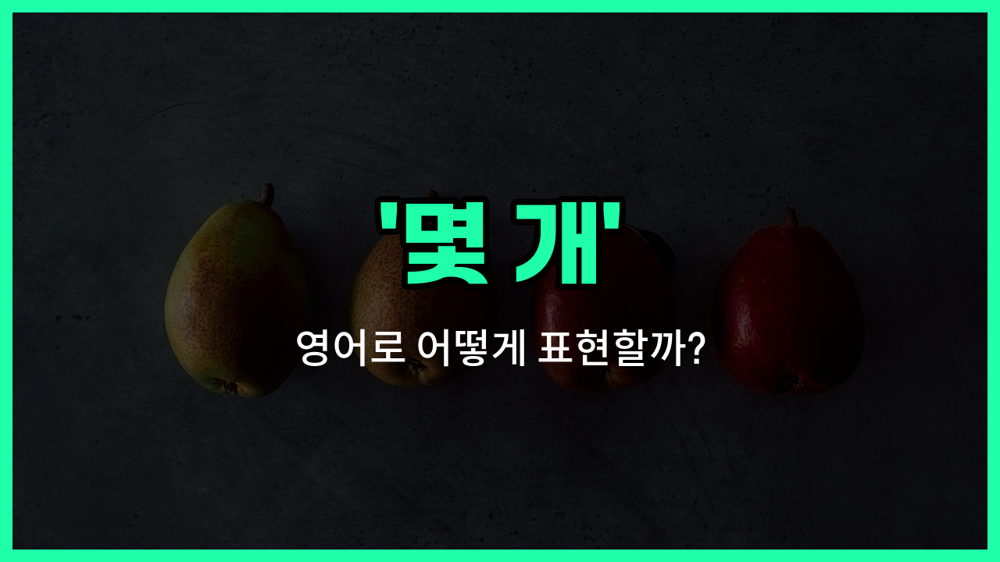

## 🌟 영어 표현 - a few

안녕하세요 👋 오늘은 영어에서 '몇 개', '조금', '소수'라는 뜻을 가진 표현 '**a few**'에 대해 알아보려고 해요.

'a few'는 **'몇 개의', '조금의', '소수의'**라는 의미로, 셀 수 있는 명사 앞에 사용돼요. 즉, 어떤 것이 아주 많지는 않지만, 어느 정도는 있을 때 자연스럽게 쓸 수 있는 표현이에요!

예를 들어, 친구에게 "쿠키 몇 개 있어?"라고 물어보고 싶을 때, "Do you have a few cookies?"라고 말할 수 있어요. 이때 'a few'는 2~3개, 혹은 그보다 조금 더 있는 상황을 의미해요.

비슷한 표현으로 'few'도 있지만, 'few'는 거의 없다는 뉘앙스가 강하고, 'a few'는 적지만 그래도 있다는 긍정적인 느낌이 있어요. 이 차이도 꼭 기억해두세요!

## 📖 예문

1. "나는 친구가 몇 명 있어요."

   "I have a few friends."

2. "냉장고에 사과가 몇 개 남아 있어요."

   "There are a few apples [left](/blog/in-english/402.leave/) in the fridge."

## 💬 연습해보기

<ul data-interactive-list>

  <li data-interactive-item>
    가게에서 사과 몇 개 샀는데 진짜 싱싱해 보여서 샀어요.
    I bought a few apples at the store because they looked really fresh.
  </li>

  <li data-interactive-item>
    이 숙제 도와줄 시간 몇 분 있어요?
    Do you have a few minutes to help me with this homework?
  </li>

  <li data-interactive-item>
    시험에서 몇 군데 실수하긴 했는데 전반적으로 괜찮게 본 것 같아요.
    I made a few mistakes on the test, but overall I think I did okay.
  </li>

  <li data-interactive-item>
    쿠키 몇 개 남았는데, 하나 먹을래요?
    There are a few cookies left. Want one?
  </li>

  <li data-interactive-item>
    그 친구는 믿을 수 있는 좋은 친구들이 몇 명 있어요.
    She has a few good friends she can always <a href="/blog/in-english/459.count/">count</a> on.
  </li>

  <li data-interactive-item>
    일어나면서 냅킨 몇 장 좀 챙겨줄래요?
    Could you grab a few napkins while you're up?
  </li>

  <li data-interactive-item>
    어젯밤에 그 새 드라마 몇 편 봤어요.
    We watched a few episodes of that new show last night.
  </li>

  <li data-interactive-item>
    오늘 아침 회의에 몇 명이 늦었어요.
    A few people were <a href="/blog/in-english/391.late/">late</a> to the meeting this morning.
  </li>

  <li data-interactive-item>
    비즈니스 때문에 뉴욕에 몇 번 가봤어요.
    I've been to New York a few times for business.
  </li>

  <li data-interactive-item>
    프로젝트 끝낼 시간 며칠만 더 주세요.
    Just give me a few more days to <a href="/blog/in-english/295.finish/">finish</a> the project.
  </li>

</ul>

## 🤝 함께 알아두면 좋은 표현들

### several

'several'은 '몇 개'보다 조금 더 많은 수를 의미해요. 보통 3개 이상, 많게는 7~8개까지를 가리킬 때 사용해요. 'a few'보다 더 넓은 범위의 수량을 말할 때 쓰여요.

- "I have several books on that topic if you want to [borrow](/blog/in-english/466.borrow/) one."
- "그 주제에 관한 책이 몇 권 더 있으니까, 빌리고 싶으면 말해요."

### a couple of

'a couple of'은 '두 개' 또는 '두어 개'라는 뜻이에요. 'a few'보다 더 적은 수를 나타내고, 보통 정확히 2개를 의미하지만, 가끔 2~3개 정도로도 쓰여요.

- "I only need a couple of minutes to finish this [task](/blog/in-english/793.task/)."
- "이 일 끝내는 데 몇 분만 있으면 돼요."

### many

'many'는 '많은'이라는 뜻으로, 'a few'와는 반대되는 개념이에요. 셀 수 있는 명사와 함께 쓰이며, 수가 많을 때 사용해요.

- "There are many reasons why I love this city."
- "내가 이 도시를 좋아하는 이유가 정말 많아요."

---

오늘은 '몇 개', '조금', '소수'라는 뜻을 가진 영어 표현 '**a few**'에 대해 알아봤어요. 일상 대화에서 자주 쓰이는 표현이니 꼭 기억해두면 좋겠어요 😊

오늘 배운 표현과 예문들을 소리 내서 여러 번 읽어보세요. 다음에도 더 유익한 영어 표현으로 찾아올게요! 감사합니다!

