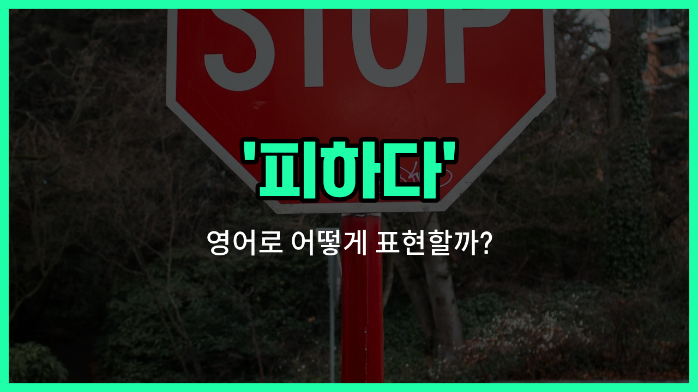

## 🌟 영어 표현 - avoid

안녕하세요 👋 오늘은 일상에서 자주 쓰이는 영어 표현 '**avoid**'에 대해 알아보려고 해요. '피하다', '회피하다', '모면하다'와 같은 상황에서 쓸 수 있는 단어예요.

'**avoid**'는 어떤 사람, 물건, 상황 등을 **의도적으로 피하거나 가까이하지 않는 것**을 의미해요. 예를 들어, 위험한 상황이나 불편한 대화를 피하고 싶을 때 사용할 수 있어요.

이 단어는 주로 동사로 쓰이며, 뒤에 피하고 싶은 대상(명사나 동명사)이 오는 경우가 많아요. 예를 들어, 'avoid [traffic](/blog/in-english/384.traffic/)'은 '교통 체증을 피하다', 'avoid talking'은 '말하는 것을 피하다'라는 뜻이에요.

## 📖 예문

1. "나는 그 문제에 대해 이야기하는 것을 피하고 싶어요."

   "I want to avoid talking about that issue."

2. "그는 교통 체증을 피하기 위해 일찍 출발했어요."

   "He [left](/blog/in-english/402.leave/) early to avoid traffic."

## 💬 연습해보기

<ul data-interactive-list>

  <li data-interactive-item>
    주말에는 마트가 언제나 사람 많아서 가는 거 일부러 피하려고 해요.
    I <a href="/blog/in-english/117.try-to/">try to</a> avoid going to the grocery store on weekends because it's always so <a href="/blog/in-english/393.crowded/">crowded</a>.
  </li>

  <li data-interactive-item>
    우리 같이 있을 때 그녀는 항상 전 남자친구 얘기는 안 하려고 해요.
    She always avoids talking about her ex-boyfriend when we're <a href="/blog/in-english/374.together/">together</a>.
  </li>

  <li data-interactive-item>
    말벌 보면 완전 피하는데, 진짜 무서워서 그래요.
    If I see a wasp, I avoid it at all <a href="/blog/in-english/664.cost/">costs</a>. I'm seriously terrified of them.
  </li>

  <li data-interactive-item>
    그 친구는 숙제를 거의 막판에 하려고 피하는 버릇이 있어요.
    He <a href="/blog/in-english/259.tend-to/">tends to</a> avoid doing his homework until the last minute.
  </li>

  <li data-interactive-item>
    당분 너무 많이 먹으면 몸이 무거워져서 되도록 피하려고 해요.
    I avoid eating too much sugar because it makes me feel sluggish.
  </li>

  <li data-interactive-item>
    솔직히 저는 싸움은 될 수 있으면 피하는 편이에요.
    <a href="/blog/in-english/336.honestly/">Honestly</a>, I just avoid confrontations whenever I can.
  </li>

  <li data-interactive-item>
    우린 시내 쪽 교통 체증 피하려고 다른 길로 갔어요.
    We took a different road to avoid the traffic jam downtown.
  </li>

  <li data-interactive-item>
    우리 강아지는 청소할 때 진공청소기를 무조건 피해요.
    My dog always avoids the vacuum cleaner when I'm cleaning the house.
  </li>

  <li data-interactive-item>
    드라마는 안 생기게 그냥 내 할 일에만 신경 쓰면서 피하려고 해요.
    I try to avoid drama by minding my own business.
  </li>

  <li data-interactive-item>
    그 친구는 사람들이 못 알아보게 모자랑 선글라스를 썼어요.
    He wore a hat and sunglasses to avoid being recognized in public.
  </li>

</ul>

## 🤝 함께 알아두면 좋은 표현들

### steer clear of

'steer clear of'는 "~을 피하다" 또는 "~을 멀리하다"라는 뜻이에요. 위험하거나 불편한 상황, 사람, 사물을 일부러 가까이하지 않고 조심스럽게 피하는 뉘앙스를 담고 있어요.

- "I try to steer clear of spicy food because it [upsets](/blog/in-english/395.upset/) my stomach."
- "저는 매운 음식은 속이 안 좋아져서 일부러 피하려고 해요."

### face head-on

'face [head-on](/blog/in-english/147.head-on/)'은 "정면으로 맞서다"라는 뜻이에요. 피하지 않고 문제나 상황을 직접적으로 대면하고 해결하려는 태도를 나타내요. 'avoid'의 반대되는 의미로, 용기 있게 상황에 맞서는 것을 강조할 때 써요.

- "[Instead of](/blog/in-english/169.instead-of/) avoiding the issue, she [decided to](/blog/in-english/062.decide-to/) face it head-on."
- "그녀는 그 문제를 피하는 대신 정면으로 맞서기로 했어요."

### dodge

'dodge'는 "재빨리 피하다" 또는 "슬쩍 빠져나가다"라는 뜻이에요. 보통 물리적으로 무언가를 피하거나, 곤란한 질문이나 상황을 교묘하게 회피할 때도 사용해요.

- "He tried to dodge the question during the interview."
- "그는 면접 중에 그 질문을 교묘하게 피하려고 했어요."

---

오늘은 '피하다', '회피하다', '모면하다'라는 뜻을 가진 영어 표현 '**avoid**'에 대해 알아봤어요. 앞으로 불편한 상황이나 원하지 않는 일을 피하고 싶을 때 이 표현을 떠올려 보세요 😊

오늘 배운 표현과 예문들을 꼭 최소 3번씩 소리 내서 읽어보세요. 다음에도 더 재미있고 유익한 영어 표현으로 찾아올게요! 감사합니다!

