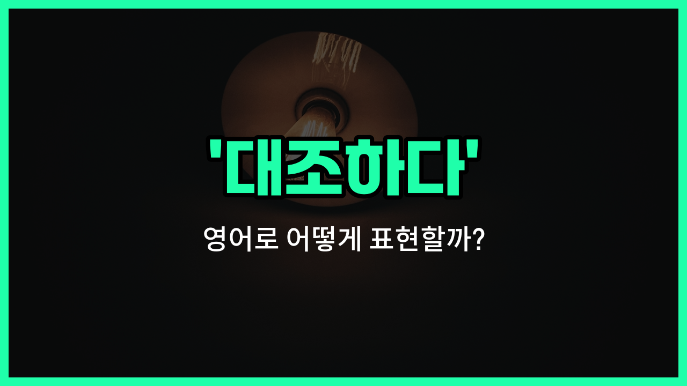

## 🌟 영어 표현 - contrast

안녕하세요 👋 오늘은 '**대조하다**'라는 뜻을 가진 영어 표현 '**contrast**'에 대해 알아보려고 해요.

'**contrast**'는 두 가지 이상의 사물이나 상황을 서로 비교해서 **차이점**을 뚜렷하게 드러내는 것을 의미해요. 즉, 서로 다른 점을 분명하게 보여주고 싶을 때 자주 쓰는 단어예요!

이 표현은 사진, 미술, 글쓰기, 일상 대화 등 다양한 상황에서 자연스럽게 사용돼요. 예를 들어, 두 그림의 색감이 완전히 다를 때 "The colors in these two paintings contrast sharply."라고 할 수 있어요.

또는, "Her [calm](/blog/in-english/380.calm/) personality contrasts with his energetic nature."라고 말하면 "그녀의 차분한 성격이 그의 에너지 넘치는 성격과 대조돼요."라는 의미예요.

'**contrast**'는 명사와 동사로 모두 사용할 수 있어서 정말 유용해요! 동사로는 '대조하다', 명사로는 '대조', '차이'라는 뜻으로 쓰이니 상황에 맞게 활용해 보세요.

## 📖 예문

1. "이 두 사진은 색감이 뚜렷하게 대조돼요."

   "These two photos contrast in color."

2. "그의 행동은 말과 대조돼요."

   "His actions contrast with his words."

## 💬 연습해보기

<ul data-interactive-list>

  <li data-interactive-item>
    뉴욕이랑 LA를 비교해보면 생활 방식이 완전 다르다는 게 확 느껴져요. 두 도시 다 살아봤는데, 완전 다른 세상 같아요.
    When you contrast New York and LA, you really <a href="/blog/in-english/061.notice/">notice</a> the differences in lifestyle. I've lived in both cities, and they feel like totally different worlds.
  </li>

  <li data-interactive-item>
    내 옛날 폰이랑 새 폰을 비교해보면 카메라 화질이 훨씬 좋아졌어요.
    If you contrast my old phone with my new one, the camera <a href="/blog/in-english/304.quality/">quality</a> is so much better now.
  </li>

  <li data-interactive-item>
    이번 년도 결과랑 작년 거랑 비교해보면서 우리 전략이 먹혔는지 봐야겠어요. 근데 확실한 숫자가 필요해요.
    Let's contrast the results from this year with last year to see if our strategy worked. We need some hard numbers, though.
  </li>

  <li data-interactive-item>
    선생님이 이야기 속 두 캐릭터를 비교하래요. 저는 영웅이랑 악당을 골랐어요.
    The teacher asked us to contrast two characters from the <a href="/blog/in-english/537.story/">story</a>. I picked the hero and the villain.
  </li>

  <li data-interactive-item>
    솔직히 7월이랑 1월 여기 날씨를 비교하면 같은 곳 같지가 않아요.
    <a href="/blog/in-english/336.honestly/">Honestly</a>, when you contrast the weather here in July and January, it hardly feels like the same place.
  </li>

  <li data-interactive-item>
    대학 생활이랑 고등학교 생활을 비교해줄 수 있어요? 저는 꽤 달랐던 것 같아요.
    Can you contrast your <a href="/blog/in-english/415.experience/">experiences</a> in college and high school? I think they were pretty different for me.
  </li>

  <li data-interactive-item>
    집에서 만든 음식이랑 패스트푸드를 비교하면 맛 차이가 바로 느껴져요.
    If you contrast homemade food with fast food, you can usually taste the difference right away.
  </li>

  <li data-interactive-item>
    사라는 자기 그림 스타일을 동생 거랑 비교해보려고 했어요. 훨씬 밝은 색을 썼더라고요.
    Sarah <a href="/blog/in-english/117.try-to/">tried to</a> contrast her painting style with her brother's. She <a href="/blog/in-english/171.used/">used</a> much brighter colors.
  </li>

  <li data-interactive-item>
    수업 시간에 과거랑 현재의 기술을 비교하래서 저는 주로 폰 얘기를 많이 했어요.
    In class, we were asked to contrast past and present technology. I talked about phones a lot.
  </li>

  <li data-interactive-item>
    걔는 평상복이랑 정장 스타일을 비교하는 걸 좋아해요. 본인만의 시그니처 스타일인 것 같아요.
    He likes to contrast <a href="/blog/in-english/150.casual/">casual</a> and <a href="/blog/in-english/895.formal/">formal</a> clothes in his outfits. I guess it's kind of his signature style.
  </li>

</ul>

## 🤝 함께 알아두면 좋은 표현들

### compare

'[compare](/blog/in-english/297.compare/)'는 '비교하다'라는 뜻으로, 두 개 이상의 사물이나 사람의 유사점과 차이점을 모두 살펴보는 것을 의미해요. 'contrast'가 주로 차이점에 초점을 맞춘다면, 'compare'는 비슷한 점과 다른 점을 모두 고려할 때 사용해요.

- "It's helpful to compare different products before making a purchase."
- "구매하기 전에 다양한 제품을 비교해보는 게 도움이 돼요."

### resemble

'resemble'은 '닮다' 또는 '비슷하다'라는 뜻이에요. 'contrast'가 차이점을 강조한다면, 'resemble'은 두 대상이 얼마나 비슷한지, 공통점이 많은지를 나타낼 때 써요.

- "The twins resemble each other so much that [it's hard to](/blog/in-english/111.hard-to/) tell them apart."
- "쌍둥이들은 너무 닮아서 구분하기가 힘들어요."

### blend in

'blend in'은 '섞이다', '조화를 이루다'라는 뜻이에요. 'contrast'가 두드러진 차이로 눈에 띄는 것을 의미한다면, 'blend in'은 주변과 잘 어울려서 눈에 띄지 않는 상태를 말해요.

- "He tried to blend in with the crowd at the party."
- "그는 파티에서 사람들과 잘 어울리려고 했어요."

---

오늘은 '**대조하다**'라는 뜻을 가진 영어 표현 '**contrast**'에 대해 알아봤어요. 두 가지를 비교하거나 차이점을 강조하고 싶을 때 이 표현을 떠올리면 좋겠어요 😊

오늘 배운 표현과 예문들을 꼭 최소 3번씩 소리 내서 읽어보세요. 다음에도 더 재미있고 유익한 영어 표현으로 찾아올게요! 감사합니다!
